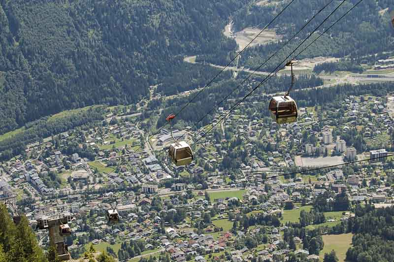
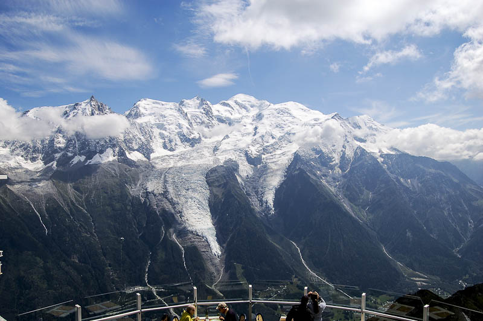
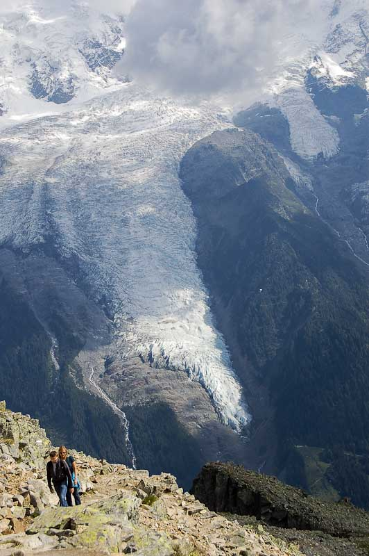
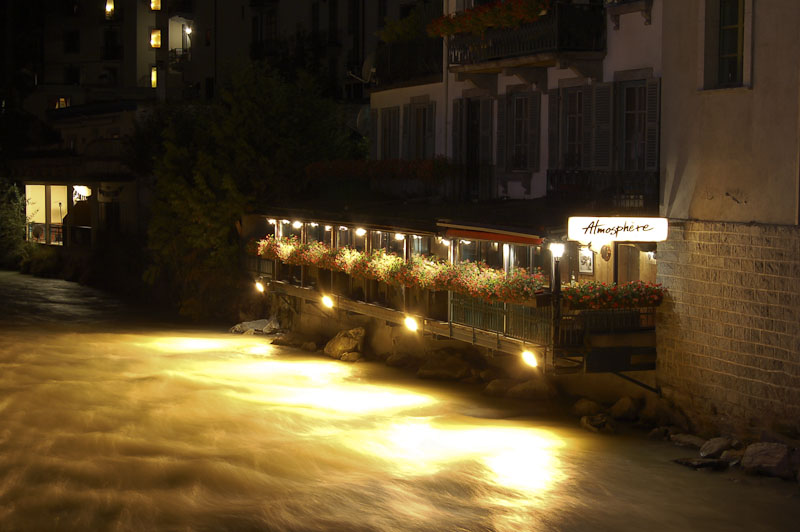

y continua el segundo día…

volvemos de [Argentière](http://en.wikipedia.org/wiki/Argenti%C3%A8re) y el mediodía comienza a dar paso a la tarde. Todavía queda tiempo y vamos a quemar aún más el pase de [Chamonix](http://en.wikipedia.org/wiki/Chamonix)… Nos dirigimos al teleferérico de Plan de Praz. Este se agarra dentro del pueblo, pero a 5 minutos del centro, subiendo una calle que parte de la calle de detrás de la iglesia.

<figure id="attachment_2112" aria-describedby="caption-attachment-2112" style="width: 790px"><figcaption id="caption-attachment-2112">Teleférico Plan de Plaz – Lluís Ribes i Portillo (<a href="http://creativecommons.org/licenses/by-nc-nd/3.0/" target="_blank" rel="noopener noreferrer">cc</a>)</figcaption></figure>

El primer teleférico te deja en el Plan de Praz, a 1000 metros sobre Chamonix. En este punto se puede comenzar algunas de las excursiones más bonitas y largas, como es la del Balcón Sud hasta La Flégere y los lagos [Lac Cornu](http://flickr.com/search/?s=int&w=all&amp;q=Lac+Cornu&m=text), Lac Noirs, [Lac Blanc](http://flickr.com/photos/santi_rf/194929885/) y [Lacs des Cheserys](http://flickr.com/search/?s=int&w=all&q=Lacs+Cheserys&m=text). Desgraciadamente un servidor no realizó ninguna de ellas. En Plan Praz puedes subirte a otro teleférico que te lleva 500 metros más arriba, al Brévent y como no íbamos sobrados de tiempo lo agarramos.

Mientras subes con este teleférico se puede observar como llegando arriba, a la derecha hay toda una pared vertical donde se hace escalada deportiva. ¡Eso sí que es escalar!. Y una vez llegado arriba la vista de toda la cordillera del Mont Blanc es alucinante. Reservar vuestra cámara para este lugar:

<figure id="attachment_2111" aria-describedby="caption-attachment-2111" style="width: 790px"><figcaption id="caption-attachment-2111">Cordillera de Mont Blanc – Lluís Ribes i Portillo (<a href="http://creativecommons.org/licenses/by-nc-nd/3.0/" target="_blank" rel="noopener noreferrer">cc</a>)</figcaption></figure>

Desde Brévent se puede descender a pie hasta Plan de Praz y realizar las excursiones anteriormente descritas. Pero también se puede hacer una excursión como la que hicimos, que es hasta el Lac du Brévent. Este se puede observar bien desde arriba. Si se quiere llegar a él hay que descender por el lado opuesto al valle de Chamonix por un sendero señalizado. Este sendero es una ruta que da toda la vuelta a la zona del lago y vuelve a Brévent. Si queréis llegar al mismo lago, tendréis que coger un camino que sale del sendero que está marcado con puntos amarillos. Está aproximadamente a 30 o 45 minutos desde Brévent. Si encontráis este camino, no hay pérdida y llegáis al lago (reservaros tiempo y energía, que la vuelta es una subida moderada!).

Bueno, llegados a este punto, el día había sido bastante completo y decidimos volver a Chamonix via teleféricos. Subimos del lago sin dejar de contemplar la vista del Glaciar de Bionnassay que quedaba a la espalda, bonito de verdad:

<figure id="attachment_2109" aria-describedby="caption-attachment-2109" style="width: 522px"><figcaption id="caption-attachment-2109">Glaciar de Bionnassay – Lluís Ribes i Portillo (<a href="http://creativecommons.org/licenses/by-nc-nd/3.0/" target="_blank" rel="noopener noreferrer">cc</a>)</figcaption></figure>

Una última observación de esta zona de los alpes. En el teleférico que va de Brévent a Plan de Praz se puede observar unas pistas de tierra que bajan a Chamonix haciendo zig-zag por la ladera de la montaña muy tentadoras de hacer con una mountain bike. Así pues, si alguna vez vais a subir a Plan de Praz/Brévent considerad de hacerlo con una bici – en ambos teleféricos se pueden subir – para realizar un descenso descargando adrenalina por todos los poros de la piel.

Tras cenar en el refugio de Chamonix, me fuí a dar una vuelta por el pueblo de noche. Claro, esto no es ni Calafell ni Platja d’Aro y siendo un martes estaba todo muy tranquilo, [que mejor momento para hechar alguna foto](http://flickr.com/search/?q=segon%20dia%20nit&w=98472959%40N00).

<figure id="attachment_2110" aria-describedby="caption-attachment-2110" style="width: 790px"><figcaption id="caption-attachment-2110">Atmosphere – Lluís Ribes i Portillo (<a href="http://creativecommons.org/licenses/by-nc-nd/3.0/" target="_blank" rel="noopener noreferrer">cc</a>)</figcaption></figure>

Bonne nuit.  
[Link externo a un video de Brévent en temporada de ski](http://www.absolutemotions.com/Newsletter/Cham/brevent_video.htm)