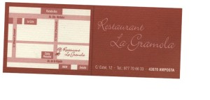

Hola,

Cuando viajo con coche a [Valencia](http://es.wikipedia.org/wiki/Valencia_%28ciudad%29) (vía autopista del mediterraneo), si el trayecto coincide de mediodía con el paso por las [tierras del Ebro](http://es.wikipedia.org/wiki/Parque_natural_del_Delta_del_Ebro), acostumbro a hacer una parada en un restaurante de [Amposta](http://www.amposta.es/index.asp).

Porque este restaurante es de aquellos que te invitan a salir de tu trayecto unos kilómetros para disfrutar con un buena comida.

Se llama “Restaurant La Gramola” y está en C/Estel 12 (tel. 977 70 66 33), en el mismo centro de [Amposta](http://es.wikipedia.org/wiki/amposta). Su especialidad los arroces, como no, pero tiene una cocina muy variada con unos platos muy buenos y de calidad. El establecimiento es pequeño y muy tranquilo, elegante y con un personal muy atento.

Pero lo que más me gusta es su menú diario. Por 12,5 € puedes escoger entre un menú muy variado que lo incluye todo, hasta un vino de la casa (tinto o blanco) que lo puedes acompañar con una botella de agua. Por supuesto postre y café y lo vuelvo a repetir, unos platos ricos ricos ricos.

De esta forma, si algún día tenéis que deteneros a comer por la zona pensad en este artículo y probad este restaurante, menú o carta, da igual, no os arrepentiréis.