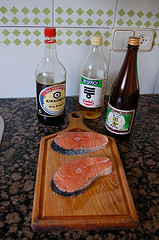
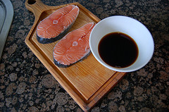
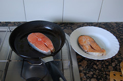
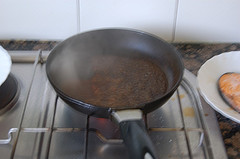
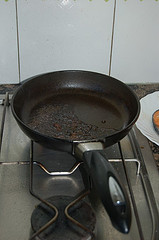
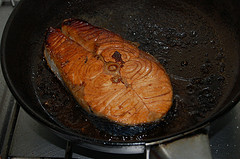
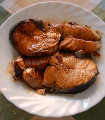

Aquí va el tercer encuentro con la comida japonesa en este blog. A continuación os presentaré un plato muy y muy fácil de hacer y bien bueno. Es el Sakana No Teriyaki, o Pescado asado caramelizado a la parrilla.

El pescado es un ingrediente importantísimo de la dieta japonesa y es la fuente principal de proteína animal de esta. El plato que os doy a conocer se puede una gran realizar conmultitud de pescados, sobre todo aquellos que tienen un gran lomo y se puede obtener unos grandes filetes, como el emperador, el atún o el salmón.

Esta receta, a través de una salsa, le da al pescado un brillo y un color muy bonito así como un sabor muy especial (hasta que no lo cociné, no había probado nada igual) pero sin matar el sabor del pescado original, por tanto es importante que este sea fresco y bueno. En mi caso he usado salmón noruego.

Plato Sakana No Teriyaki:

-   4 Filetes de pescado (emperador, atún, salmón,…)

Salsa Teriyaki:

-   60 ml. de sake
-   100 ml. de mirin
-   70 ml. de salsa de soja

Preparación:

1.  Se prepara primero la salsa Teriyaki. Muy fácil, se vierte todos los ingredientes en un bol y se mezclan.

3.  Se prepara el pescado. Para ello, en una sartén o parrilla con un poquito de aceite se hace un vuelta vuelta al pescado. Es decir, se pasa por el fuego unos segundos los dos lados tan solo para cocer la parte externa, quedando el interior crudo.

5.  Una vez que los filetes han sido pasados ligeramente por el fuego vamos a acabarlos de cocinar. Con los filetes fuera del fuego se realizará los siguientes pasos. Se vierte salsa Teriyaki (la suficiente para el filete) en la sartén caliente, y se deja unos 20/30 segundos a fuego fuerte hasta que gran parte del agua de la salsa se evapora y el azúcar la acarameliza. En las siguientes fotos podéis ver la salsa justo en el momento de entrar en la sartén (se genera mucho vapor), y una vez que se carameliza.

7.  Se pone un filete de pescado de los que hemos precocinado en la sartén con la salsa caramelizada. Se tapa y se deja cocer a fuego más lento cada lado un minuto aproximadamente. Depende de la fuerza del fuego y de como les guste a los comensales si más hecho o no puede ser variar este tiempo. A mi me gusta poco hecho.

9.  Se retira del fuego con cuidado que no se rompa, y a la mesa!.

Como podéis comprobar en la foto anterior, a mi se me ha destrozado un poco y por tanto la presentación no es muy buena, pero el sabor que tenía ese pescado y la textura de la salsa, ummm…, que os voy a contar 🙂

Bien, si alguien ponía como excusa para no hacer cocina japonesa el que era muy complicada, ya no tiene motivo alguno para ello :o)

¡Gochisoma!