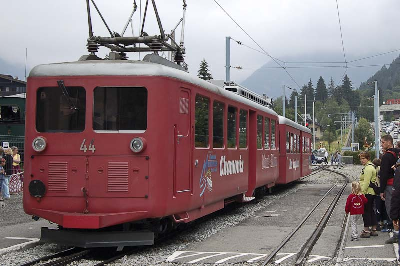
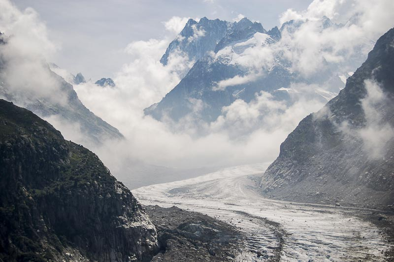
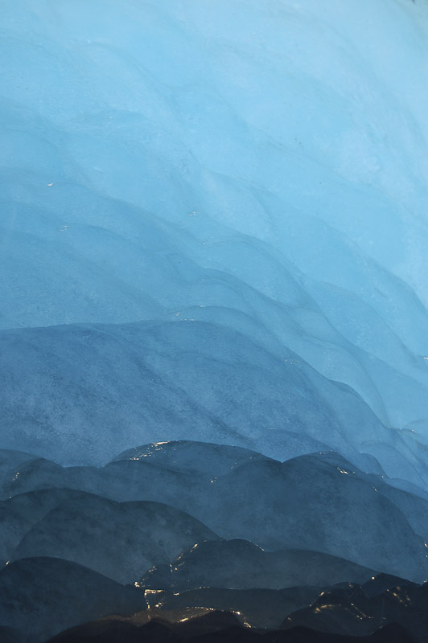
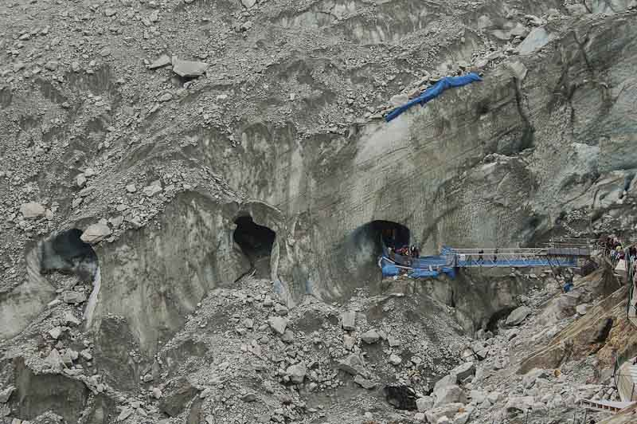
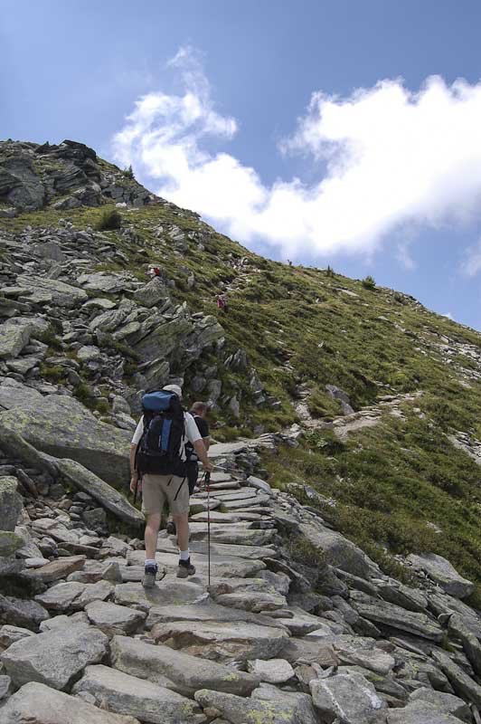

Tercer día y último en Chamonix,El día amaneció totalmente cubierto, el techo de las nubes estaba a 2200 metros, tapando todas las cumbres del valle. Nuestra intención era visitar la [Mer de Glace](http://en.wikipedia.org/wiki/Mer_de_Glace), pero al ver esas nubes nos animamos a volver a subir a [l’Aiguille du Midi](http://en.wikipedia.org/wiki/Aiguille_du_Midi), porque la posibilidad de tener unas vistas desde arriba con las cumbres que sobresalen de un espeso manto de nubes podía valer la pena.  
Así pues, almuerzo y bajamos al centro del pueblo donde consultamos el parte metereológico en la oficina de turismo. La previsión era buena, a pesar que estaría nublado toda la mañana, y por tanto la vista desde los 3800 metros podía ser impresionante. Nos dirigimos a la estación del teleférico y al llegar las fotos bucólicas de ver los picos sobresalir de las nubes se esfumaron en un abrir y cerrar de ojos. La cola que se tenía que hacer para subir a l’Aiguille du Midi era considerable. Y es que eran las 10 y pasadas del mañana y no las 8 como el día anterior. De esta forma abandonamos la idea de subir arriba para hacer fotos espectaculares y nos fuimos directamente a la Mer de Glace, nuestra excursión inicial.  
Para dirigirse a la Mer de Glace desde [Chamonix](http://en.wikipedia.org/wiki/Chamonix) hay varias formas. Una, como de costumbre es subir caminando desde el pueblo haciendo una excursión, en este caso por Blaitière. Esta excursión no es difícil técnicamente pero si que se requiere de un muy buen estado físico y mucho tiempo. Son 1300 metros de desnivel hasta un sendero para posteriormente bajar otros 400 metros. Calculo que son 5 o 6 horas. Existe otro camino, directo y que va por el sendero de la vía del tren, llamado el camino Muletero. Son 800 m, de desnivel que se realizan en 3 h. La última opción e  
s subir con el [cremallera del tren de Montenvers](http://en.wikipedia.org/wiki/Montenvers_Railway) (la estación de la Mer de Glace) que sale del mismo pueblo.

<figure id="attachment_2040" aria-describedby="caption-attachment-2040" style="width: 790px"><figcaption id="caption-attachment-2040">Cremallera tren Montenvers – Lluís Ribes i Portillo (<a href="http://creativecommons.org/licenses/by-nc-nd/3.0/" target="_blank" rel="noopener noreferrer">cc</a>)</figcaption></figure>

Para no romper con la tradición de los anteriores días subimos con el tren :). Este realiza un trayecto de 20 minutos y la vista es muy bonita, siempre y cuando esté despejado…  
Una vez que se llega a Montenvers se puede observar desde sus terrazas la Mer de Glace, el glaciar más famoso de los Alpes franceses, que desciende por la montaña con un trazado sinuoso. Es un glaciar largo y con una gran cantidad de superficie de poca inclinación donde se puede realizar caminatas sobre él (con el equipamiento adecuado).

<figure id="attachment_2037" aria-describedby="caption-attachment-2037" style="width: 790px"><figcaption id="caption-attachment-2037">Mer de Glace – Lluís Ribes i Portillo (<a href="http://creativecommons.org/licenses/by-nc-nd/3.0/" target="_blank" rel="noopener noreferrer">cc</a>)</figcaption></figure>

Una de las visitas más famosas en Montenvers es la gruta de hielo que permite entrar dentro del mismo glaciar. Para acceder a la gruta, hay un [pequeño telecabina](http://www.flickr.com/photos/lluisr/225202213/in/set-72157594235419908/) que baja a unas pasarales inferiores, las cuales llevan a la misma entrada. Si nunca se ha estado dentro del hielo, es una visita obligada, a pesar que la cueva no es muy grande y no es muy espectacular, es muy curioso [estar dentro de un cubito gigante](http://www.flickr.com/photos/lluisr/225197793/in/set-72157594235419908/).

<figure id="attachment_2038" aria-describedby="caption-attachment-2038" style="width: 522px"><figcaption id="caption-attachment-2038">Hielo de la Mer de Glace – Lluís Ribes i Portillo (<a href="http://creativecommons.org/licenses/by-nc-nd/3.0/" target="_blank" rel="noopener noreferrer">cc</a>)</figcaption></figure>

Como dato curioso, si se observa la entrada de la cueva desde la pasarela se puede ver dos o tres cuevas a su lado, sin acceso y parcialmente derruidas. Estas son las entradas de los años anteriores y es una muestra que el glaciar se mueve, o lo que es lo mismo, que a montaña está viva.

<figure id="attachment_2039" aria-describedby="caption-attachment-2039" style="width: 790px"><figcaption id="caption-attachment-2039">Entrada Mer de Glace – Lluís Ribes i Portillo (<a href="http://creativecommons.org/licenses/by-nc-nd/3.0/" target="_blank" rel="noopener noreferrer">cc</a>)</figcaption></figure>

Tras visitar las cuevas, volvimos a la estación a tomar una [crêpe](http://en.wikipedia.org/wiki/Crepe) y esta vez nos dividimos. Santi y Oriol se dirigieron a la misma Mer de Glace para caminar sobre ella. Yo realicé la excursión del balcón norte de Chamonix, pero esto ya es otro artículo…

<figure id="attachment_2036" aria-describedby="caption-attachment-2036" style="width: 522px"><figcaption id="caption-attachment-2036">De trekking por Chamonix – Lluís Ribes i Portillo (<a href="http://creativecommons.org/licenses/by-nc-nd/3.0/" target="_blank" rel="noopener noreferrer">cc</a>)</figcaption></figure>