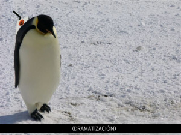

¿Puede [Martin Varsavsky](http://spanish.martinvarsavsky.net/) estar contemplando el uso de pingüinos para la implantación de su red WIFI en la Antártida?

Esta noticia ha conmocionado el mundo científico. La posibilidad abierta por Varsavsky de ofrecer una total cobertura de Internet en la Antártida a través de su red [FON](http://es.fon.com/), es factible y permitirá poder consultar entre otras cosas el parte metereológico en cualquier momento.

A continuación se observa un primer prototipo, con el router FON en las espalda del huésped:

[(cc)](http://creativecommons.org/licenses/by-sa/2.0/) Original photo by [Mike Martoccia](http://flickr.com/photos/es0teric/73851005/)