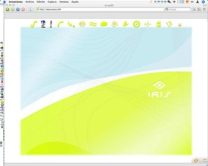

Finalmente prové [EyeOS](http://www.eyeos.info/), ese programa que [hice mención unas semanas atrás](http://lluisr.blogspot.com/2006/09/eyeos-os-free-server.html). Estaba equivocado, porque pensaba que era un sistema operativo que instalabas en tu ordenador y que posteriormente accedías a todos los servicios vía la red. En realidad es un entorno [Web para aplicaciones php, java](http://en.wikipedia.org/wiki/WebOS). Pero eso no desmerece nada el trabajo que están realizando con este software.

¿A qué me refiero con un entorno Web para aplicaciones? Bueno, pues que con un simple (y fiable) navegador, como [Mozilla](http://www.mozilla.org/) o [Opera](http://www.opera.com/), accedes a una página web con tu usuario correspondiente y tienes tu escritorio donde lanzar distintas aplicaciones.

Eso es EyeOS, y se puede probar en la demo on-line que tiene (te puedes dar de alta rapidamente en la página principal). Una vez que entras el aspecto es el siguiente:  
Arriba el menú de aplicaciones, donde podemos escoger entre las aplicaciones más comunes como una calculadora, un procesador de texto, agenda, navegadore etc, más otras aplicaciones que podemos añadir. Actualmente hay una buena cantidad de aplicaciones extras como son juegos (como el [Prince of Persia](http://es.wikipedia.org/wiki/Prince_of_Persia)), reproductores de mp3, programas de chat,… Estas aplicaciones se depliegan por toda la ventana del navegador, y abajo hay unos botones de control. También existe un botón que te permite subir todos los documentos que quieras a tu escritorio eyeOS.

¿Y funciona? Sí, funciona y bastante decentemente. Puedes editar textos al estilo “word”, jugar con juegos 2D sin ningún tipo de problema, oír la música tanto del reproductor como del sistema y todo ello desde cualquier ordenador con un navegador y conexión a Internet. Y una vez que has acabado la sesión, la cierras, y puedes volver a conectarte desde cualquier otro ordenador que tendrás allá tu fondo de escritorio, tus documentosl todo tal como lo dejaste.

¿Y es práctico? En realidad no mucho, es más bien un prototipo llevado a la práctica con talento que deja entrever el futuro uso de la informática a nivel doméstico. El tema de seguridad está muy verde, la interficie se debe depurar (hablando en términos de eficiencia), sobretodo cuando hay varias aplicaciones abiertas así como la multitarea o capacidad de ejecutar varios programas simultaneamente.

Hablando un poco más técnicamente, eyeOS funciona de forma estándar sobre un servidor HTTP y proporciona el servicio a través del puerto 85 . Las aplicaciones están desarrolladas usando tecnología [php](http://en.wikipedia.org/wiki/Php) y [java](http://en.wikipedia.org/wiki/Java) mediante el uso de una interfaz sencilla en [XML](http://en.wikipedia.org/wiki/XML), donde el desarrollador establece los parámetros y el comportamiento de la aplicación en el escritorio.

Actualmente, hay un servidor de demostración en la página web, pero el servidor está disponible (bajo licencia [GPL](http://en.wikipedia.org/wiki/GPL)) en versión [Windows](http://en.wikipedia.org/wiki/Microsoft_Windows) (un [apache](http://en.wikipedia.org/wiki/Apache_HTTP_Server) con el eyeOS incorporado) que es muy fácil de instalar, o el mismo código fuente. Este servidor permite instalar el eyeOS en una intranet por ejemplo sin ningún coste alguno. Está muy bien.

Este tipo de software de acceso a un escritorio vía la web, hace tiempo que está siendo desarrollado por varios grupos y empresas. En realidad, el concepto es parecido a las soluciones de [Windows](http://www.citrix.es/Productos_y_Soluciones/Citrix_Go_To_MyPc/) y [Mac](http://www.apple.com/remotedesktop/) que permiten acceder al escritorio de forma remota (también vía navegador de internet). Pero la filosofía es bien diferente, porque aquí se accede a aplicaciones de la [web 2.0](http://en.wikipedia.org/wiki/Web_2.0) que interactúan entre ellas, repartidas por toda la web y que están demostrando desde hace años su gran potencial basado en la compartición y análisis de la información. Como ejemplo tradicional, una aplicación web que planidica tus vacaciones. Gracias a la tecnología web 2.0, este tipo de aplicación puede consultar las ofertas de las diferentes compañías de aviones, así como la de operadores turísticos y precios de hoteles para ofrecer al usuario un viaje adecuado a sus necesidades.

Para mi, uno de los valores de estos prototipos como es eyeOS, es que nos enseña que dentro de unos años será normal acceder a todas estas aplicaciones desde cualquier lugar sin la necesidad de usar una tostadora como es el ordenador doméstico actual.

Otros prototipos de escritorios en red están en desarrollo, os dejo los links:

-   [klorofil](http://www.klorofil.org/)
-   [fenestela](http://www.fenestela.com/index.php?e=1)
-   [youOS](https://www.youos.com/)
-   [Twinklefish](http://www.twinklefish.com/)
-   [WebOS](http://www.webos.ws/)
-   [Xin Ajax](http://www.xinteleport.com/)
-   [Desktoptwo](http://desktoptwo.com/)
-   [OrcaDesktop](http://orcadesktop.com/)

a continuación os dejo links del mismo [proyecto eyeOS](http://www.eyeos.info/):

[eyeApps](http://orcadesktop.com/) – aplicaciones para eyeOS  
[eyeLook](http://orcadesktop.com/) – temas de escritorio para eyeOS  
[eyeBlog](http://eyeos.blogspot.com/) – blog de eyeOS