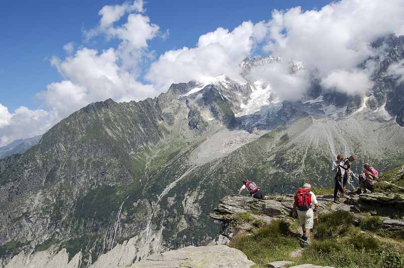
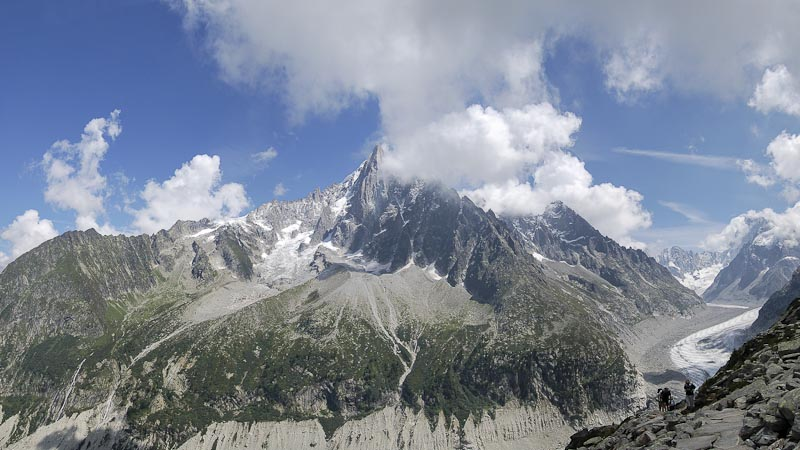
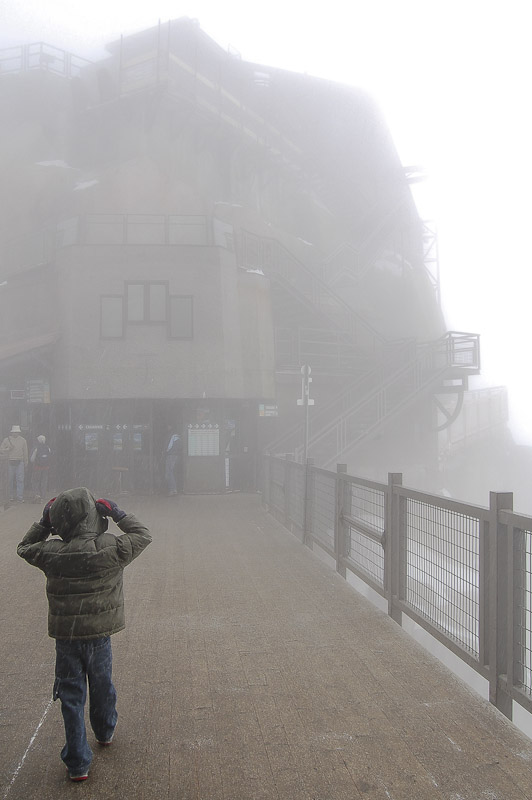

El Gran Balcón Norte. No es una terraza donde tomar un refresco sino unos de los recorridos más clásicos del valle de [Chamonix](http://en.wikipedia.org/wiki/Chamonix), recorrido que realicé tras visitar la [Mer de Glace](http://en.wikipedia.org/wiki/Mer_de_Glace) en el tercer día. El sendero es una pequeña travesía de tres horas por las montañas del macizo del Mont Blanc que dan al valle.

Comencé desde Montenvers y para llegar al Gran Balcón Norte hay que subir un poco por un camino que parte justo al lado del hotel. La subida tiene unos 200 metros de desnivel hasta la Señal de Forbes. Esta ascensión se realiza por la parte que da a la Mer de Glace y a unos minutos hay unas vista de esta muy bonitas:

<figure id="attachment_2031" aria-describedby="caption-attachment-2031" style="width: 790px"><figcaption id="caption-attachment-2031">Trekking en los Alpes – Lluís Ribes i Portillo (<a href="http://creativecommons.org/licenses/by-nc-nd/3.0/" target="_blank" rel="noopener noreferrer">cc</a>)</figcaption></figure>

Una vez llegados a la Señal de Forbes aparece una de las vistas más espectaculares de la zona: el mítico Aiguille du Dru que se eleva a las nubes encima de un espectacular macizo, que a sus pies tiene la Mer de Glace que llega serpentando a la derecha por el valle que ha esculpido durante miles de años y se abre a la izquierda hacia el vallé de Chamonix. No está nada mal, sino mirar la siguiente panorámica:

<figure id="attachment_2032" aria-describedby="caption-attachment-2032" style="width: 790px"><figcaption id="caption-attachment-2032">Aiguille de Dru – Lluís Ribes i Portillo (<a href="http://creativecommons.org/licenses/by-nc-nd/3.0/" target="_blank" rel="noopener noreferrer">cc</a>)</figcaption></figure>

Una vez visto y fotografiado el paisaje, comencé el sendero del Gran Balcón Norte dirección a la Plan de l’Aiguille. Todo el sendero está bien trazado y es bastante plano. A pesar de ello, hay un momento que baja bastante haciendo zig-zag y parece que te dirijas hacía el pueblo. Pero no, es parte del sendero y posteriormente vuelve a subir. La vista es grande, y el recorrido muy bonito pese que en ningún momento te da la sensación de estar en un entorno tan salvaje como los alpes porque parece las ramblas de la cantidad de gente que lo recorre. A mi me gustó especialmente el tramo final, donde hay toda una serie de torrentes que bajan del glaciar de Blaitère y uno puede provisionarse de agua fresca y buena. En total estuve unas tres horas largas haciendo una parada para comer, para finalizar en la estación intermedia del teleférico de la [Aiguille du Midi](http://en.wikipedia.org/wiki/Aiguille_du_Midi).

Al llegar a este, me decidí por tomarlo otra vez hacia arriba. Hacía buen tiempo en el sendero y en el valle en general, pero arriba, en las montañas estaban bien tapadas, y por supuesto el teleférico desaparecía en ellas en la ascensión. Podía ser interesante… Subí y mientras nos dirigiamos a la Aiguille du Midi me abrigué y preparé la cámara. Bueno, al cabo de 30 segundos, desde la cabina solo se veía a los cuatro que estábamos dentro de ella. A fuera, una niebla terrible. Y arriba, tres cuartos de lo mismo, además un frío del carajo y un poco de nieve. Pero pese que pocas fotos pude sacar, realicé alguna interesante:

<figure id="attachment_2030" aria-describedby="caption-attachment-2030" style="width: 522px"><figcaption id="caption-attachment-2030">Aiguille du Midi – Lluís Ribes i Portillo (<a href="http://creativecommons.org/licenses/by-nc-nd/3.0/" target="_blank" rel="noopener noreferrer">cc</a>)</figcaption></figure>

Y poca cosa más, está claro que en la Aiguille du Midi, si hay mal tiempo es la mayor decepción que puedes encontrarte. Suerte que ya la habíamos visitado el día anterior!. Además, como llegué tarde, debí de esperar al último teleférico para bajar.

A pesar de ello tuve tiempo de recibir una llamada de Telefónica MoviStar que me ofrecían cambiarme de compañía. Tras la presentación de la operadora le dije que estaba a 4000 metros de altura, colgado en una aguja y en el extranjero… en ese momento ella dijo:

“Ostia!!! Creo que es mejor que me ponga en contacto con usted en otro momento”

Y colgó. Todavía sigo conservando el mismo número de móvil 🙂  
Otro gran día, con un poco mas de trekking que los anteriores. Acabamos reuniéndonos todos en el albergue y pasándonos las fotos. Vaya envidia que me entró cuando vi las fotos de Santi y Oriol de los ríos que se forman sobre la Mer de Glace. [National Geographic](http://www.nationalgeographic.com/)!