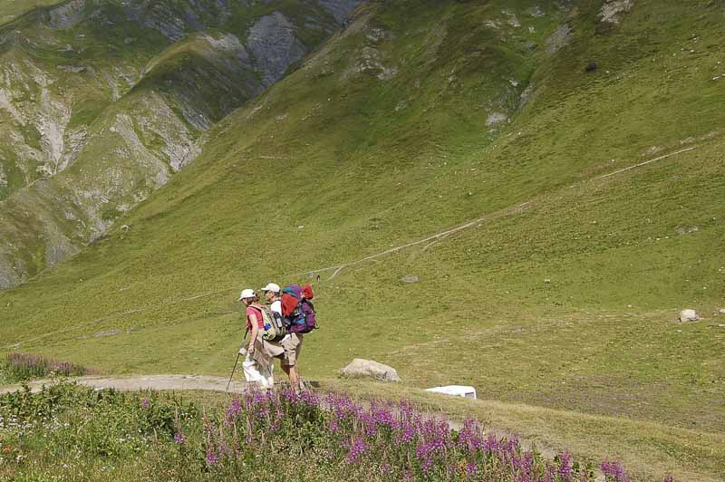
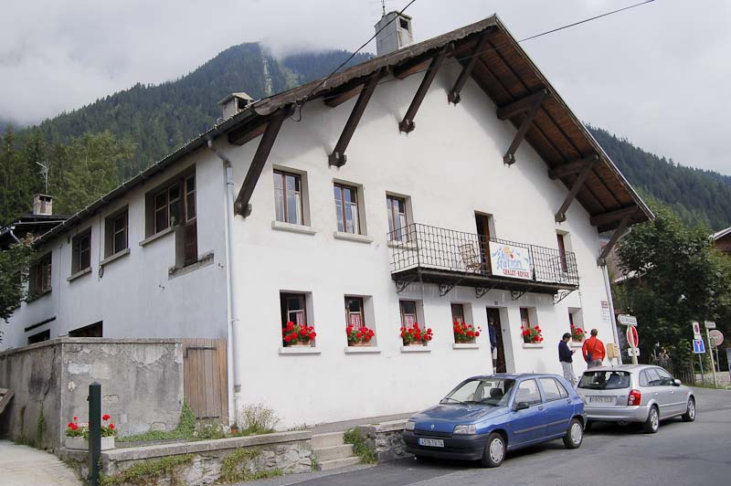
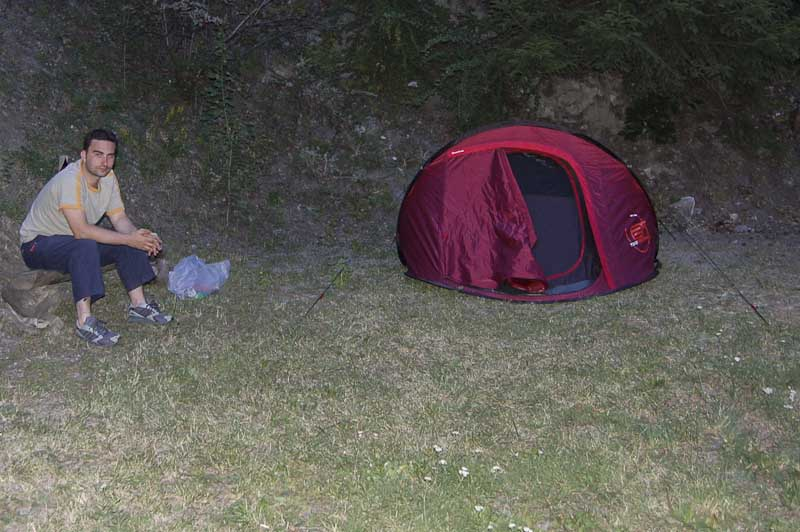
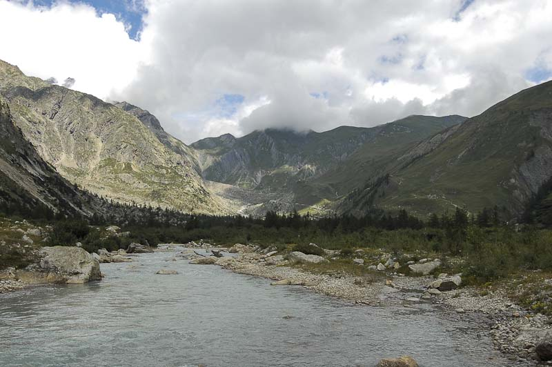
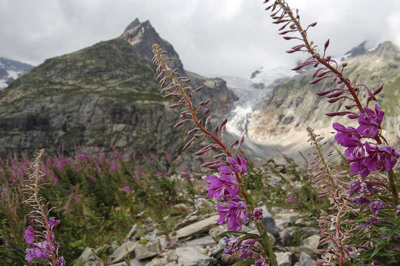
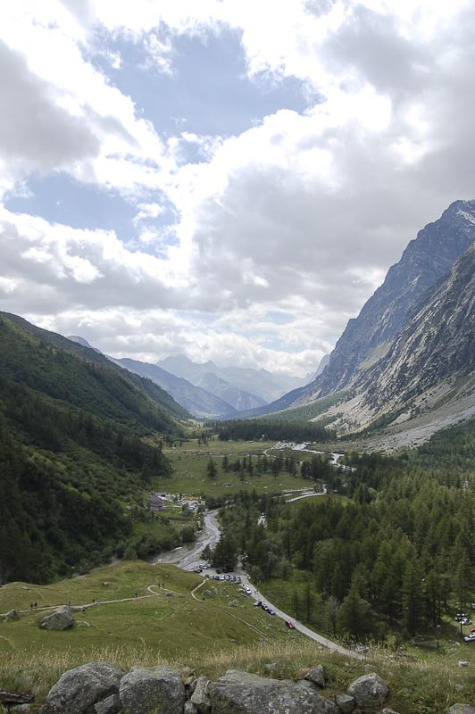

<figure id="attachment_2021" aria-describedby="caption-attachment-2021" style="width: 790px"><figcaption id="caption-attachment-2021">De paseo por los Alpes – Lluís Ribes i Portillo (<a href="http://creativecommons.org/licenses/by-nc-nd/3.0/" target="_blank" rel="noopener noreferrer">cc</a>)</figcaption></figure>

Cuarto día. En ese día abandonamos [Chamonix](http://en.wikipedia.org/wiki/Chamonix), pero no los Alpes. Quedaban dos días de viaje y aún mucho que visitar al otro lado de la frontera, en [Italia](http://es.wikipedia.org/wiki/Italia). Dejamos atrás el albergue de Chamonix donde pasamos las tres últimas noches, y con ello gente guapa que conocimos, una gatita que nos visitó una noche a las 03:00 de la mañana (por donde entró??) y la pareja fantasma de la habitación continua a la nuestra (nuestra habitación era en realidad su pasillo) que se iban a dormir antes que nosotros y marchaban de ella cuando nosotros ya estabamos volteando por las montañas.

<figure id="attachment_2026" aria-describedby="caption-attachment-2026" style="width: 590px"><figcaption id="caption-attachment-2026">Guite a Chamonix – Lluís Ribes i Portillo (<a href="http://creativecommons.org/licenses/by-nc-nd/3.0/" target="_blank" rel="noopener noreferrer">cc</a>)</figcaption></figure>

Para dirigirnos a Italia tomamos el tunel del [Mont Blanc](http://en.wikipedia.org/wiki/Mont_Blanc_Tunnel). Este túnel de unos 11 kilómetros atraviesa el macizo, pasando por debajo del mismo pico del Mont Blanc, desde Chamonix ([Francia](http://es.wikipedia.org/wiki/Francia)) hasta [Courmayeur](http://en.wikipedia.org/wiki/Courmayeur) (Italia). Pasa un poco como los teleféricos, si no se va a temprana hora, puedes encontrar una buena caravana para el acceso. [Desde que el trágico accidente de hace 7 años](http://www.landroverclub.net/Club/HTML/MontBlanc.htm), las medidas de seguridad son altas, y entre estas medidas está el dejar pasar los coches con un margen de seguridad muy grande. Un consejo, si vais a usar el tunel de ida y vuelta podéis pedir un ticket que incluye los dos viajes y es más barato.  
Au revoir Chamonix, au revoir France… estas palabras teníamos en nuestras mentes mientras atravesavamos el túnel del Mont Blanc… Benvinitu Italia!!!  
Lo primero que te confirma que estás en un país latino cuando sales del túnel y te diriges por la carretera son los adelantamientos imposibles que se marcan los italianos. Hay algún que otro loco en el volante… Bueno pero nosotros tranquilitos y a buscar un camping cercano. La idea era tener el campamento base cerca del macizo del Mont Blanc. Tras un poco de indecisión, en la carretera pasado Courmayeur encontramos un camping. Un poco caro, pero suficiente para extender nuestra nueva tienda, [la 2″ del Decatlhon](http://www.decathlon.es/ES/Product_arborescence/mountain/hiking/hiking-equipmen/camp-site-tents/product_5599863/index.html): la tienda que se monta en 2 segundos (mentira, en realidad son 40 segundos, pero no está mal):

<figure id="attachment_2022" aria-describedby="caption-attachment-2022" style="width: 590px"><figcaption id="caption-attachment-2022">Santi y la tienda Decathlon – Lluís Ribes i Portillo (<a href="http://creativecommons.org/licenses/by-nc-nd/3.0/" target="_blank" rel="noopener noreferrer">cc</a>)</figcaption></figure>

Tras acampar nos dirigimos a la [Val de Ferret](http://www.courmayeur-mont-blanc.com/CourmaValFerretVeny.htm). Este es el valle que queda en la parte italiana del macizo del Mont Blanc. A diferencia de la parte francesa, el valle practicamente no está urbanizado, tan solo hay campings e instalaciones de recreo así como una carretera y la sensación de ir por un lugar virgen es mucho mayor que en Chamonix, sin duda.

<figure id="attachment_2025" aria-describedby="caption-attachment-2025" style="width: 790px"><figcaption id="caption-attachment-2025">Valle Ferret – Lluís Ribes i Portillo (<a href="http://creativecommons.org/licenses/by-nc-nd/3.0/" target="_blank" rel="noopener noreferrer">cc</a>)</figcaption></figure>

La excursión del día consistió en dejar el coche en Lavachey (final de la carretera) y seguir a pie durante 4 kilómetros hasta el refugio/restaurante cercano al Puerto de Col Ferret. Esta excursión forma parte del [Tour de Mont Blanc](http://en.wikipedia.org/wiki/Tour_du_Mont_Blanc), un recorrido de días que rodea todo el Mont Blanc atravesando Francia, Italia y [Suiza](http://es.wikipedia.org/wiki/Suiza). La vista de la excursión era formidable: a la izquierda tenías las montañana del macizo, escarpadas e imponentes con glaciares tremendos de donde nacía el torrente Dora Ferrer. A la derecha, unas montañas no tan imponentes pero no por ello impresioanntes, con un relieve más suave y verdes, muy verdes. Qué bonito!

<figure id="attachment_2023" aria-describedby="caption-attachment-2023" style="width: 790px"><figcaption id="caption-attachment-2023">Dora Ferrer- Lluís Ribes i Portillo (<a href="http://creativecommons.org/licenses/by-nc-nd/3.0/" target="_blank" rel="noopener noreferrer">cc</a>)</figcaption></figure>

Los 5 kilómetros se realizan sin ninguna dificultad, pese a que hace un poco de subida y cuando se llega al refugio se puede tomar un refresco o hasta comer. Se nos había hecho un poco tarde, con todo el tema del camping de la mañana y no podíamos continuar. Una pena, tras un último ascenso de 500 metros de desnivel se llegaba a la frontera con Suiza :'(

<figure id="attachment_2024" aria-describedby="caption-attachment-2024" style="width: 522px"><figcaption id="caption-attachment-2024">Valle de Ferret- Lluís Ribes i Portillo (<a href="http://creativecommons.org/licenses/by-nc-nd/3.0/" target="_blank" rel="noopener noreferrer">cc</a>)</figcaption></figure>

Volvimos al coche y nos dirigimos al lado opuesto del valle hasta llegar a un punto donde la carretera estaba cerrada por desprendimientos. La noche estaba comenzando a salir, pero Oriol con su espíritu aventurero continuó por la carretera unos kilómetros hasta llegar a un precioso lago. El resto le esperamos en el camping mientras preparábamos unos deliciosos macarrones…  
[  
Las fotos del día](http://flickr.com/search/?q=quart%20dia&w=98472959%40N00)