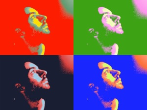

Vuelvo a la acción.

El 2 de Octubre comienzo un nuevo reto profesional en [Cornellà](http://www.cornella.cat/). Vamos a poner a punto el [Citilab de Can Suris](http://www.bcn2000.es/es/mapa/bcn2.aspx?_gIdMapa=5&_gIdContexto=2&idioma=es&_gIdLocalizacion=225). Muchos de vosotros ya conocéis este proyecto, en el que he estado involucrado el último año, pero para aquellos que todavía no tenéis idea alguna de que es os hago un breve resumen.

Citilab de Can Suris va a ser un espacio, de 4500 m2 donde la tecnología tomará un papel primordial para proporcionar a la sociedad un lugar para la experimentación y aprendizaje de las nuevas tecnologías, para la creación de empresas start-up innovadoras, para realizar e-learning, para poner en práctica todas aquellas curiosidades y aptitudes tecnológicas que un ciudadano tenga y no pueda hacerlo al no tener los recursos necesarios, tanto humanos como materiales.

Será un espacio donde compartir ideas y conocimientos entre gente de todas las edades e inquietudes pueda ayudar no tan solo a eliminar la brecha y el analfabetismo digital sino también para ayudar a la construcción de la futura sociedad digital.

Este es el presente de Can Suris, el futuro, lo construiremos entre todos.