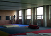
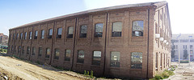
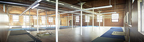
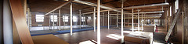

Mi primera semana en Can Suris ya ha acabado. Durante ella hemos puesto en marcha el equipo de trabajo, compuesto por Santi en la parte económica, Lluís en la parte técnica y Vicençs en la dirección. A todo ello decir que estamos trabajando codo a codo con departamentos del ayuntamiento que han gestionado el proyecto hasta el día de hoy y miembros de la Fundació Privada pel Foment de la Societat del Coneixement, impulsora del mismo centro Can Suris.

Las cosas que me gustaría destacar de estos días son varias. El edificio de Can Suris está quedando muy bonito y se ha realizado un gran trabajo de rehabilitación. Me gustará verlo en acción con todo el entorno tecnológico que va a acoger dentro de si. Tengo unas pocas fotos (lamentablemente de hace unos 6 meses) para que os hagáis una idea de su arquitectura:

Cada vez me parece más interesante el despliegue de WIFI y la importancia que tendrá este dentro del edificio. Se quiere tener acceso a la red desde cualquier rincón del edificio.

Y por último las excelentes comunicaciones que tiene Can Suris. A 20 minutos en tranvia desde la misma Diagonal de Barcelona, a 5 minutos del metro y la renfe y al lado de la A-2, las Rondas y por consecuencia a 15 minutos del aeropuerto (\*).

(\*) siempre que no haya tráfico… un problemón en horas puntas.