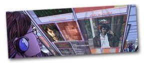
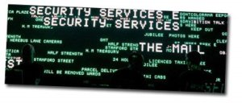

Dos puntos interesantes sobre el [ArtFutura](http://www.artfutura.org/) de este año:

1. Van a realizar un pase especial de la película “[A Scanner Darkly](http://spanish.imdb.com/title/tt0405296/)“ para todos aquellos que puedan ir a la inauguración del ArtFutura (intentaré ser uno de ellos). Esta película me da que va a ser una nueva película de culto gracias a la técnica usada para su creación y su atmósfera. Es una película de animación que usa actores reales, algo así como una historieta de cómic llevada al cine. Actores como Keanu Reves o Winona Ryder se convierten en dibujos animados dentro de esta película de ciencia ficción ambientada en el París de 2050. Para más información de la película os incluyo un par de links:

[Página web oficial](http://wip.warnerbros.com/ascannerdarkly/)  
[Fotogramas de la película](http://spanish.imdb.com/title/tt0405296/photogallery-ss-0)  

2. El sábado a la noche, en el Fórum (donde sino… ) habrá una actuación de [United Visual Artist](http://www.uva.co.uk/) para todos aquellos que tengan la entrada del sábado a Art Futura. ¿Quiénes son United Visual Artist? Son los encargados de montar las escenografias visuales de las giras de grupos como [Massive Atack](http://www.massiveattack.co.uk/) o [U2](http://www.u2.com/). Para esta ocasión realizarán un concierto experimental de sonido, luz e imágenes generadas por ordenador que puede ser muy interesante.