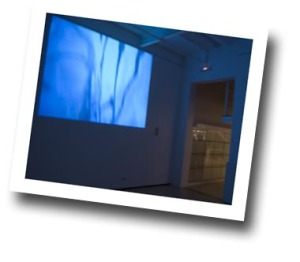
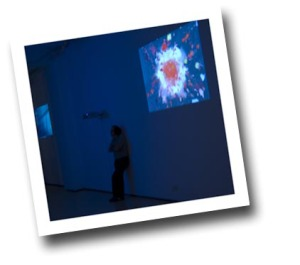
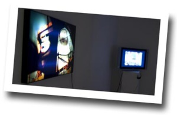
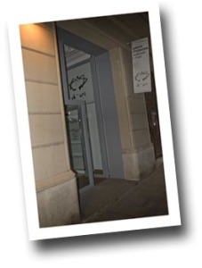

Hola,

Esta semana he conocido a Albert Merino. Albert ha realizado estudios de bellas artes y actualmente está realizando su actividad como artista usando herramientas informáticas avanzadas para poder materializar sus obras. Me enseñó su última obra, que está expuesta en una galería (más adelante hablo de ella) así como otra en donde ha realizado el trabajo técnico. Me gustó, pero sobretodo me hizo reflexionar:

Todo este tema del arte dentro del entorno digital, que siempre me ha entusiasmado, se basan en las aplicaciones que nosotros, los informáticos creamos. Estas son fáciles de usar (con un poco de formación) y los resultados que se pueden obtener son realmente espectaculares. No me atrevo a decir que la informática hace más democrático el arte, porque al fin al cabo, la expresión artística puede realizarse con tan solo pensar, pero sí que aumenta y acerca al ciudadano casi hasta el infinito un abanico de posibilidades de representación artística que un siglo atrás no existía.

En definitiva, que la informática y en general las nuevas tecnologías, contribuyen a que el arte sea más accesible a todas las personas, en términos de presupuesto, infraestructura y requiere de una dedicación de tiempo por obra menor. Además su difusión es mucho mayor, tan solo hay que ver la enfermedad que está de moda: el [marketing viral](http://es.wikipedia.org/wiki/Marketing_viral).

Pero volviendo al trabajo de Albert. Os recomiendo que visitéis la galeria de arte del grupo [Ob-art](http://www.ob-art.com/) que actualmente y hasta finales de semana la tienen en la calle Enric Granados 7 de Barcelona, muy cerca de la Plaça Catalunya. En ella están expuestas obras de arte digital de este grupo. Es una galeria pequeña pero muy linda, donde mediante unos proyectores y pantallas planas se exponen los diferentes trabajos. Un pequeño apunte, a pesar de deciros anteriormente que el arte digital facilita la creación con menos recursos, para esta exposición no pueden tener toda la infraestructura de proyectores, por ejemplo, que les gustaría tener en la galería :(. ¡Ojalá que esto pueda cambiar pronto!

¿Qué es o quiénes son Ob-art exactamente? Pues es un grupo de profesionales que se dedican a la producción y distribución de videos. Aprovechando que se mudan a otra galeria han inaugurado una página web, donde si navegáis un poco podréis ver fragmentos de sus obras y obtener más información de ellos.

Os dejo la nueva dirección por si queréis contactar con ellos:  
Galeria Ob-Art

Provença 318, 3º 1ª  
08037 Barcelona, Spain

[contact@ob-art.com](mailto:contact@ob-art.com)

Actualmente y hasta final de semana les podéis visitar en Enric Granados 7, Barcelona, Spain. No lo dudéis, si os gusta, pasaros por la galería.

ciao!