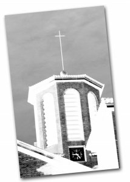

Saludos,

En Cornellà del Llobregat, [en el centro de la ciudad se levanta](http://maps.google.com/?ie=UTF8&z=18&amp;ll=41.355613,2.070432&spn=0.001965,0.005032&t=k&om=1) una iglesia donde se sitúa la torre con el reloj de la ciudad. Este es el reloj que todos los ciudadanos usan para ajustar los suyos de bolsillo, es el reloj que marca el ritmo de vida de los ciudadanos de una forma precisa e impecable desde hace hace tanto tiempo que nadie sabe recordar desde cuando está en funcionamiento.

Pero el día 19 de Octubre de 2006, a las 9 horas y 49 minutos de la mañana tomé la siguiente foto del reloj de la Iglesia de Cornellá:

(8:26)

Esa mañana todo el mundo experimentaba una extraña desorientación, el reloj que marca sus ritmos de vida, se había parado la noche anterior a las 8 horas 26 minutos de la tarde. ¿Qué había paso? Preguntando entre todos aquellos que transnochan en la ciudad apareció un hecho común: La noche anterior, hubo una gran tormenta sobre la ciudad y el centro metereológico confimó que un rayo cayó directamente a esa hora sobre el campanario.

¿Pero eso es todo lo que pasó aquel día? No, unos pocos aún creemos que aquel miércoles a la noche, mientras todos los ciudadanos se resguardaban de la tormenta en sus hogares, [Marty McFly](http://en.wikipedia.org/wiki/Marty_McFly) regresaba al futuro con su [deLorean](http://en.wikipedia.org/wiki/DeLorean_DMC-12).

Yo soy uno de esos pocos que llegamos a esa conclusión, seguramente tras disfrutar varias veces de una buena película como es [“Regreso al futuro”](http://spanish.imdb.com/title/tt0088763/). Y es que la vida es así.

recuerdos!