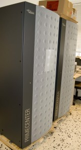
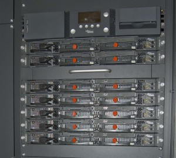
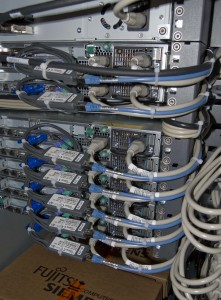
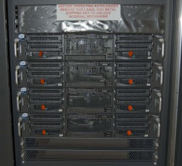
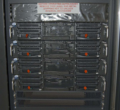
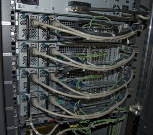
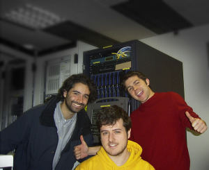

Hola,

Los equipos informáticos de [Citilab – Can Suris](http://search.blogger.com/?q=suris+blogurl%3Alluisr.blogspot.com&btnG=Buscar+blogs&hl=es&ie=UTF-8&amp;amp;amp;amp;x=0&y=0&amp;scoring=d&ui=blg) ya están comenzándose a montar. De momento los tenemos en un laboratorio de [Siemens](http://www.siemens.es/), donde se realizará la configuración base.Me refiero a los equipos del CPG, o Centro de Proceso en Grid. Estos darán servicios a todo el centro y están compuestos por 11 servidores situados en dos racks, que son los siguientes:

El primer rack contiene 7 servidores [Siemens-Fujitsu](http://www.fujitsu-siemens.es/) RX200 S2. Vienen con una caja de backups (todavía en montaje) y un SAI para el apagado controlado de los servidores. Estos servidores se llamarán como el [primer programa espacial tripulado americano: Mercury](http://es.wikipedia.org/wiki/Proyecto_Mercury). En las dos siguientes fotos se puede observar la parte frontal y trasera de estos 7 servidores:

También en este rack está empotrada la cónsola que se despliega fácilmente sobre unos railes, y con el cual se accede a todos los servidores de los dos racks:

El segundo rack contiene 4 servidores [Siemens-Fujitsu](http://www.fujitsu-siemens.es/) RX300 S2. Vienen también con su caja de backups, SAI y una SAN de 2.5 TBytes que todavía no está en el rack. Heredarán el nombre del [primer programa espacial tripulado soviético: Vostok](http://es.wikipedia.org/wiki/Programa_Vostok). Podéis ver mas detalles del frontal y la parte trasera a continuación:

Lo del [Grid](http://es.wikipedia.org/wiki/Grid) no es casual, desde el inicio de la elaboración del uso de las máquinas del centro hay una clara vocación que estas, más el centenar de equipos de usuarios más los demás CPG que se unan al del Citilab puedan trabajar conjuntamente aprovechando sus tiempos muertos para sacar el máximo el rendimiento creando así un verdadero superordenador en red.

Todo esto me recuerda viejos tiempos 🙂 con [GridCAT](http://search.blogger.com/?as_q=gridcat&ie=UTF-8&amp;amp;amp;amp;x=0&y=0&amp;q=gridcat+blogurl:lluisr.blogspot.com&ui=blg&amp;scoring=d) y el servidor sahara con sus 9 [Dell](http://www.dell.es/) PowerEdge 1855 funcionando a toda máquina con el [Grid](http://es.wikipedia.org/wiki/Grid) experimental que algunos buenos resultados nos dió. Básicamente era una configuración Blade de 9 [Debian-Linux](http://www.debian.org/), con servicios como [LDAP](http://es.wikipedia.org/wiki/LDAP), [apache](http://es.wikipedia.org/wiki/Servidor_HTTP_Apache), [wiki](http://es.wikipedia.org/wiki/wiki) funcionando en estas máquinas, a la vez que mediante el uso del software [Globus](http://www.globus.org/) instalado en cada servidor, diversos proyectos de la universidad podían utilizar tecnología Grid, haciendo trabajar a la vez estas máquinas más 9 que teníamos a 200 metros en otro edificio y 2 que estaban a varios kilómetros, en [Castelldefels](http://www.castelldefels.cat/). Por último una instantánea de aquella época :’):

[Lluís](http://lluisr.blogspot.com/), [Vicente](http://trompeti.blogspot.com/) y [Carlos](http://deepbit.blogspot.com/)