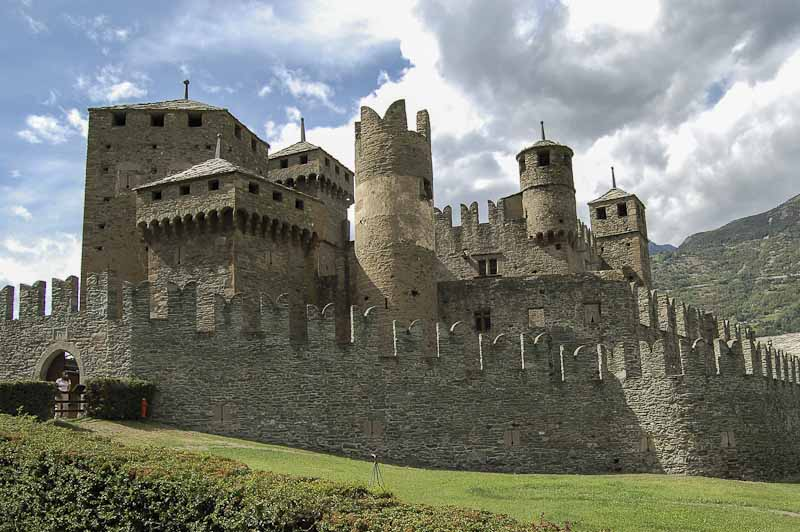
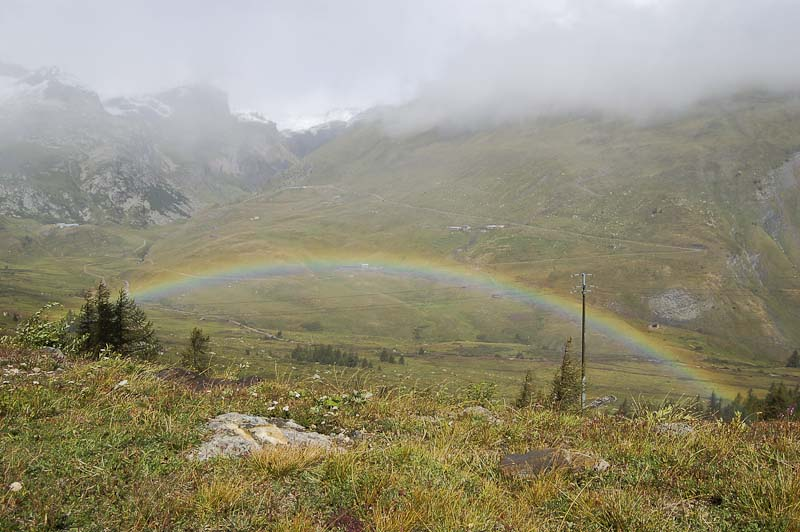

Tras un largo período de tiempo sin postear alrededor de los [Alpes](http://es.wikipedia.org/wiki/Alpes), voy a escribir el último artículo de nuestra mini-escapada, que incluye el penúltimo y último día.Voy a tener que hacer memoria, pero no me va a costar mucho, todo lo bueno permanece. El penúltimo día nos levantamos de la tienda de mañana. Había llovido ligeramente y refrescaba un poquito. Nuestro objetivo aquel día no se diferenciaba del resto, ir a hacer un poco de montaña. Esta vez, dejaríamos el macizo del [Mont Blanc](http://es.wikipedia.org/wiki/Mont_Blanc) y fuimos al [Cervino](http://es.wikipedia.org/wiki/Cervino). Este monte hace frontera con [Suiza](http://es.wikipedia.org/wiki/Suiza) e [Italia](http://es.wikipedia.org/wiki/Italia), y es la inspiración del logotipo de uno de los [chocolates más populares que existen](http://www.toblerone.ch/). Nos dirigimos con coche, habían 80 km desde nuestro camping, situado al pie del Mont Blanc, hasta [Cervinnia](http://www.cervinia.it/), el pueblo italiano que se sitúa en un hermoso valle del mismo Cervino.

Cervinia es básicamente una estación de esquí, donde la construcción ha invadido gran parte del valle y donde es posible ver esquiadores hasta en verano, dado que existen pistas de esquí que en pleno verano abren a la mañana. Tiene su encanto el pueblo, porque está un un lugar privilegiado, pero poco más, mucho comercio y restaurantes donde ser víctima del “coperto”, o como dice [Paquita](http://paqquita.blogspot.com/): “coperto: tomadura de pelo italiana que consiste en cobrarte más de lo que figura, inicialmente, en la carta de precios, por cada uno de los comensales”. Eso sí, las pizzas ricas ricas.

Hasta el momento, el tiempo prácticamente nos había acompañado durante toda la semana para disfrutar de los grandes escenarios de la zona y para tirar buenas fotos 🙂 Pero aquel día las nubes quisieron ser protagonistas y estaban situadas encima de las montañas, entre ellas la del Cervino. La decepción fue doble. Una, porque como buenos turistas que éramos no se podía sacar ninguna foto del Cervino. Dos, porque como buenos deportistas que somos, el tiempo no invitaba a comenzar una caminata montaña arriba. No hubo más remedio que realizar cambio de planes.

Nos costó un poco decidir que hacer, tomar decisiones entre tres a veces es un poco difícil y me recordó a aquellos momentos que sales de noche, y entre toda la cuadrilla debes decidir que hacer en plena calle de la ciudad a las 3 de la madrugada. No es fácil… Finalmente nos dirigimos al Lago Azul, a 1 km de Cervinia por la única carretera que llega al pueblo. Este lago en realidad es más bien un estanque, muy pequeño pero con un color y una flora bucólica. Y pese ser pequeño, su situación en el valle es fantástica y permite contemplar grandes reflejos en sus tranquilas aguas. Un lugar ideal para hacer un pequeño tentempié:

Tras visitar este lago, y viendo que el tiempo no mejoraba, volvimos dirección de regreso al camping, pero haciendo un par de paradas interesantes. La primera, al castillo “[Castello di Fenis](http://www.icastelli.it/regioni/valledaosta/fenis.htm)” el más famoso del valle de Aosta. Esta región de Itália tiene una gran cantidad de castillos a visitar y aún más de historias detrás de cada uno de ellos:

<figure id="attachment_2012" aria-describedby="caption-attachment-2012" style="width: 790px"><figcaption id="caption-attachment-2012">Castillo di Fenis – Lluís Ribes i Portillo (<a href="http://creativecommons.org/licenses/by-nc-nd/3.0/" target="_blank" rel="noopener noreferrer">cc</a>)</figcaption></figure>

La segunda parada la hicimos en la ciudad de [Aosta](http://es.wikipedia.org/wiki/Aosta). Esta había sido un antiguo asentamiento romano, y pese la fuerte industrialización actual y de su periferia, en su interior se encuentran algunos testimoneos como la muralla, el arco de triumfo o los restos de un teatro romano que invitan como mínimo si estás de pasada por la zona, a realizar una visita dando un agradable paseo por el casco antiguo.

Realmente, ese día estabamos ya un poco cansados, hicimos una gran cantidad de kilómetros en coche para arriba y para abajo y decidimos tras visitar Aosta y cuando la tarde comenzaba a dejar paso a la noche ir a descansar. Al día siguiente teníamos que realizar 900 km de vuelta a casa…

Día de regreso, y como todo, hasta lo bueno se acaba. Recogimos el campamento, nos tomamos nuestro [cappuccino](http://es.wikipedia.org/wiki/Cappuccino) en la consergería del camping y de vuelta estabamos. Decidimos (con acierto) tomar un camino alternativo. Desde el valle de Aosta, para dirigirse a [Francia](http://es.wikipedia.org/wiki/Francia), el camino más directo es el Tunel de Mont Blanc, pero agarramos otra ruta, y nos dirigimos a Francia por el Pequeño puerto de San Bernardo. Este puerto de montaña, antigua vía de comunicación entre los dos países sube hasta los 2500 metros, atrevesando pueblos de clara vocación de esquí y no hace falta decir que el paisaje era muy gratificante, con arco iris de película incluído:

<figure id="attachment_2008" aria-describedby="caption-attachment-2008" style="width: 790px"><figcaption id="caption-attachment-2008">Arco Iris Alpes- Lluís Ribes i Portillo ( <a href="http://creativecommons.org/licenses/by-nc-nd/3.0/" target="_blank" rel="noopener noreferrer">cc</a>)</figcaption></figure>

Como veis en la foto anterior, el tiempo que habíamos tenido el día anterior no había cambiado, y arriba, en la antigua aduana, nos encontramos a 3 grados y copos de nieve que caían del cielo gris.

Fue muy divertido tomar el puerto de montaña, a pesar que el recorrido fuera más largo, pero fue la guinda del pastel.

Para finalizar, recuerdo que en el trayecto por Francia nos pilló un aguacero terrible, pero que dejó paso a unas formaciones de nubes perfectas para ser fotografiadas y antes de entrar en España, una caravana de esas que no olvidas, kilómetros y kilómetros, pero y que, ¡que nos quiten lo bailado!

Y colorín colorado este cuento se ha acabado. Os dejo los links de los diferentes comentarios que he dejado sobre el viaje a Los Alpes:

[Alpes 1](http://lluisr.blogspot.com/2006/08/alpes-1.html), [Alpes 2](http://lluisr.blogspot.com/2006/08/alpes-2.html), [Alpes 3](http://lluisr.blogspot.com/2006/08/alpes-3.html), [Alpes 4](http://lluisr.blogspot.com/2006/08/alpes-4.html), [Alpes 5](http://lluisr.blogspot.com/2006/09/alpes-5.html), [Alpes 6](http://lluisr.blogspot.com/2006/09/alpes-6.html), [Alpes 7](http://lluisr.blogspot.com/2006/09/alpes-7.html), Alpes 8  
También os adjunto tres links a fotografias tomadas desde la misma Mer de Glace, que Santi y Oriol tomaron el día que yo realicé otra excursión por mi cuenta:  
[Oriol – Riachuelo Glaciar 1](http://static.flickr.com/116/285701756_51aeb03737_b.jpg)  
[Oriol – Riachuelo Glaciar 2](http://static.flickr.com/120/285701752_8a70169672_b.jpg)  
[Santi – Panorama from Mer de Glace](http://www.flickr.com/photos/santi_rf/255876727/in/set-72157594252098415/)  
Y el link a todas mis fotos publicadas de este viaje:  
[Alpes PhotoSet](http://www.flickr.com/photos/lluisr/sets/72157594235419908/)  
Hasta pronto, gracias por visitarme y sobretodo espero que disfrutéis de todas las historias que voy contando por aquí 🙂