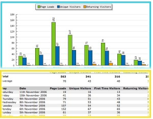
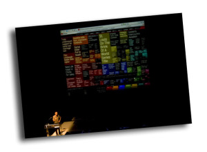
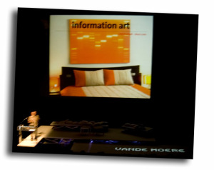
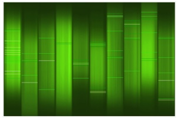
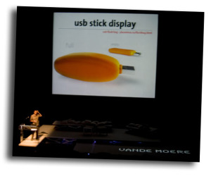
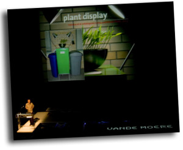
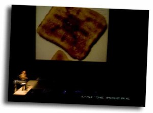

Como ya sabéis, a mi me interesa mucho las conferencias que se realizan los viernes en [Art Futura 2006](http://www.artfutura.com/), que están enfocadas a la vida digital. Este año habían tres conferencias. Este primer post, está dedicado a la conferencia de Andrew Vande Moere.

[A](http://wwwpeople.arch.usyd.edu.au/~andrew/)[ndrew es un profesor](http://wwwpeople.arch.usyd.edu.au/~andrew/) de la [Universidad de Sidney](http://www.usyd.edu.au/), que tras la realización de su trabajo de doctorado alrededor de agentes de visualización de datos, decidió promover e impulsar el conocimiento sobre este campo mediante un Blog: [infosthetics.com](http://infosthetics.com/). Este blog es uno de mis preferidos, así como uno de los que tiene más repercusión en la llamada blogesfera. En el confluye el arte con el conocimiento del mundo mediante el análisis de todo tipo de datos. ¿Cómo lo hace? En infosthetics.com se presenta los diferentes proyectos que surgen en la red que a partir de un conjunto de datos (demográficos, sociales, políticos, científicos, etc etc) que se pueden encontrar en páginas web, bases de datos públicas o privadas, o mediante una interacción directa del internauta, realizan una representación visual de la información contenida. ¿Por qué es importante la representación visual? Lo bonito entra mejor, y la información no es una excepción.

Os pondré un ejemplo bien sencillo:

Los de arriba son los datos de visitas a mi querido blog durante la semana. En el recuadro azul, una representación gráfica de los datos. En el recuadro naranja, lo datos sin más. ¿Cuál de los dos recuadros creéis que consulto más? Sin duda el azul. Ahora bien, con gráficos “PowerPoints” como mi ejemplo, el blog de Andrew no sería muy interesante. Venga, os pongo un ejemplo extraído de la conferencia. ¿Cómo proporcionar la información de cual es la posición de cada palabra inglesa respecto a su frecuencia de uso?. Conectad a [WordCount](http://www.wordcount.org/main.php) y entenderéis a que me refiero.  
  
¿Véis por donde van los tiros? Así pues primer bloque de la presentación en Art Futura, lo dedicó a explicar esta necesidad de la representación visual, usada en todos los campos científicos y sociales dada la complejidad de la información que se genera. De esta forma, Andrew comentó muchos ejemplos, de los que os adjunto 4 de ellos:

-   Sin salir del campo de la información en las palabras, enseñó [Color Project](http://loop.aiga.org/resources/loop/loop9/colorproject/colorcode.html), una gran representación interactiva de la relación entre todas las palabras según su significado.
-   El proyecto [TextArc](http://www.textarc.org/), donde se puede observar las relaciones entre las palabras de diversas obras literarias como son [Hamlet](http://www.textarc.org/Hamlet.html)[Alicia en el país de las Maravillas](http://www.textarc.org/Alice.html)
-   [Swarm](http://labs.digg.com/swarm/), una curiosa representación en tiempo real de las noticias que los [diggers](http://www.digg.com/) van ponderando
-   La página [NewsMap](http://www.marumushi.com/apps/newsmap/newsmap.cfm) que es un mapa gráfico espectacular con las noticias más importantes que están aconteciendo

A parte de los proyectos en si, Andrew comentó algunas de las herramientas informáticas usadas para la generación de estas representaciones. Este apartado me pareció muy interesante porque yo las desconocía totalmente. Comentó tres herramemientas: [Processing](http://processing.org/) , [Max/MSP](http://www.cycling74.com/products/maxmsp) y el [VVVV](http://vvvv.org/tiki-index.php). Todas ellas se pueden bajar y probar, aunque su uso requiere un cierto conocimiento informático.

Este primer bloque, representó la primera media hora. La siguiente media hora se centró en dos bloques. Uno en referente al impacto artístico de la representación de datos. Y es que las fuentes de la información, los datos, parecen provenir de un mundo caótico, desordenado pero según como se interpreten muchas veces consiguen una estraña belleza. Andrew nos recordó tal asemejanza con los [fractales](http://es.wikipedia.org/wiki/Fractal), estructuras matemáticas que a partir de unas reglas muy sencillas y sin aparente capacidad de crear nada interesante son capaces de generar [imágenes de una compleja belleza](http://flickr.com/search/?q=fractals&w=all). Con los datos pasa lo mismo, y os pondo un ejemplo de la misma conferencia. [web2dna](http://www.baekdal.com/web2dna/) es una aplicación que crea el DNA de tu página web a partir de la información que encuentra, como los links, las imágenes. Cómo podéis ver, su utilidad no parece muy grande más que para hacerse un bonito cuadro. Ja, pero los creadores de esta aplicación han rizado el rizo y tienen una tienda en internet que te envían la imágen enmarcada para que la puedas colgar en la pared de tu casa. Oh… negocio…$$$ parece más interesante ahora, eh? 😉 De momento, yo no me voy a poner un DNA del blog en mi casa, pero si os pica la curiosidad aquí lo tenéis:

Y para finalizar, el último bloque se centro más en la interacción entre el hombre y la máquina, recordándome a la conferencia del año pasado de [Hiroshi Ishii](http://lluisr.blogspot.com/2005/10/art-futura-2005-hiroshi-ishii.html). Andrew Vande Moere explicó diversos proyectos en fase embrionaria relacionado con tal interacción. Algunos de estos proyectos fueron [un coche que cambia de color según el estado de ánimo del conductor](http://infosthetics.com/archives/2005/04/mood_car_lights.html), una tostadora que te dibuja la predicción del tiempo en la misma tos  
tada, una planta que crece hacía un lado o otro en función si las personas que están a su lado son más o menos ecológicas o un dispositivo de memoria USB que se hincha cuanto más ficheros contenga.

Este bloque ya fue un poco surrealista, pero muy divertido, perfecto para acabar la gran conferencia, y quien sabe, quizá un avance de lo que nos encontraremos en el mañana.