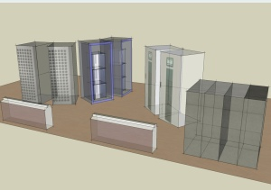
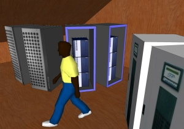

Os voy a hablar un poco más del [Centro de Procesos en Grid](http://lluisr.blogspot.com/2006/10/citilab-can-suris-centro-de-procesos.html). Este no tan sólo estará formado por servidores. Para proporcionar los servicios de telefonía IP, videoconferencia, comunicaciones externas, wifi y otros servicios del edificio Can Suris del Citilab Cornellà se necesitan de muchos otros sistemas, que igual que los servidores se colocan dentro de un rack, o armario para tenerlos bien recogidos. De estos sistemas de telecomunicaciones os hablaré más adelante.

Pero ahora os quiero hablar del SAI. El [SAI o sistema de alimentación ininterrumpida](http://es.wikipedia.org/wiki/SAI) es una electrónica que permite que todos los sistemas informáticos estén salvaguardados de alteraciones eléctricas. Por ejemplo, cuando hay un apagón, el SAI se encarga de proporcionar electricidad con total transparencia a los sistemas informáticos. O en las subidas y bajadas de tensiones, que son muy peligrosas para los componentes electrónicos, el SAI las elimina proporcionando siempre una electricidad estable. Hay muchos tipos de SAI, desde uno par el ordenador personal hasta aquellos que trabajan con los sistemas informáticos de todo un edificio. Va en función fundamentalmente del potencial eléctrico con el que se quiere trabajar.

Para el Citilab Cornellà, de momento partimos de 40 kV mediante un modelo de [Riello](http://www.riellogroup.com/). Este es un SAI de dimensiones medianas, como un armario, conectado a un conjunto de baterias, que suman un centenar para nuestras instalaciones.

Todos estos sistemas, más el aire acondicionado estarán situados en el CPG. De momento, os dejo unas imágenes virtuales (dado que se está montando a trozos en diferentes laboratorios) de una propuesta inicial de como vamos a realizar el CPG en la habitación habilitada para ello:

Estas representaciones virtuales las hemos creado con el programa gratuito [Google SketchUP](http://sketchup.google.com/). Este software es el usado para la creación de los edificios en [Google Earth](http://maps.google.com/), y permite generar escenarios exteriores e interiores con relativa facilidad. Si queréis el fichero SketchUP con nuestro CPG, para jugar con él, aprovechar los modelos creados, o dar un paseo virtual (aunque sea una habitación muy chica), lo podéis descargar aquí (recordad de bajaros el programa en [Google SkethUP](http://sketchup.google.com/)):

[CPG – Citilab Cornellà](http://lluisribes.googlepages.com/CPG-CitilabCornella.skp)

Ah, y si queréis una instalación de sistemas como la del Citilab pero más cañera (ni mejor ni peor, solo diferente) podéis visitar [la web del MareNostrum](http://www.bsc.es/plantillaA.php?cat_id=200), del [Barcelona Super Computing](http://www.bsc.es/), situado en Barcelona. Simplificando mucho, es una sala con más de 2000 ordenadores (cada uno de ellos puede funcionar como si fuera 4) funcionando conjuntamente y a toda máquina.