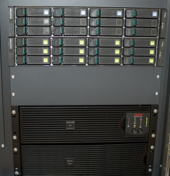
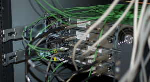
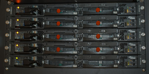

Los servidores del Citilab Cornellà que gestionarán la informática en el edificio Can Suris ya tienen electricidad fluyendo entre sus circuitos. En el [último post sobre estos servidores](http://lluisr.blogspot.com/2006/10/citilab-can-suris-centro-de-procesos.html) os presenté todas las máquinas, aún montándose en el armario, y quedaba la SAN para montarse, la cual ya está lista.

La [SAN](http://es.wikipedia.org/wiki/Storage_area_network) es una red informática que tiene como único objetivo crear un espacio de almacenamiento de datos de altas prestaciones. Esto lo consigue interconectando en una red tantos discos duros como se necesiten para llegar a la capacidad de almacenamiento deseado. Las altas prestaciones se podrían resumir en:

-   Gran capacidad de almacenaje, por ejemplo 1000[GB](http://es.wikipedia.org/wiki/Gigabyte), 10000GB, 100000GB o más. En Citilab Cornellà, a día de hoy tenemos 2500GB (2,5 [TB](http://es.wikipedia.org/wiki/Terabyte))
-   Alto rendimiento de acceso a los datos. Para que la red no sea un cuello de botella, se usan redes de altas prestaciones basadas en fibra.
-   Clustering, o la capacidad de soportar redundancia. En caso de fallo de alguno de los componentes, automáticamente se autoconfigura para intentar disminuir el impacto del fallo. De esa forma, fallos puntuales (en algún cable de la red, o en un disco duro) no repercute en la actividad normal del sistema.
-   Escabilidad, o la capacidad de crecer rápidamente sin perder ninguna de las características comentadas.
-   Trabajo a bajo nivel, es decir, que a efectos del administrador, y por supuesto del usuario, el SAN se comporta como un único sistema de almacenamiento.

Os incluyo un par de imágenes de la SAN del Citilab Cornellà:

Esta primera foto es la parte frontal de la SAN. Como véis, en nuestro caso son dos cajas que puede albergar 24 discos duros de diferentes capacidades. Por cierto, en esta foto podéis ver en la parte inferior el [SAI](http://es.wikipedia.org/wiki/SAI) del armario.

La segunda foto, es la parte posterior, donde podéis apreciar el cableado. En este caso, todos los discos están interconectados entre ellos con buses, que son circuitos electrónicos, dado que están todos en un espacio físico reducido. Pero si os fijáis, salen unos cables verdes hacia arriba. Estos son las fibras ópticas que van al servidor, el encargado de procesar los datos. Sin estos cables verdes, el servidor tendría un acesso a los datos deficiente, algo así como tener un camino forestal donde se necesita una autopista.

Por último os incluyo otra foto, de algunos de los servidores Mercury con los [leds](http://es.wikipedia.org/wiki/LED) encendidos. Actualmente estamos instalando el [sistema operativo](http://es.wikipedia.org/wiki/Sistema_operativo), o el software básico para que las máquinas funcionen:

