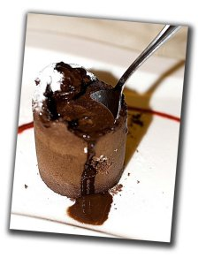

He oído del [Coulant de Chocolate](http://www.chefuri.com/recetas/ver.php?id=22&cat=repostero) como el mejor postre que existe en el planeta tierra. Este postre fue creado por el chef [Michel Bras](http://www.michel-bras.com/) y he tenido el placer de probar uno que se inspira en él. ¿Cómo era? No hay mucho que explicar, más lo que podéis ver en la foto del inicio del comentario.

Y es que de aproximaciones de Coulant de Chocolate hay muchos, tantos como chefs de cocina existen, y os recomiendo que probéis el que probé en un restaurante de [Lleida](http://www.paeria.es/), llamado Ambrosia.

Ambrosia está situado en la misma capital de Lleida, en frente del Turó de Gardeny. Tiene una muy buena cocina mediterranea moderna, pero sin excesos de diseño. Las personas que trabajan en él son jóvenes, incluído el chef y se nota en la frescura de sus platos. El restaurante es agradable y grande, y aunque no tenga parking y que cuesta un poco aparcar por la zona, no os dejo de recomendar a que lo probéis.

Ambrosia  
Càtering

Cardenal Cisneros, 30  
25003 LLEIDA  
tel. (+34) 973 28 16 53  
[Google Earth](http://maps.google.es/maps?f=q&hl=es&amp;q=cardenal+cisneros,+lleida&ie=UTF8&amp;amp;amp;amp;amp;z=16&ll=41.610565,0.608368&spn=0.009658,0.023518&om=1)