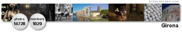
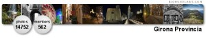
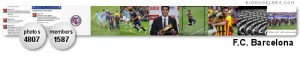
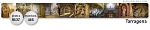
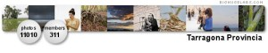
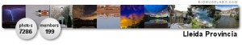

Alguna vez os he hablado de [flickr](http://flickr.com/), un lugar en la web donde compartir tus fotografias. Una de las posibilidades que te da es la crear grupos, donde otros usuarios pueden participar subiendo fotos y comentarios. Normalmente los grupos se crean alrededor de una temática y con unas reglas básicas que el administrador o administradores crean. A partir de este punto, los usuarios que descubren el grupo por invitación o por saltos en la [red social](http://en.wikipedia.org/wiki/Social_network) de flickr, si están interesados se apuntan.En mis primeros 9 meses en flickr hemos creado unos cuantos grupos que cubren unos espacios que se encontraban a faltar, muchos de ellos relacionados con [Catalunya](http://es.wikipedia.org/wiki/Catalu%C3%B1a).  
El primero fue el [grupo de Girona](http://flickr.com/groups/girona/). Yo ya tenía un montón de fotos de esta bella ciudad y en cambio no había ningún lugar específico para ella. Se creó con el objetivo de recoger fotografías con una relación directa con la [ciudad de Girona](http://es.wikipedia.org/wiki/Gerona). Es de los grupos más activos de los creados, y actualmente tiene 84 miembros y 623 fotos.

Posteriormente creé el [grupo Girona Provincia](http://flickr.com/groups/gironaprovincia/). Tras la creación del grupo Girona, hubo muchas personas que sentían la necesidad de colgar fotos relacionadas no con la ciudad, sino con sus alrededores y la provincia en general. Lógico, la [provincia de Girona](http://es.wikipedia.org/wiki/Provincia_de_Girona) es una auténtica mina de fotos, hay una gran variedad de lugares increíbles. Así pues de creó el grupo, que hoy tiene 55 miembros y 731 fotos.

El siguiente [grupo fue Catalunya Natura](http://flickr.com/groups/catalunyanatura/). Este grupo lo creamos [Santi](http://flickr.com/photos/santi_rf) y yo mientras hacíamos nuestros PFC en las salas de ordenadores de la [facultad](http://www.fib.upc.es/). Y es que da para mucho esos momentos. Es un grupo para colgar fotografías relacionadas con la naturaleza de Catalunya. Existían ya grupos de Catalunya, algunos de ellos con una fuerte connotación política que no nos acaban de convencer para colgar fotos de la naturaleza. Solución, crear un grupo que a día de hoy son 68 grupos y 746 fotos.

Más grupos. El siguiente salió también haciendo el PFC, y es uno de los pocos lugares donde disfrutar de imágenes de uno de los clubs de fútbol más grandes del mundo: el [F.C. Barcelona](http://www.fcbarcelona.cat/). El [grupo FC Barcelona](http://flickr.com/groups/fcbarcelona/) ahora tiene 38 miembros y 120 fotos:

A raíz del éxito del grupo de Girona, inicié los grupos de [Tarragona](http://flickr.com/groups/tarragona), [Tarragona Provincia](http://flickr.com/groups/tarragonaprovincia/), [Lleida Provincia](http://flickr.com/groups/lleidaprovincia/) y [Barcelona Provincia](http://flickr.com/groups/barcelonaprovincia/). [Lleida](http://flickr.com/groups/lleida) y [Barcelona](http://flickr.com/groups/barcelona), ya tenían grupos propios:

Y para acabar el último grupo que inicié hace dos meses: [Tune Flickr ♫ (put music in your photos)](http://flickr.com/groups/tuneflickr) donde se puede colocar fotografías acompañadas de un link hacia una canción. Porque una canción puede aumentar la dimensión de una foto, y al revés. Es la unión de dos artes que se complementan perfetamente:

[. Get yours at bighugelabs.com/flickr")](http://flickr.com/groups/18286603@N00/)

Y así es como en unos meses hemos creado un pequeño fondo documental fotográfico, en parte de Catalunya, que no para de crecer. Un fondo fotográfico creado por los cientos de miembros que de forma voluntaria y con las ganas de compartir fotos, ideas, comentarios, relaciones están creando fotos y colgándolas en Internet, en definitiva fabricando cultura. Y a pesar que todas las fotos tienen sus derechos de autor, algunas de ellas están bajo licencia [Creative Commons](http://es.creativecommons.org/) que permite que las podáis copiar, usar y hasta modificar para vuestras necesidades. Caray, que divertido es crear cultura!Voy a dejar unos links en la zona de links del Blog donde podréis activar pases de diapositivas de los diversos grupos para que disfrutéis y aprendáis de todos las hermosas instantáneas que la gente está compartiendo.

A jugar!