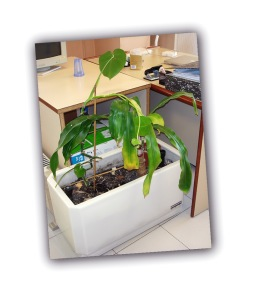

Hola,

El viernes pasado apadriné dos plantas [en mi trabajo](http://lluisr.blogspot.com/2006/09/vuelvo-la-accin.html). Estaban en un mismo tiesto en una habitación de 5 m2, solas, sin agua, con apenas un poco de luz que se filtraba entre la persiana de madera y con el aire acondicionado encendido. Así estuvieron durante cuatro meses hasta que me las he llevado a mi puesto de trabajo.

Ahora le damos luz, agua y lo más importante, compañía y nos lo agradecen con un tono cada día más verde en sus hojas y un aspecto menos tétrico. He dicho damos, porque la estoy cuidando juntamente con la ayuda de mis compañeras del departamento de educación quienes les agradezco ese cariño. Quienes me conocéis, sabréis que no soy un experto en plantas y aún menos un entusiasta, pero intentaré que crezcan con fuerza.

Ahora les falta un nombre a cada una de ellas, por tanto abro un concurso durante los siguientes días para que podáis proponer nombres para ellas. Os animo a sugerir dos nombres.

Os pongo una foto de ellas:  
Gracias