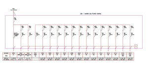

Poco a poco se va avanzando en [Citilab – Cornellà](http://www.citilab.eu/). A día de hoy y de momento no tengo muchas cosas más a explicar que cosas de perfil técnico. Pero es que me parecen muy interesantes.Hoy toca [electricidad](http://es.wikipedia.org/wiki/Electricidad). Una de las asignaturas que más encontré a faltar en [mi universidad](http://www.upc.edu/) fue alguna que tratara el tema de las [salas de procesamiento de datos](http://es.wikipedia.org/wiki/Centro_de_proceso_de_datos), más conocidas en la jerga informática como [neveras](http://flickr.com/photo_zoom.gne?id=29681158&size=o). Es aquella sala donde está situado el [servidor de la web](http://es.wikipedia.org/wiki/Servidor_web), el servidor de correo, el [servidor de red](http://es.wikipedia.org/wiki/Servidor_de_correo), los [switches](http://es.wikipedia.org/wiki/Switch) [de comunicaciones](http://es.wikipedia.org/wiki/Switch) etc etc. En todo edificio con un mínimo de servicios informáticos hay una, de más grande o menos y temas como la ventilación, la disposición y distribución física de los equipos, o el esquema eléctrico es fundamental diseñarlos bien para evitar problemas posteriores. Y lamentablemente, en la escuela no se trata nada de ello y normalmente estas salas van adaptándose a base de errores, que se solucionan sobre la marcha, si no es el caso que se contrate alguna empresa especializada para ello.  
En [Citilab – Cornellà](http://www.citilab.eu/) hemos tenido que estudiar estas 2 semanas pasadas el sistema eléctrico de la [Sala de Procesamiento en Grid](http://lluisr.blogspot.com/2006/10/citilab-can-suris-centro-de-procesos.html). Antes de continuar, un apunte. Todo circuito eléctrico tiene como mínimo dos protecciones:

-   [Diferencial](http://es.wikipedia.org/wiki/Diferencial_%28el%C3%A9ctrico%29): desconecta el circuito cuando una persona se enrrampa con el cable, disminuyendo un poquito las consecuencias de una electrocución…
-   [Magnetotérmico](http://es.wikipedia.org/wiki/Interruptor_magnetot%C3%A9rmico): desconecta el circuito cuando se poduce un cortocircuito o se sobrepasa un límite de potencia fijada (consumo por unidad de tiempo).

Visto el apunte, el problema a solucionar en Citilab – Cornellà es el siguiente. Hay que distribuir la electricidad entre 20 ordenadores como mínimo, que serán los que se intalarán en la sala. Para distribuir esta corriente se ha tenido en cuenta:

-   a) Todos los sistemas informáticos reciben electricidad de un [SAI](http://es.wikipedia.org/wiki/SAI). El SAI proporciona estabilidad en la corriente y corriente cuando hay un corte de luz. Para más información podéis leer este comentario: [Can Suris – El SAI y la habitación del CPG](http://lluisr.blogspot.com/2006/11/can-suris-el-sai-y-la-habitacin-del.html)
-   b) Los ordenadores generan residuos de corriente (corriente alterna que se va por la masa). Esto puede provocar que el diferencial salte de forma aleatoria. Para ello hay que instalar diferenciales superinmunizados.
-   c) Los ordenadores, sobretodo en la puesta en marcha pueden generar picos de potencia. Uno no pasa nada, pero unos cuantos pueden hacer que los magnetotérmicos salten. Para evitar este efecto se han adquirido magnetotérmicos de curva lenta.
-   d) En un lugar con decenas de ordenadores, si todos están conectado al mismo circuito y uno de ellos funciona de forma anómala y crea problemas eléctricos, las protecciones saltarán y todos los otros ordenadores se quedarían sin electricidad. Parece lógico crear circuitos independientes que agrupen conjuntos de ordenadores más pequeños. Nosotros hemos optado en tener dos circuitos por rack (unos 5 ordenadores por circuito).

Estos cuatro puntos son los ejes en que se centra nuestro cuadro eléctrico, la cajita que controla toda la electricidad en la sala. Desde mi punto de vista, el punto d) es el más importante, luego b), a) y c) por este orden.Para que veáis como queda el cuadro eléctrico de nuestro Centro de Proceso en Grid os incluyo el esquema recién salido del horno:

A simple vista puede parecer sobredimensionado para 20 máquinas pero hemos apostado por un cuadro con un margen de escabilidad generoso. A la izquierda vemos el circuito que alimenta el SAI (#900) que proporciona electricidad por el circuito #901 a los racks (#904-#916). Por último los circuitos #902 y #903 que llevan la electricidad a las dos máquinas de aire acondicionado.

Si queréis saber un poco más sobre los problemas eléctricos en una instalación derivados de los ordenadores os recomiendo leer: [adios\_a\_luz](http://redes.eui.upm.es/daniel/opiniones/adios_la_luz/adios_la_luz.html). He aprendido mucho en esta página.  
Y este es mi artículo casi del mes sobre [Citilab](http://www.citilab.eu/). Espero que algún día os pueda ser útil.  
—  
(nueva entrada relacionada): [Can Suris – El cuadro eléctrico finalizado](http://lluisr.blogspot.com/2007/04/can-suris-el-cuadro-elctrico-finalizado.html)