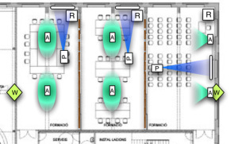
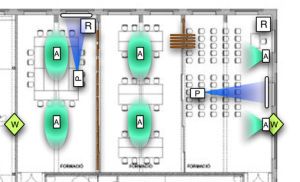
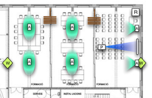

Os voy a hablar de uno de los espacios más importantes del Citilab – Cornellà: la sala de formación. Es una de las salas más grandes, con aproximadamente entre 300 y 400 m2. Su uso está enfocado a la formación y posee una disposición polivalente que posibilita mediante un sistema de mamparas que va de pared a pared creando una, dos o tres salas independientes en función de las necesidades.

La sala, indistintamente de su configuración proporcionará un sistema propio de proyección a cada una de sus divisiones que permitirá proyectar formatos como Dvd, Divx, Mpeg, entrada de ordenador y entrada de streaming por la red. También se está pensando permitir la repetición de señal de cualquier otra de las estancias del centro, como el auditorio o salas de proyectos creando algo que un amigo me dijo que lo llamaban “Over Floor” por los EEUU…Como podéis ver en los diagramas que adjunto al final de este comentario, la sala tiene dos paredes con ventanas que están enfocadas al norte. Las dos paredes restantes son de interior y una es de madera y otra de hormigón que tiene a cada lado las entradas. Uno de los mayores problemas ha sido la colocación de los dispositivos para cumplir con los requerimientos de la sala, y el problema se ha resuelto al puro estilo de las redes: han participado en el problema diversos actores que tienen funciones diferentes en el proyecto como son el técnico de sonido, el arquitecto, el aparejador, yo mismo y otros muchos que han ido proponiendo soluciones a las diversas complicaciones que surgían.  
El mayor inconveniente es la propia forma de las salas. Estas se crean con el sistema de mamparas y son rectangulares, más bien estrechas y no permite que la proyección se realice en el lado corto de forma óptima (hay que tener en cuenta el espacio de recogida de las mamparas, que crea un espacio útil aún más estrecho). De esta forma, la pantalla de proyección debería instalarse en la pared de ventana o en la pared de hormigón. La decisión final ha sido sobre la pared de ventana dado que en el lado de la pared de hormigón estará el paso de personas (en caso contrario, con la configuración de 3 salas, acceder a la del medio supondría “atacar” dos lados de alguna de las otras dos salas).  
La excepción al punto anterior es la proyección en la sala de la derecha (que es un poco más ancha). Esta sí que proyecta sobre el lado más corto, que vuelve a tener ventanas, ya que está pensada para que ofrezca la proyección cuando la configuración de la sala sea de una sola.

A pesar de estar las ventanas encaradas al norte, la luz que entra es importante y para minimizar los efectos de esta sobre la pantalla de proyección (más de uno estará sorprendido al enterarse de esta colocación tan singular), se dispondrán de cortinas, siendo las de las ventanas que tienen las pantallas de material foscurit que no permiten pasar la luz.

Posteriormente, se añadirán dos puntos de conexión wifi para dar una correcta cobertura de red inalámbrica (la colocación exacta depende de otros espacios del edificio) y los altavoces que deberán tener una colocación que aseguren un buen comportamiento para las múltiples configuraciones.

Aquí va un esquema sobre la planta con las diferentes configuraciones de la sala:  
(R=Fuente de la señal, A=Altavoces,P=Proyector,W=punto Wifi)

Configuración Salas 1/3

Configuración Sala 1/3 y Sala 1/2

Configuración Sala 1/1