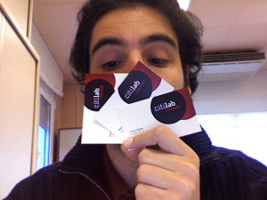

Hola,

Esta semana nos llegaron las primeras tarjetas de visita del [Citilab – Cornellà](http://www2.blogger.com/www.citilab.eu). Hace ilusión: son las primeras de la historia del Citilab – Cornellà y es una pequeña señal que va materializándose el proyecto.

El diseño de las tarjetas, juntamente con el logo ha sido diseñado por [Aymerich Comunicació](http://www.aymerich-comunicacio.com/index.htm), quien continua trabajando en otros puntos de la imágen del centro.