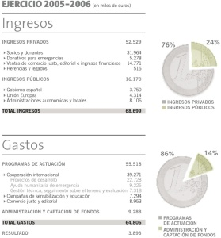

El pasado lunes se realizó la asamblea general anual de [Intermon Oxfam](http://www.intermonoxfam.org/) y ya han colgado los [respectivos resumenes de actuación en su web](http://www.intermonoxfam.org/page.asp?id=60&idioma=1&amp;cap=0702newsdi-02). Os recomiendo que leáis los informes porque en ellos se puede comprobar como se están realizando una gran multitud de proyectos en todo el mundo. En estos informes, podéis ver los objetivos que persiguen, el presupuesto y que terceras intituciones (Fundaciones, gobiernos, universidades) han participado de cada uno de los cientos de proyectos ejecutados en Asia, Am´rrica y África por IO.

Pero sobretodo es muy recomendable leer los informes para aprender en que situaciones macroeconómicas y sociales está cada país de los 38 donde IO realizan proyectos. Es como una pequeña clase de geografía actualizada, fundamental para entender un poco el mundo donde vivimos. En cualquier caso, también recomiendo para ello la web de [Amnistía Internacional](http://www.amnesty.org/).Quiero resaltar de los datos económicos de los informes, que me sorprende gratamente ver como de los 68 millones de euros de ingresos de este año pasado, el 76% de estos son de capital privado, y de los cuales el 33% son generados mediante el comercio justo:  
A continuación os dejo un enlace personal a los informes:

-   [Memoria IO (2006)](http://lluisribes.googlepages.com/Memoria.pdf)
-   [Resumen económico IO (2006)](http://lluisribes.googlepages.com/Resumen.pdf)
-   [Actividades en África (2006)](http://lluisribes.googlepages.com/Africa.pdf)
-   [Actividades en América (2006)](http://lluisribes.googlepages.com/America.pdf)
-   [Activadades en Asia (2006](http://lluisribes.googlepages.com/Asia.pdf)

Y el enlace original de la página de IO: [Memoria Anual](http://www.intermonoxfam.org/page.asp?id=60&idioma=1&amp;cap=0702newsdi-02)