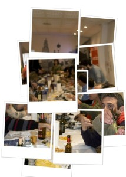
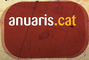

La historia de mi línea casera (nunca mejor dicho) de internet sigue igual. De mientras os dejo un par de comentarios en el blog.

Primero, las fotos que realicé de la [III Calçotada Popular en Sueca](http://calcotadasueca.blogspot.com/):  
Segundo, si os interesa la actualidad, el periodismo y las noticias de los últimos años, visitar la siguiente web:

Es una pequeña hemeroteca catalana en desarrollo con una recopilación de las noticias más revelantes de los últimos 12 años. Las noticias provienen del fondo de la [Fundació Catalunya](http://www.fundaciocatalunya.org/) que recoge artículos de los diarios “[Avui](http://www.avui.cat/)” y “[El Periódico](http://www.elperiodico.cat/)“.