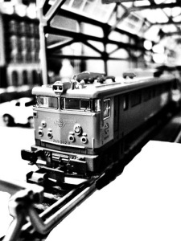

[RENFE](http://www.renfe.es/) es la antigua compañía de trenes del estado de España, actualmente privatizada y que sigue manteniendo la principal infraestructura de convoyes y lineas del país (aunque las vías y el mantenimiento está bajo otra empresa [ADIF](http://www.adif.es/)). Desde hace años, y antes que se privatizara inclusive, el servicio de trenes regionales en Catalunya (trenes de un recorrido de 100-200km) deja mucho que desear. Y no estoy referiéndome a las [rodalías de Barcelona](http://www.renfe.es/cercanias/barcelona/index_horarios.html), que durante estos meses ha sido el foco de atención de todos los medios de comunicación locales por los problemas en su funcionamiento, sino [aquellos trenes que circulan por Tarragona, Lleida y Girona y que con una configuración de estrella en los recorridos, siempre acaban pasando por Barcelona](http://www.renfe.es/mediadistancia/md_catalunya.html).

Os incluyo un caso concreto de [El Agradable](http://www.flickr.com/photos/agradable/), que creo que resume bien lo que pasa a menudo en los regionales catalanes: poca información y abandono en la atención al cliente y averías aleatorias:

[RENFE – A SPANISH DISASTER](http://www.flickr.com/photos/agradable/449674909/in/photostream)