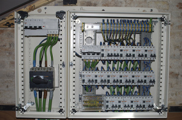

El cuadro eléctrico de la sala de informática del edificio de Can Suris del [Citilab Cornellà](http://www.citilab.eu/) ya está listo. Lo ha realizado la empresa VELME y os dejo una foto interactiva:

Para aquellos que quieran saber un poco sobre este cuadro, su función, su diseño etc, visitar el artículo anterior: [Can Suris – El cuadro eléctrico](http://lluisr.blogspot.com/2007/01/can-suris-el-cuadro-elctrico.html)