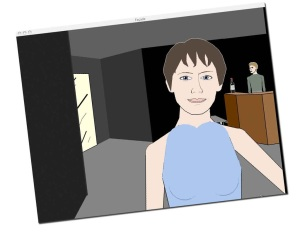

Hola,

Façade ¿es un juego… o un drama interactivo? Este pequeño juego creado por [Procedural Arts](http://proceduralarts.net/) te permite estar en la piel de uno de los amigos de Trip y Grace, una pareja que no está pasando por sus mejores momentos. Trip te invita a pasar un rato por su apartamento cuando está Grace. Tu aceptas y te presentas delante de la puerta de su apartamento. A partir de ese momento, lo que va a pasar dependerá en gran medida de lo que hagas.

El juego tiene un entorno tridimensional, sencillo pero muy efectivo donde puedes interactuar con los personajes por ejemplo hablándoles o con los objetos (no pude resistirme a tomar una copa de vino). Mediante un sistema de inteligencia artificial los personajes van reaccionando a tus palabras, tus gestos o acciones y se va creando dinámicamente una historia. Una de las cosas que para mi diferencian este juego de otros similares es lo bien logrado que están los gestos de los personajes, que expresan de forma muy natural sus sentimientos.  
Está [disponible tanto para Windows como para Mac](http://www.interactivestory.net/), y si tenéis 20 minutos libres os recomiendo que lo probéis.  
Comentaros para finalizar que hace unos días [os hablé del e-learning y sobre los juegos de simulación y como se aprende jugando](http://lluisr.blogspot.com/2007/03/el-juego-no-es-tan-solo-un.html). ¿Os imagináis usar este tipo de juegos para mejorar tus amistades? ¿O como terapia para ganar en seguridad en tus relaciones? Quizás Façade es un ejemplo un tanto lejano, pero sí que es un primer contacto que permite pensar que este tipo de juegos correctamente adaptados tienen mucho juego (nunca mejor dicho). Si os parece interesante leer el siguiente artículo de la revista [The Atlantic](http://www.theatlantic.com/): [Sex, lies and Video Games](http://proceduralarts.net/atlantic/)