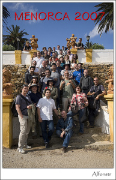
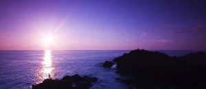

Ya hemos vuelto de Menorca!

Quería escribiros desde el hotel, pero el primer intento fue desesperante y hacer funcionar el blog en mi portàtil con la conexión Wifi que tenía era poco más que desesperante…

En resumen, Menorca es un lugar donde el tiempo pasa muuuuuuy lentamente, hasta para la conexión de internet.  
Bueno, para comenzar os dejo una foto de todo el grupo tomada por [Alfons](http://www.flickr.com/photos/alfonstr/):

Estuvimos los cuatro días alojados en un hotel de Cala Galdana, desde donde partíamos tras un buen desayuno a las diferentes excursiones. Hubo un montón y muy variadas: salidas de sol, puestas de sol, sociales, playas, barrancos así como las que cada uno se montaba por su cuenta.

La mejor excursión fue la salida de sol al faro de Favaritz. La noche anterior estabamos todo el grupo tomando unas cocas menorquinas en la terraza del hotel a la vez que la organización concretaba esta salida. Ahora bien, 5 de nosotros, [Fran](http://flickr.com/photos/johan14), [Jordi](http://flickr.com/photos/xip), [Alfons](http://flickr.com/photos/alfonstr), [Víctor](http://flickr.com/photos/45street) y yo queríamos estar en el faro antes que el propio sol y nos obligaba salir una hora antes de la hora oficial de la organización. A las 04:45 levantados todos, y a las 05:05, los cinco embutidos dentro de un Opel Corsa dirección Favaritz. Para ello cruzamos gran parte de la isla y a las 06:10 plantábamos los trípodes…  
  
Pero las otras de la organización no desmerecieron para nada y tengo un especial reconocimiento a Pere, el organizador y a todos los que estuvieron implicados así como al pueblo de Ferreríes. Nos acogieron estupendamente, y espero corresponderles a todos con mis fotos.  
Gracias,