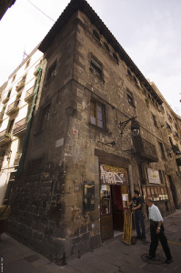
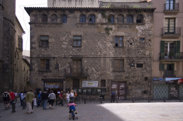
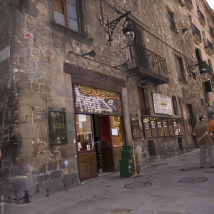
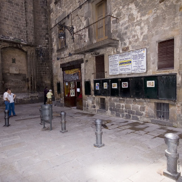

Plaça del Pi 1, Barcelona. La estamparía más antigua de la ciudad ha cerrado. Hoy estaban retirando las últimas obras del local. No se si conociais esta tienda pero parece que tenía mucha historia y por un desinterés del propietario del inmueble (no de la tienda) va a desaparecer.  
Os dejo unas fotos del que quizá ha sido su último día de vida:

  
  
  
  
