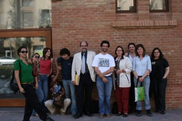

El miércoles visitó un grupo de estudiantes de doctorado de antropología de la [UB](http://www.ub.edu/) el Citilab – Cornellà. Les realicé la visita del edificio (la antigua fábrica téxtil Can Suris) que está a punto de finalizar su fase de rehabilitación y realmente fué una de las visitas que más disfruté dar. Todos ellos se interesaron mucho por el proyecto, preguntando y preguntando, tomando notas e interesándose por los detalles.

Espero que aprendieran mucho sobretodo de aspectos técnicos y conceptuales del uso de los espacios, tanto como nosotros podremos aprender de ellos del conocimiento del ser humano en su entorno.

Os dejo una foto que improvisamos al finalizar la visita.  
