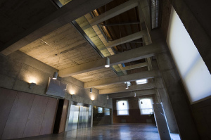
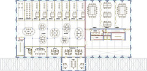
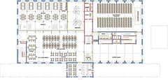

Ya hace un mes que estamos situados en el edificio de Can Suris. Todavía no está operativo ni finalizado pero ya se puede apreciar el resultado final de las obras. Os dejo unas cuantas fotos de su interior para que podáis contemplar algunos de los espacios que albergará el edificio del proyecto Citilab – Cornellà.

[Fotos en flickr](http://flickr.com/photos/citilab)  
[Fotos en Panoramio](http://www.panoramio.com/user/672019)  

También, si hacéis click sobre los dos siguientes planos accederéis a un pequeño mapa interactivo donde podréis guiaros sobre planta donde se sitúa cada una de las fotos en el edificio:

La rehabilitación de la antigua fábrica está siendo dirigida por Julià Arquitectes Associats.