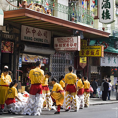

Llegando por la 101 con el [Shuttles](http://www.sftravel.com/shutl.html) a la tarde se me presentaba una ciudad industrial. El skyline estaba cubierto de una niebla que pareceía polución, gris sin luz y para colmo un tránsito como las de las rondas de Barcelona pero con el doble de carriles. Ugl… me daba la sensación que iba a pasar una temporada en una metalúrgica robotizada. Menos mal que en el shuttler conocí a un tipo (un IT en [SAP](http://es.wikipedia.org/wiki/SAP), quién lo iba a decir) de la ciudad que me explicó que aquello no era polución sino la niebla típica de estos días y que la ciudad está muy bien. Paciencia Lluís, paciencia.

Una vez llegado a los apartamentos, me atendieron muy bien en recepción y me comencé a dar cuenta que practicamente no existe un primer trato de distancia entre desconocidos y las relaciones con el cliente son siempre muy atentas. Llave en mano me fuí directo a la cama, había volado 12 horas desde Munich y llevaba 22 horas sin descansar en condiciones.  
Yo no tengo fe en el [“Jet-Lag”](http://en.wikipedia.org/wiki/Jetlag) y siempre me pasa lo mismo y nunca me escapo. Resultado, la primera mañana fuí el primero en entrar en el comedor alrededor de las 7:00 de la mañana para tomar el desayuno.  
Con el desayuno entré de lleno en el estilo americano de vida. Cada mañana hay tres cajas de 60 cm llenas de bollería. Una bollería que no tiene nada que ver con aquella que encuentras en los supers de Barcelona envueltas en plástico. Croissants grandes como la luna, madalenas como la palma de la mano y de todos los sabores, donuts como los que come Homer y otras delicias. Y a pesar que la bollería tiene pinta de ser industrial, está recién hecha y buenísima, guau!. Ahora bien, todo dulce, nada salado ( donde está ese embutido sobre una “llesca de pa amb tomàquet”? 🙁 ). Y como no, el termo de café y vasos XXL para llenarlos hasta arriba.  
El desayuno del apartamento se toma en el ático donde se puede observar los edificios de la ciudad, auténticas moles bien alineados, limpios con sus escaleras de emergencia y varios de ellos con la bandera americana ondeando en lo alto. Tal como en las películas, solo falta Spiderman saltando entre ellos.  
Ya en la calle me dirigo a [Market Street](http://en.wikipedia.org/wiki/Market_Street_%28San_Francisco%29). Viene a ser una [Avenida Diagonal](http://en.wikipedia.org/wiki/Avenida_Diagonal) pero en San Francisco, aunque mucho más estrecha. Lo curioso es que a pesar de ser relativamente estrecha con los grandes edificios que están en ella no da sensación de claustrofobia. No se que es, quizá el hecho de que no hay árboles, pero te sientes cómodo no es agobiante, curioso. Bien, esta diagonal de 5km, cruza la ciudad desde la estación de ferrys (por donde pasaban más de 100.000 personas cada día antes de la construcción del [Golden Gate](http://en.wikipedia.org/wiki/Golden_gate)) y el distrito financiero hasta [Castro Street](http://en.wikipedia.org/wiki/The_Castro) (punto central de la comunidad gay). La zona por la que me muevo es la del distrito financiero y me sorprende como se mezclan gente muy distinta como los sin techo (hay muchos), las familias de corte tradicional, chavales con un estilo hip hop, yuppies con sus trajes impecables, entre otros de forma muy natural, sin molestarse entre ellos.  
La ciudad, más allá de esta faceta cosmopolita y de su gran ingeniería urbanística, no me sorprende, de momento.  
Para buscar un poco de contraste me dirigo al [Chinatown](http://en.wikipedia.org/wiki/Chinatown). Y allí comienzo a entender la ciudad. San Francisco son ciudades dentro de una ciudad. El Chinatown tiene poco que ver con el distrito financiero anterior. Toda la gente es china, solo se oye hablar mandarín y cualquier excepción a esta regla es un turista como yo. No hay ni un solo vagabundo y está a rebosar de tiendas que venden muchos artículos de bisutería y ropa. Mención especial sus mercados, situados al norte del barrio, donde puedes encontrar todo tipo de productos entre ellos frutas y legumbres que no había visto todavía en la ciudad. Y lo mismo pasa con el JapanTown, o el Theater District, ciudades dentro de una ciudad…  
Al mismo tiempo que comienzo a entender San Francisco, la niebla matinal se levanta, el sol entra con fuerza e ilumina la hasta entonces ciudad gris. Las calles se van llenando de más gente y la ciudad parece cobrar vida y te das cuenta que estás en una gran ciudad que esconde muchas cosas a descubrir. Me comienza a gustar, no te sientes extraño, la gente va a su bola pero si quieres puedes entablar conversación. Como os he dicho la atención al público es muy atenta y los trabajadores de los servicios públicos como conductores de buses, policía etc son especialmente atentos y te ayudan con mucha amabilidad.  
También me gusta la cantidad de pequeños comercios que hay por todos los barrios: cada portal tiene un comercio, de restauración (hay muchos 🙂 🙂 ), ropa y souvenirs, lavanderías, supermercados, tiendas artesanales… Creía que me iba a encontrar con una ciudad poco comercial, con algún [“gran Shopping Mall”](http://en.wikipedia.org/wiki/Shopping_mall) pero no, el comercio tradicional parece funcionar muy bien y es de agradecer. Y es curioso, porque a la vez contrasta con algunos comercios o hoteles de lujo, que están puerta a puerta con los tradicionales más modestos, donde aparcan limosinas de dimensiones estratoféricas (a lo largo, a lo ancho y hasta a lo alto) y donde hay un mozo que guarda en la puerta con uniforme de película.  
Me gusta, me siento bien en la ciudad a pesar que creo no haber visto practicamente nada de ella. Así pues, manos a la obra, os dejo que voy a dar una vuelta.

