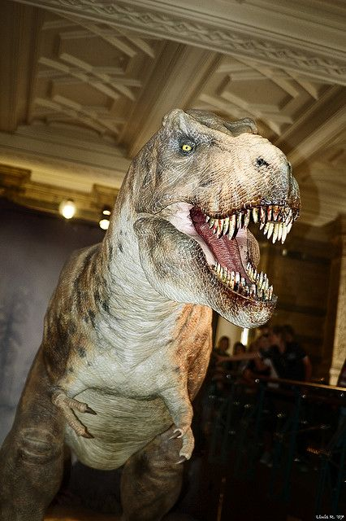

¿Para qué sirve compartir? Para construir.

¿A qué viene esto? Durante la semana pasada, Deborah, editora del blog [Life in the Fast Lane](http://www.lifeinthefastlane.ca/) donde habla de cosas relacionadas con la ciencia [realizó un artículo sobre lo rápido que era el dinosaurio T-Rex](http://www.lifeinthefastlane.ca/scientists-reveal-tyrannosaurus-rex-would-outrun-football-player/offbeat-news) hace muchos años atrás… Necesitaba una foto del dinosauro en cuestión, y la buscó entre las millones de fotos con licencia [Creative Commons](http://es.creativecommons.org/) que hay en internet. Y encontró una mía, del Museo de Historia Natural Británico. La foto es una réplica a escala real y animada de un T-Rex que tienen el museo y la ha usado para su blog.  
Deborah podría haberla copiado y usado sin más, pero siguiendo el espíritu de la blogosfera y respetando la licencia Creative Commons insertó en el artículo un enlace al autor de la foto, en este caso yo. Y siguiendo este espíritu así de bien le va el blog:  
[http://www.technorati.com/blogs/www.lifeinthefastlane.ca](http://www.technorati.com/blogs/www.lifeinthefastlane.ca)  
gracias Deborah