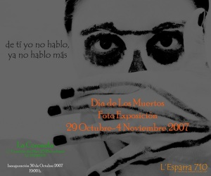

L’Esparra 710 somos un grupo de amigos fotógrafos que nos conocimos a través de [flickr](http://www.flickr.com/). Estamos a unos días de inaugurar nuestra primera exposición con motivo del día de los difuntos.El evento lo realizamos en un lindo restaurante mejicano situado al final de la Vía Layetana:

La Coronela  
Carrer Consulat del Mar, 25  
Barcelona

y la inauguración será el próximo Martes día 30 de Octubre. Os esperamos a todos los que queráis compartir nuestro bautizo como expositores.