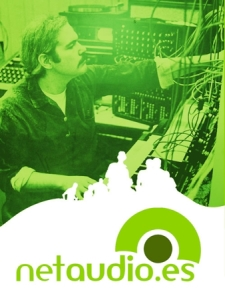
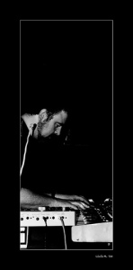

[Netaudio](http://netaudio.es/) es el primer encuentro nacional para reflexionar sobre el futuro de la nueva industria discográfica. Esta nueva industria cuestiona los mecanismos tradicionales de difusión y distribución de los productos audiovisuales.

No se si voy a poder asistir, por culpa de una afición como es la fotografía que me quita mucho tiempo (bueno, en realidad me regala momentos preciosos). Pero comparto la filosofía del Netaudio y los netlabels (sus participantes). Creo en sistemas de derechos de propiedad intelectual como [Creative Commons](http://es.creativecommons.org/) que permiten de una forma rápida, eficaz, concreta y económica proteger tus obras. Ello permite su rápida distribución en una red tan compleja como Internet, y promocionarte sin tener que hipotecar tu carrera a sociedades como la [SGAE](http://www.sgae.es/).El mundo de la creación musical no lo toco. Solo dos piezas mías han salido a la luz como música para acompañar mis dos videos sobre [Theo Jansen](http://www.strandbeest.com/) ( [“Strandbeest – Theo Jansen”](http://www.youtube.com/watch?v=sNA_bd0b1bw) y [“Animaris Rhinoceros – Art Futura 2005”](http://www.youtube.com/watch?v=muxfaOxUsgg)). Pero me gusta y me fascina proyectos como [Jamendo](http://www.jamendo.com/) y [Magnatune](http://magnatune.com/) así como el último disco de [Radiohead](http://www.radiohead.com/) y su [original forma de venderlo](http://www.ghacks.net/2007/10/01/radiohead-is-trying-a-new-distribution-method/). Creo en ello, en facilitar la creación y distribución de música, fotos, textos, ideas, en definitva compartir y compartir. Eventos como el Netaudio seguro que ayuda a ello. Reflexionar discutir y hacer ruido sobre este tema es importante.  
Aquí os paso el programa del [NetAudio](http://www.op3n.net/en/): [Programa NetAudio](http://www.op3n.net/en/cas/index.php?display=programacion) El evento se realiza en [Barcelona](http://www.bcn.es/) , en el [CCCB](http://www.cccb.org/).  
También os dejo lugares donde obtener música libre de royalties o con derechos [CreativeCommons](http://es.creativecommons.org/):  
[betterPropaganda](http://betterpropaganda.com/)  
[inSound](http://www.insound.com/mp3/mp3s.php)  
[InternetArchive](http://www.archive.org/browse.php?collection=etree&field=/metadata/creator)  
[Jamendo](http://www.jamendo.org/)  
[Magnatune](http://magnatune.com/)