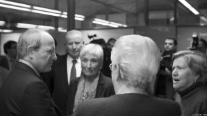
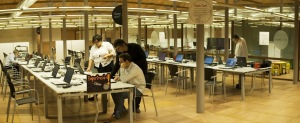
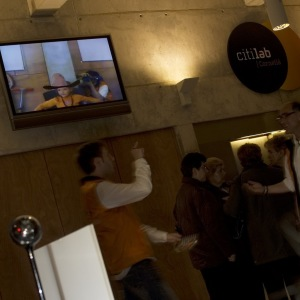
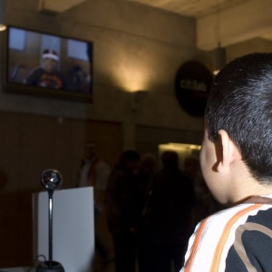
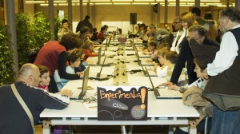
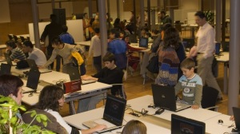
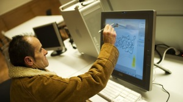
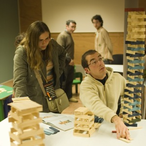
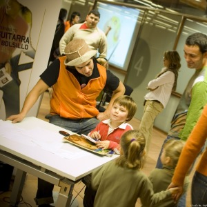
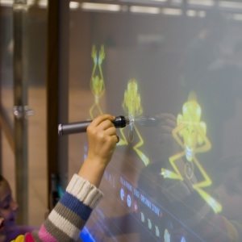

Hola,

voy a haceros un breve resumen, seguramente desordenado dado que tengo la cabeza como un bombo a estas horas.

El viernes se realizó el acto de inauguración. Destacar que éramos aproximadamente 400 personas. Entre ellas un pequeño comité que era el hijo y familiares del dueño de la fábrica Can Suris donde se sitúa el Citilab a día de hoy. Un siglo atrás, una fábrica téxtil, hoy una fábrica de ideas. Estaban encantados y me pareció un detalle muy grande por parte de Julià, el arquitecto de la rehabilitación, quién consiguió mover los contactos.

(aquí José Montilla conversando con ellos)

Después hubo parlamento. El auditorio a tope. Si queréis ver el video aquí os dejo el enlace del streaming:

[http://www.citilab.eu/inauguracio/](http://www.citilab.eu/inauguracio/)

La realización del video fué hecha por Jordi y Javier (quién se ha pasado meses en el Citilab montando audiovisual) de la empresa [PGN](http://www.pgn.es/). Se lo han currado. Pero tras la realización, la producción, que ha permitido verlo a través de Internet hay que felicitar a [Paco](http://www.corbacho.net/) y agradecer a la gente de [BetaSystem](http://www.betasystem.net/) por aportar sus conocimientos y trabajo.

Tras el parlamento un pica pica y para casa. Pero no todos, un pequeño comité nos quedamos hasta más allá de la medianoche preparando todos los juegos y espacios para el fin de semana que iba a ser de puertas abiertas. Bueno, la siguiente foto podéis ver un poco plan que había:

(que pedazo de cracks!)

A la izquierda al fondo, Joan, muy concentrado. En el centro, MariJoe, Jordi y Santi haciendo piña y a la derecha Paco preparando los portátiles con los ojos cerrados seguramente (no porque se dormía, sino porque domina). Poner a punto 50 portátiles es una tarea larga… :). Por mi parte me quedé un poco más tarde para poner en marcha un invento que tenía en mente: crear un espacio en la entrada donde los visitantes pueden verse en directo en una pantalla panorámica con disfraces.

Realmente la gente lo ha disfrutado mucho y algo tan sencillo como ponerse un parche en ojo o una corona real provoca una cadena de carcajadas muy sanas. Os dejo un par de fotos para que veáis de que os hablo:

(Una niña con un sombrero de cowboy)

(un primer plano de un niño con una corona)

El sábado y el domingo ha sido una locura. No nos esperábamos tanta gente, más de 2000 personas han pasado por el centro seguro. En las puertas abiertas se había programado una gincama con juegos de ordenadores, de construcción, juegos colaborativos etc. Para que véais el ambiente que había (el sábado ya cerrando):

(en la zona de experimenta, con un juego super interesante)  
(Al fondo estaban las [Wii](http://es.wikipedia.org/wiki/Nintendo_Wii))

(antonio haciendo un graffiti…)

No todo eran ordenadores, la construcción también puede provocar innovación y una buena forma de hacerlo es mediante el juego de las maderas:

(aguantará?)

Otro actividad que diseñé a partir que me encargaron de realizar un taller de fotografía digital fué crear un pequeño blog con fotos que la gente se hacía con la cámara, las editaba y las subía a Internet. El resultado es el siguiente:

[http://fotolab-citilab.blogspot.com](http://fotolab-citilab.blogspot.com/)

No hay muchas fotos en este blog, pero ciertamente volvíamos a arrancar sonrisas a las personas que participaban :). Gracias Oriol por cuidar de este espacio el domingo.

Las actividades las acompañábamos con música en directo realizada con aparatos electrónicos como GameBoys, ordenadores Commodore o pianos Casio de décadas atrás. [Ramón](http://www.ramonsanguesa.com/) ( a quién le vi super contento durante los dos días 🙂 ) realizó un video del dj Alex Martin, mirar mirar:

  
 

En la primera planta más, y el artista [Brian Mongard](http://homepage.mac.com/cabareteando/Menu17.html) estubo enseñando a tocar canciones con guitarra con la [Nintendo DS](http://es.wikipedia.org/wiki/Nintendo_DS).

(un niño aprendiendo a tocar la guitarra)

Por último, os comento que l[as paredes interactivas](http://lluisr.blogspot.com/2007/06/can-suris-la-pared-interactiva.html), en este caso con video y retroproyección van agarrando solideza. Estos días, niños jugaban en unas pantallas gigantes gracias a ello.

([la pared en acción!](http://lluisr.blogspot.com/2007/06/can-suris-la-pared-interactiva.html))

Bueno poca cosa más, solo comentar que el trabajo realizado en la imagen y comunicación del centro (se ha realizado toda rotulación) y en la preparación de estas jornadas por Jordi me ha parecido espectacular.

Pronto más, en la página del [citilab.eu](http://www.citilab.eu/) podréis encontrar más cosas de estos días durante la semana.