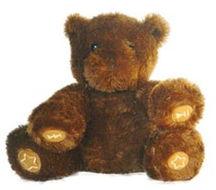

Hoy he comprado el regalo de mis sobrinas para [el caga tio](http://es.wikipedia.org/wiki/Ti%C3%B3_de_Nadal). Es un oso cuentacuentos. ¿Y qué tiene de especial para dedicarle un comentario en mi blog? Primero que es algo para mis sobrinas y eso ya lo es todo. Segundo, que me ha llamado la atención una serie de cosas de este oso.

Este oso se llama [Nabar](http://www.nabar.com/), el oso cuentacuentos y cuenta cuentos en 7 idiomas: aragonés, catalán, inglés, español, euskera, francés y occitano. Así es, en estos 7 idiomas. Por lo que pone en su casa (la web [www.nabar.com](http://www.nabar.com/)) el osito surgió de los pirineos bascos y como tal parece que aprendió a hablar todos estos idiomas sin problemas :). Además los cuentos que recita son procedentes de todo el mundo (debe ser un oso muy viajero). Y todos estos cuentos, con licencia [Creative Commons](http://es.creativecommons.org/), te los puedes descargar de la web. Y todo muy casero, nada de multinacionales detrás. ¿A qué es una chulada? ¿Y si os digo que es estéreo?Bueno, pues este es el regalo que he comprado. Me hace gracia y a pesar de que es un poco caro, no me importa porque tengo la sensación que detrás del oso hay gente que se interesan por hacer las cosas bien hechas, que piensan en la cultura y en las diferentes sensibilidades, valores importantes a enseñar a los chavales.  
Visitar la [web](http://www.nabar.com/), podéis escuchar los cuentos todos ellos hermosos y podréis comprar a Nabar por Internet, estando en vuestras casas en una semana. A continuación os dejo el “spot publicitario” que me ha ayudado a decidirme en hacer este regalo:

Ya os contaré cuando llegue a mi casa y a las manos de mis sobrinas:), de momento ya soy amigo de Nabar!