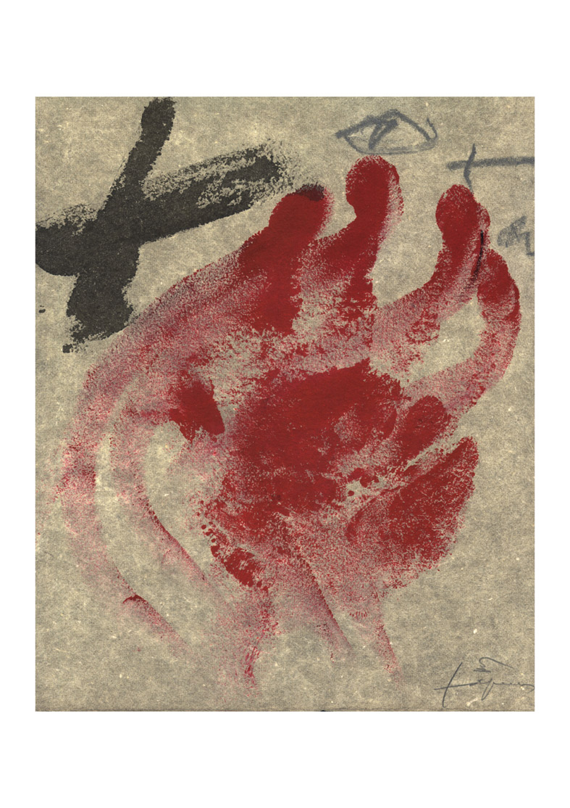

Tengo ya mi litografía de [Antoni Tàpies](http://www.fundaciotapies.org/site/rubrique.php3?id_rubrique=279) que donó para hacer frente a la sanción de 300.000 euros que fué impuesto por la [Generalitat Valenciana](http://www.gva.es/) a [Acció Cultural del País Valencià](http://www.acpv.cat/) con motivo de su negativa de cortar las emisiones de [TV3](http://www.tv3.cat/) y otros canales afines en Alicante.

Os resumo un poco el tema. En la [Comunidad Valenciana](http://es.wikipedia.org/wiki/Comunidad_Valenciana), que comprende Castellón, Valencia y Alicante se emiten desde hace años los canales de la televisión de la [Corporació Catalana de Ràdio i Televisió](http://www.tv3.cat/ptvcatalunya/tvcHome.jsp) ([TV3](http://www.tv3.cat/), [Canal 33](http://www.tvcatalunya.com/ptvcatalunya/tvcSeccio.jsp?seccio=trenta3)). En estos dos últimos años, el gobierno de la Comunidad Valenciana ha decidido comenzar a cerrar los repetidores de estos canales, de tal forma que en este territorio se deje de ver tales canales de televisión. Los motivos, muchos y quizá complicados de explicar en este mismo post, pero son motivos desde mi punto de vista que van en contra de la riqueza cultural y la libertad de expresión que proporciona un canal en un territorio.

Para evitarlo, una agrupación llamada [Acció Cultural del País Valencià](http://www.acpv.cat/) ha realizado acciones en contra del cierre de los repetidores, pero lo único que ha encontrado es una resistencia ferrea del gobierno valenciano quien ha realizado acciones jurídicas consiguiendo sancionar a la agrupación así como cerrar el primer repetidor en Alicante.  
Pero lo más triste de todo, es que [el gobierno de Cataluña](http://www.gencat.net/) actual de quien depende la Corporació Catalana de Ràdio i Televisió no ha se ha posicionado de forma firme a favor de su propia televisión. El silencio respecto el tema es notable. ¿Qué pasa?  
De mientras, si alguien quiere contribuir a hacer frente la sanción a [Acció Cultural del País Valenciá](http://www.acpv.cat/) y simbólicamente posicionarse a favor de las emisiones de TV3, Canal33… en el País Valencià, puede comprar a 10€ la litografía de Joan Tàpies. Si os interesa puedo conseguirla, enviarme un mail. A continuación os dejo la obra en concreto que la entregan en una cartulina dinA3 de muy buena calidad:  
Más información:  
[ACPV campanya per garantir la continuïtat de TV3 a País Valencià](http://www.acpv.cat/php/pagina.php?id_text=103)