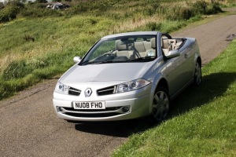
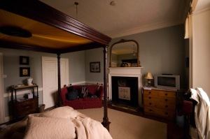

[Mostra un mapa més gran](http://maps.google.es/maps?f=d&hl=ca&geocode=&saddr=Halifax+Rd,+Dunston,+Gateshead,+Regne+Unit&daddr=High+Street,+Ecclefechan&mra=pi&mrcr=0&doflg=ptm&sll=54.954553,-1.65598&sspn=0.0121,0.025105&ie=UTF8&ll=56.692442,-4.262695&spn=5.926877,12.854004&source=embed)

El primer día fue de tránsito. Un vuelo tranquilo que salió con un retraso de 20 minutos me llevó al norte de Inglaterra. Tras un primer intento de aterrizaje abortado por causa del fuerte viento (bueno, yo creo que la razón fue que la aproximación se hizo a mucha velocidad… )llegué a las 17:30 horas a Newcastle donde una persona de la empresa [Thrifty](http://www.thrifty.com/) del alquiler del coche me vino a buscar para ir al garaje a unos 15 km. a agarrar mi coche. Tras rellenar todos los papeles, la sorpresa la mía que me habían cambiado el modelo inicial del Peugeuot 307 Cabriolet por un precioso [Megane Coupè Cabriolet](http://www.meganecc.com/). Pues a dar gracias, subir al coche y a comenzar a disfrutar tras apretar el botón “Start Engine”.

<figure style="width: 290px"><figcaption>El auto del viaje – Lluís Ribes i Portillo (<a href="http://creativecommons.org/licenses/by-nc-nd/3.0/" target="_blank" rel="noopener noreferrer">cc</a>)</figcaption></figure>

Me dirigí hacia el norte por las autopistas y carreteras hasta [Ecclefechan](http://en.wikipedia.org/wiki/Ecclefechan) donde tenía reservado el primer B&B. La conducción fue intensa, era el primer día conduciendo por la izquierda y en muchos aspectos era como volver a conducir de nuevo: el cambio de marcha a la izquierda, los cambios de carril, las rotondas, controlar las medidas del coche en las urbanizaciones. Cien ojos necesitabas  
El trayecto se alternó con sol y lluvia y llegué de noche. El B&B se llamaba Carlyle House y lo lleva un chico joven. Es un B&B que lo encontré [en la página oficial de turismo de Escocia](http://www.visitscotland.com/) en Internet, y estaba muy bien. Vaya la primera impresión de un B&B fué genial. Os dejo una foto de la habitación.  

<figure style="width: 290px"><figcaption>Carlyle House – Lluís Ribes i Portillo (<a href="http://creativecommons.org/licenses/by-nc-nd/3.0/" target="_blank" rel="noopener noreferrer">cc</a>)</figcaption></figure>

  
Tenía la habitación baño propio y estaba situado en un lugar muy tranquilo. Perfecto para descansar de todo el viaje y prepararse para el primer desayuno escocés del día siguiente…  
B&B  
Carlyle House  
High Street Ecclefechan, by Lockerbie  
Dumfriesshire, DG11 3DG  
Propietors C.Martin A.Meese  
Tel/Fax: 01576300322  
carlylehouse@ecclefechan.com  
Precio individual: 30£

[volver al resume de todo el viaje](http://lluisr.blogspot.com/2008/08/viaje-escocia.html)