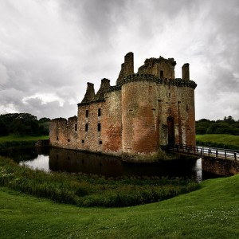
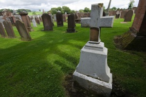
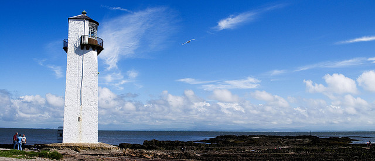
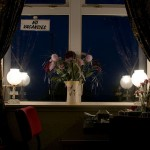

  
[Mostra un mapa més gran](http://maps.google.es/maps?f=d&hl=ca&geocode=7086520859219053661,55.127290,-3.457190%3B5510968248382916909,55.067990,-3.600060%3B569160877055569473,54.972317,-3.534018%3B523426069752113355,54.981090,-3.622700%3B10854162426671047580,54.874370,-3.598050&saddr=High+Street,+Ecclefechan&daddr=A709+%4055.127290,+-3.457190+to:A756%2FBrooms+Rd+%4055.067990,+-3.600060+to:B725%2FShore+Rd+%4054.972317,+-3.534018+to:A710+%4054.981090,+-3.622700+to:Carrer+desconegut+%4054.874370,+-3.598050+to:54.817305,-3.928986+to:Stranraer&mra=dpe&mrcr=0&mrsp=6&sz=11&via=1,2,3,4,5,6&doflg=ptm&sll=54.85843,-3.933105&sspn=0.194058,0.401688&ie=UTF8&ll=56.824933,-4.658203&spn=5.906039,12.854004&source=embed)

Segundo día, primer día real de viaje. Fue la primera experiencia con [el desayuno escocés: cereales, zumos, morcilla, huevos, tostadas con matequilla salada, pancetas, tomate, una especie de aluvias con salsa y café o té](http://en.wikipedia.org/wiki/Full_breakfast). La verdad es que comienzan fuerte, pero tuve la suerte que el B&B del primer día, el Carlely House era espléndido y todo estaba preparado al momento y con fundamento.

Uno de los recuerdos que me quedarán del viaje, fue de este desayuno. Estaba solo en el salón, decorado con un mobiliario de mediados del siglo XX (aunque los vasos eran de Ikea) y con la [BBC de música que sonaba de fondo con canciones que me hacían venir a la cabeza esos documentales en blanco y negro de la gente en la playa, con esos bañadores de pantalones y camisetas](http://www.radioblogclub.com/open/147101/in_the_mood/Glenn_Miller_-_In_The_Mood). Yo y mis huevos esperando a ser catados.

<figure id="attachment_2129" aria-describedby="caption-attachment-2129" style="width: 290px"><figcaption id="caption-attachment-2129">Castillo de Caerlaverock – Lluís Ribes i Portillo (<a href="http://creativecommons.org/licenses/by-nc-nd/3.0/" target="_blank" rel="noopener noreferrer">cc</a>)</figcaption></figure>

Tras el almuerzo, recogí y me dirigí al sur, a [Dumfries](http://en.wikipedia.org/wiki/Dumfries). Esta es una ciudad que no tiene mucha cosa en especial pero aproveché para ir a la oficina de turismos y comprar los mapas. Tras este pueblo, visité el [Castillo de Caerlaverock](http://en.wikipedia.org/wiki/Caerlaverock_Castle), al sur por un camino asfaltado. Es realmente bonito, está medio en ruinas y es pequeño pero se sitúa en medio de un foso y el castillo tiene la peculiaridad que es triangular. Mi visita coincidió con un festival medieval, bueno, era todo muy escocés…

<figure style="width: 290px"><figcaption>Cementerio de New Abbey – Lluís Ribes i Portillo (<a href="http://creativecommons.org/licenses/by-nc-nd/3.0/" target="_blank" rel="noopener noreferrer">cc</a>)</figcaption></figure>

Visto el castillo, era hora de hacer ruta. Quería ver un poco de costa y me recorrí la A710 y A711. Es una carretera bonita, de dos carriles pero algunos tramos estrechos y con curvas, como me gustan. En esta ruta visité una abadía, la de [New Abbey](http://en.wikipedia.org/wiki/New_Abbey). Las abadías abundan en el sur de escocia y son interesantes porque guardan un cierto encanto de misterio mesónico que tiene su punto, y las que se conservan con sus cementerios son chulos. La de New Abbey es una bonita abadía de piedra rojiza.

Pasado New Abbey, hay un punto donde puedes desviarte hacia el faro de [Southerness Point](http://en.wikipedia.org/wiki/Southerness). Pintoresco faro en una pequeña población donde los apartamentos cerca de la playa son una maravilla e invitan a quedarse para siempre. Pero como mi viaje tenía más días no pude… y continué carretera al oeste.

<figure id="attachment_2130" aria-describedby="caption-attachment-2130" style="width: 630px"><figcaption id="caption-attachment-2130">El faro de Southerness Point – Lluís Ribes i Portillo (<a href="http://creativecommons.org/licenses/by-nc-nd/3.0/" target="_blank" rel="noopener noreferrer">cc</a>)</figcaption></figure>

<figure id="attachment_2128" aria-describedby="caption-attachment-2128" style="width: 140px"><figcaption id="caption-attachment-2128">B&amp;B Alisa- Lluís Ribes i Portillo (<a href="http://creativecommons.org/licenses/by-nc-nd/3.0/" target="_blank" rel="noopener noreferrer">cc</a>)</figcaption></figure>

Eran las 1700 horas y debía decidir donde pasar la noche. Me fuí a [Stranraer](http://en.wikipedia.org/wiki/Stranraer). ¿Por qué aquí? Pues no lo se, me pareció que podría encontrar sitio para pasar la noche a esas horas porque Stranraer es un puerto que no tiene prácticamente ningún encanto turístico más allá de sentirte en un lugar que no tiene nada que ver con tu casa, aún más si eres de secano. Es un puerto importante, desde luego.

De el parten [Ferrys hacia Belfast](http://www.stenaline.co.uk/ferry/routes/belfast-stranraer), pero nada más. Llegué tarde, a las 18:30 horas y me acojoné un poco al no encontrar ningún B&B libre, y algunas calles no eran muy acogedoras. Pero al final me comentaron que en el paseo marítimo (mira por donde) habían unos 15… bueno, no se si tantos pero habían muchos. Y allí encontré un modesto B&B, llevado por Alisa, una simpática señora. Era el Alisa View B&B, pequeño, baño compartido, con un pequeño comedor con vistas al paseo y muy bien situado, justo además con un inmenso parquing público para dejar el coche delante.

Dejé la bolsas, y fui a dar una vuelta. Lo mejor la playa gris, que a esa hora de mareabaja pude caminar 100 metros mar a dentro mientras vi partir el último ferry de la noche.

  
B&B  
Alisa View B&B  
Anne Laurie, 8 Agnew Crescent, Stranraer DG9 7JY  
tel: 01776 705792  
email: [annelaurie117@btinternet.com](mailto:annelaurie117@btinternet.com?Subject=Enquiry%20from%20Stranraer.org)  
Precio individual: 20£  

[volver al resume de todo el viaje](http://lluisr.blogspot.com/2008/08/viaje-escocia.html)