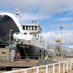
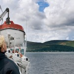
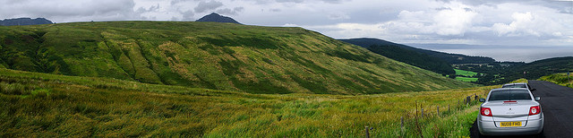
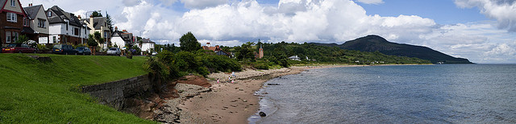

  
[Mostra un mapa més gran](http://maps.google.es/maps?f=d&hl=ca&geocode=&saddr=Stranraer&daddr=55.414205,-4.743347+to:Whiting+Bay&mra=dpe&mrcr=0&mrsp=1&sz=10&via=1&doflg=ptm&sll=55.265033,-4.633484&sspn=0.584506,1.142578&ie=UTF8&ll=55.265033,-4.633484&spn=0.584506,1.142578&source=embed)

El tercer día comienza con un almuerzo escocés un poco “heavy”. Si bien el B&B de Alisa era muy acogedor y ella era muy amable, el almuerzo parecía de regimiento, calentado con microondas :(. Bueno, pero todo pasa por comer lo justo y luego durante el viaje ir reponiendo.

Stranraer puede ser un buen lugar para visitar la península de [The Rhins of Galloway](http://en.wikipedia.org/wiki/Rhinns_of_Galloway), pero en mi caso quería llegar ese día a la [Isla de Arran,](http://es.wikipedia.org/wiki/Arran) al nordeste de Escocia. Para ello, por la mañana me dirigí al norte por la A77 y sus variantes que van por la costa hasta Ardrossan (siguiendo siempre la ruta turística).

<figure id="attachment_2136" aria-describedby="caption-attachment-2136" style="width: 140px"><figcaption id="caption-attachment-2136">Ferry de Androssan – Lluís Ribes i Portillo (<a href="http://creativecommons.org/licenses/by-nc-nd/3.0/" target="_blank" rel="noopener noreferrer">cc</a>)</figcaption></figure>

[Ardrossan](http://en.wikipedia.org/wiki/Ardrossan) es una localidad del suroeste desde donde salen los Ferrys hacia la Isla de Arran. Estos ferrys son de la compañía [Caledonian MacBrayne](http://www.calmac.co.uk/) que realizan prácticamente todos los recorridos a las islas del oeste de Escocia.

Para agarrar el ferry en Ardrossan en temporada alta, se recomienda reservarlo por internet, pero mi experiencia fue que no es necesario si se llega con tiempo. Llegué 2 horas antes que partiera el ferry a las 12:00, compré el billete a la isla y el de vuelta (que lo realizaría hacia el norte) en la terminal del ferry y a pesar que el Ferry se llenó de coches, pude entrar.

Nunca había viajado en un ferry, y parece mentira la cantidad de vehículos que pueden entrar en ellos. El viaje, de una hora fue espléndido ya que el ferry de este trayecto es un gran barco y cuando estás en los salones interiores apenas te das cuenta que te estás moviendo.

<figure id="attachment_2135" aria-describedby="caption-attachment-2135" style="width: 140px"><figcaption id="caption-attachment-2135">De Ardrossan a Brodick – Lluís Ribes i Portillo (<a href="http://creativecommons.org/licenses/by-nc-nd/3.0/" target="_blank" rel="noopener noreferrer">cc</a>)</figcaption></figure>

Llegué a la Isla de Arran al mediodía. ¿Qué es la isla de Arran? Es una de las joyas de Escocia, como dice la guía de [Lonely Planet](http://www.lonelyplanet.com/), es como una Escocia en pequeña. Tienes playas tranquilas, costa de acantilados, castillos, bosques, ríos para pescar, montañas para hacer trekking durante todo un día y es también un excelente lugar para hacer ruta en bici gracias a su pintoresca carretera que la rodea.

Con el Ferry llegas a la población principal, [Brodick](http://en.wikipedia.org/wiki/Brodick) y lo primero que hice fue buscar alojamiento, no en el bullicio de esta pequeña localidad sino en las poblaciones de costa que están más al sur. Encontré un B&B genial en [Whiting Bay](http://en.wikipedia.org/wiki/Whiting_Bay), [The Burlington](http://www.burlingtonarran.co.uk/), en primera linea de costa. Tenían habitaciones individuales, eran sencillas pero con una vista a través de la pequeña ventana de la habitación impresionantes.

Impresionantes porque si hace buen tiempo, Whiting Bay te hace olvidar que estás tan al Norte del globo terráqueo. El clima es muy suave y por el paseo puedes ver alguna que otra palmera. La playa (totalmente condicionada por la marea y por tanto no apta para el baño) es grande, y muy tranquila.

<figure id="attachment_2138" aria-describedby="caption-attachment-2138" style="width: 630px"><figcaption id="caption-attachment-2138">Prados en la isla de Arran – Lluís Ribes i Portillo (<a href="http://creativecommons.org/licenses/by-nc-nd/3.0/" target="_blank" rel="noopener noreferrer">cc</a>)</figcaption></figure>

Excelente, tengo alojamiento y marcho a hacer una ruta por la isla. La carretera que la rodea pasa por lugares muy bonitos, eso sí, hay tramos muy estrechos y la conducción es un tanto complicada pero merece la pena poder pararse en un parquing y contemplar el monte de Goatfell:

<figure id="attachment_2137" aria-describedby="caption-attachment-2137" style="width: 630px"><figcaption id="caption-attachment-2137">PLaya Whiting Bay – Lluís Ribes i Portillo (<a href="http://creativecommons.org/licenses/by-nc-nd/3.0/" target="_blank" rel="noopener noreferrer">cc</a>)</figcaption></figure>

El final del día, lo pasé en un pub con mucha animación, buena gente y buena cerveza. Está pasado Whiting Bay a un cuarto de milla a mano derecha. Es un pub grande con una terraza en frente del mar, siempre animado y no recuerdo más…

B&B  
The Burlington  
Shore Road Whiting  
Bay Isle of Arran  
North Ayrshire KA27 8PZ  
Scotland United Kingdom  
tel:Telephone – 01770 700255  
fax:Fax – 01770 700232  
web: [http://www.burlingtonarran.co.uk/](http://www.burlingtonarran.co.uk/)  
mail: info@burlingtonarran.co.uk  
  
Precio individual: 26£

[volver al resume de todo el viaje](http://lluisr.blogspot.com/2008/08/viaje-escocia.html)