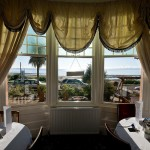
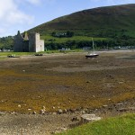
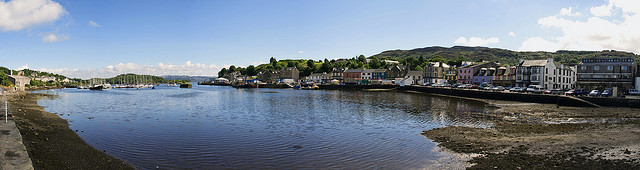
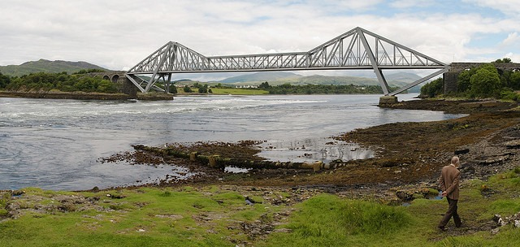
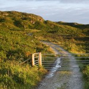
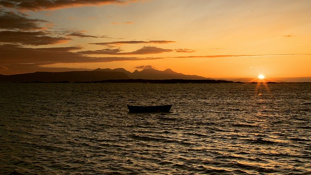

  
[Mostra un mapa més gran](http://maps.google.es/maps?f=d&hl=ca&geocode=&saddr=Whiting+Bay&daddr=56.413901,-5.476685+to:arisaig&mra=dpe&mrcr=0&mrsp=1&sz=10&via=1&doflg=ptm&sll=56.301301,-5.234985&sspn=0.374108,0.803375&ie=UTF8&ll=56.668302,-5.075684&spn=5.930671,12.854004&source=embed)

El cuarto día se levantó con un tiempo espectacular. Bueno, en realidad se levantó un poco nublado a muy temprana hora, alrededor de las 6:00 horas. Pero posteriormente se despejó y quedó un cielo azul (os preguntaréis qué hacía a las 6:00 levantado…, intentar hacer una salida de sol que se convertieron rápidamente en unas horitas más en la cama…).

<figure id="attachment_2144" aria-describedby="caption-attachment-2144" style="width: 140px"><figcaption id="caption-attachment-2144">B&amp;B The Invermay – Lluís Ribes i Portillo (<a href="http://creativecommons.org/licenses/by-nc-nd/3.0/" target="_blank" rel="noopener noreferrer">cc</a>)</figcaption></figure>

El desayuno lo recuerdo de forma entrañable porque fui el primero en entrar en el comedor y la vista con esos ventanales victorianos y las palmeras y ese día espléndido y esa tranquilidad era increíble. ¡Me quiero quedar! pero tenía aún muchas millas por delante… Desayuno, recoger bolsa, pagar y dejar una dedicatoria en el libro de visitas. Eran las 10:00, y bajé a la playa que estaba en mareabaja a tomar fotos. Que lugar tan fantástico para pasear con tu perro o con tu caballo…

<figure id="attachment_2143" aria-describedby="caption-attachment-2143" style="width: 140px"><figcaption id="caption-attachment-2143">Castilo de Lochranza – Lluís Ribes i Portillo (<a href="http://creativecommons.org/licenses/by-nc-nd/3.0/" target="_blank" rel="noopener noreferrer">cc</a>)</figcaption></figure>

Tras la playa continúe la ruta hacia el norte. Recuerdo la carretera de [Brodick](http://en.wikipedia.org/wiki/Brodick) a [Lochranza](http://en.wikipedia.org/wiki/Lochranza) (la otra población donde se puede agarrar ferry en la Isla de Arran) cuando esta hace un giro al interior y se convierte en un trayecto de 8 millas en un terreno ondulado con la carretera que sube y baja y gira y vuelve a girar suavemente dentro de un valle. Gustazo. En Lochranza agarraba el ferry hacia [la península de Kintyre](http://en.wikipedia.org/wiki/Kintyre). Es un ferry pequeño, donde la terminal es apenas una zona asfaltada con los coches haciendo cola. Este solo funciona en verano, y por lo que ví, no puedes comprar los tiquets allá, si un caso en las oficinas de Brodick al sur.

Al otro lado del trayecto en Ferry te espera una península poco habitada, no remota, pero sí con esa sensación de soledad increíble (¡y en temporada alta!). No la recorrí, Claonaig (no llegué a ver ni una casa, era un pueblo¿?) donde te deja el ferry ya está bastante al norte pero la pequeña carretera para salir de Claonaig te da la idea de como es toda la península. Dirigiéndome hacia el norte pasé por la [bonita población de Tarbert](http://en.wikipedia.org/wiki/Tarbert,_Argyll_and_Bute), hice una parada en las piedras monolíticas de más de 5000 años en Kilmartin y atravesé la ciudad comercial y con mucha vida de [Oban](http://en.wikipedia.org/wiki/Oban).

<figure id="attachment_2145" aria-describedby="caption-attachment-2145" style="width: 630px"><figcaption id="caption-attachment-2145">Puerto de Tarbert – Lluís Ribes i Portillo (<a href="http://creativecommons.org/licenses/by-nc-nd/3.0/" target="_blank" rel="noopener noreferrer">cc</a>)</figcaption></figure>

Más al norte de Obán, a 5 millas, están [las cataratas del Lora](http://www.fallsoflora.info/). No son estrictamente unas cataratas, sino unos rápidos que se origina por efecto de la marea. Es un lugar interesante para hacer cayak o tomar alguna fotografía del puente que lo cruza. Como no, tuve que realizar una panorámica:

<figure id="attachment_2146" aria-describedby="caption-attachment-2146" style="width: 630px"><figcaption id="caption-attachment-2146">Rápidos bajo el Puente Lora – Lluís Ribes i Portillo (<a href="http://creativecommons.org/licenses/by-nc-nd/3.0/" target="_blank" rel="noopener noreferrer">cc</a>)</figcaption></figure>

El día continuaba, era pasado el mediodía y continúe hacia el norte hasta [Fort William](http://en.wikipedia.org/wiki/Fort_William%2C_Scotland). Esta población, es una de las más turísticas de Escocia, y [me recuerda a los alpes](http://lluisr.blogspot.com/search?q=alpes) (salvando las dimensiones) al estar situado al lado de un lago, entre montañas y con una calle principal llena de tiendas de deporte. La ciudad está tocando a la montaña más alta de escocia, el [Ben Nevis](http://en.wikipedia.org/wiki/Ben_Nevis), y por tanto es una población muy usada como campamento base para hacer trekking.

Desgraciadamente el día a la tarde empeoró un poco, no pude ver el Ben Nevis y la lluvia se iba alternando con un cielo gris de nubes bajas en Fort William. Decidí salir de Fort William y dirigirme a [Mallaig](http://en.wikipedia.org/wiki/Mallaig), situada 30 millas al oeste en la costa, un puerto desde donde parten los ferrys hacia [la Isla de Sky](http://en.wikipedia.org/wiki/Isle_of_skye). Para llegar a Mallaig solo se puede hacer por la carretera A830 por donde transcurre también un bonito tren a vapor (creo que es el usado en las películas de Harry Potter).

<figure id="attachment_2142" aria-describedby="caption-attachment-2142" style="width: 140px"><figcaption id="caption-attachment-2142">Camino por Arisaig – Lluís Ribes i Portillo (<a href="http://creativecommons.org/licenses/by-nc-nd/3.0/" target="_blank" rel="noopener noreferrer">cc</a>)</figcaption></figure>

Llegado a Mallaig, a las 18:30 solo hacía que ver B&B [con el cartel de “No Vancancy”](http://images.google.es/images?um=1&hl=ca&client=firefox-a&rls=org.mozilla%3Aca%3Aofficial&q=%22no+vacancy%22+%22neon+sign%22&btnG=Cerca+Imatges) en las ventanas. Realmente es una población que acoge a mucha gente, es bonita y está en la ruta hacia la Isla de Skye desde el sur. Y la oficina de turismo, a punto de cerrar me confirmó lo que me temía. No había ni una habitación en la población, y seguramente ninguna en las proximidades. Las opciones que tenía eran: a) ir a un camping (tenía una tienda por si las moscas), b) regresar a Fort William o c) poner en práctica “El Secreto”.  
Esta tercera opción escogí y me adentré en un conjunto de poblaciones que las atraviesas por una pequeña carretera de costa hasta llegar a Arisaig, un acogedor pueblo. Allá, pregunté en una casa de una señora que tenía B&B pero lo tenía ocupado, pero muy amablemente realizó una llamada y me confirmó que en la calle de abajo había una casa con B&B que estaba libre. Eran las 20:00 horas, y pude comprobar [como las redes siempre han estado allá](http://fluxchange.typepad.com/ramonsanguesa/2007/09/pensando-en-red.html), más allá de internet.

El B&B era de Jo Markland, y como dice en la tarjeta “a bit different”. Era un B&B muy casero, dormías en una habitación de la casa y la comida se tomaba en la enorme mesa de madera de la cocina. Que delicia, y Jo era muy atenta. Una vez que me establecí en la habitación me indicó un lugar para tomar fotos de la puesta de sol. Como no, seguí su recomendación y disparé las últimas fotos del día delante de unas pequeñas islas bañadas por el mar frío pero a la vez pacífico del norte.

<figure id="attachment_2149" aria-describedby="caption-attachment-2149" style="width: 630px"><figcaption id="caption-attachment-2149">Barca – Lluís Ribes i Portillo (<a href="http://creativecommons.org/licenses/by-nc-nd/3.0/" target="_blank" rel="noopener noreferrer">cc</a>)</figcaption></figure>

B&B  
Jo Markland  
1 Hugh Land,  
Arisaig,  
Inverness-shire  
PH39 4NP  
Tel: 01687450314  
  
Precio individual: 26£

[volver al resume de todo el viaje](http://lluisr.blogspot.com/2008/08/viaje-escocia.html)