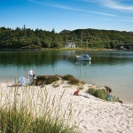
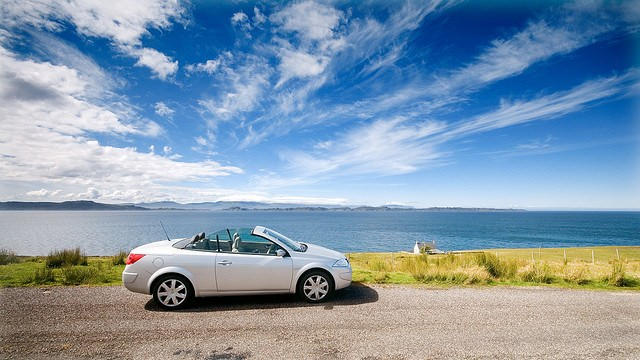
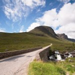
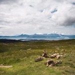
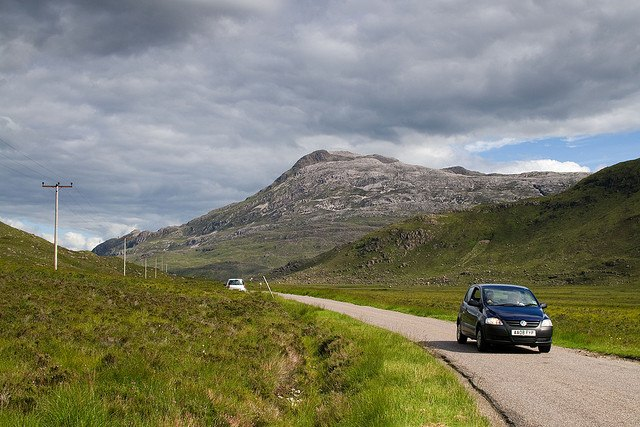
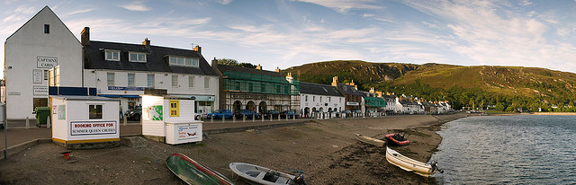
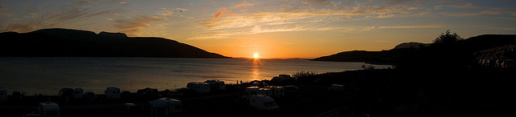

  
[Mostra un mapa més gran](http://maps.google.es/maps?f=d&hl=ca&geocode=11169493694428381790,57.414294,-5.604492%3B5461184421853108434,57.431860,-5.809710&saddr=Arisaig&daddr=A896+%4057.414294,+-5.604492+to:Carrer+desconegut+%4057.431860,+-5.809710+to:57.574779,-5.808334+to:Ullapool&mra=dpe&mrcr=0&mrsp=3&sz=11&via=1,2,3&doflg=ptm&sll=57.509184,-5.754089&sspn=0.1811,0.401688&ie=UTF8&ll=56.920997,-5.471191&spn=5.89091,12.854004&source=embed)  

Me levanto el quinto día y una vez estoy en la ducha oigo como Jo, la propietaria del B&B comienza a preparar el desayuno. Rápidamente acabo y bajo escaleras abajo a la cocina. Allá, en la mesa grande de madera que gobierna la cocina, mi desayuno aguardaba. Un desayuno completo donde predomina la fruta y el cereal. Me recuerdo especialmente de unos unos frutos silvestres que había recogido de su jardín, parecidos a granos de granada, pero más jugosos y ácidos.Entre cucharadas y charlas, vino a visitarle un amigo mayor. Jo me comentó que sabía Gaélico y aprendí mis dos únicas palabras de gaélico que conozco: Cimer|Aha|Oo (Hola, como estás?) y Tarp|Lecht (gracias). Poco más hace falta saber para viajar por Escocia. El desayuno se alargó un poco respecto a otros días, claro con buena compañía es inevitable… y a la hora de despedirme, Jo y su amigo, sabiendo que me dirigía al norte me recomendaron agarrar una ruta alternativa por la costa a medio camino, que más adelante comentaré…  
  

<figure id="attachment_2151" aria-describedby="caption-attachment-2151" style="width: 140px"><figcaption id="caption-attachment-2151">Playa de Arisag – Lluís Ribes i Portillo (<a href="http://creativecommons.org/licenses/by-nc-nd/3.0/" target="_blank" rel="noopener noreferrer">cc</a>)</figcaption></figure>

  
Día perfecto, capota abajo y me dirijo al norte vía [Isla de Skye](http://en.wikipedia.org/wiki/Sky_island). Estoy al lado de [Mallaig](http://en.wikipedia.org/wiki/Mallaig), cerca de unas preciosas playas de la costa oeste. En Mallaig parten ferrys a la isla, e igual que hice en [Ardrossan](http://en.wikipedia.org/wiki/Ardrossan) me dirijo a la terminal para sacar un pasaje. Dicen que tengo suerte, porque siempre encuentro párquing en Barcelona, pero también lo será porque encuentro plazas para el primer ferry :).El viaje dura 30 minutos, es un barco no muy grande y a pesar de la sinfonía formada por las alarmas antirrobo de los coches alemanes y por [dos cazas británicos de la RAF](http://en.wikipedia.org/wiki/Panavia_Tornado) que vuelan a ras, es un trayecto encantador.  
El puerto de la Isla de Skye se llama [Armadale](http://www.tagzania.com/item/87529), y es escasamente la terminal y un par de cabañas. La Isla de Skye es la más famosa de las islas de Escocia y un lugar natural precioso. Es ideal para ir de acampada, es todo naturaleza y un lugar ideal para pedirle [la mano a tu pareja bajo la luz de luna](http://www.radioblogclub.com/open/98851/blue_moon/billie_holiday_-_blue_moon). Sin mano a quién pedir y tampoco tiempo para quedarme en la isla, mi visita a la isla fue fugaz. Pasado 30″ estaba cruzando [el puente que conecta la isla con el la isla grande](http://en.wikipedia.org/wiki/Skye_Bridge), y justo allá me desvié por donde Jo y su amigo me recomendaros:

“El camino de Jo”

<figure id="attachment_2153" aria-describedby="caption-attachment-2153" style="width: 630px"><figcaption id="caption-attachment-2153">Lonbain – Lluís Ribes i Portillo (<a href="http://creativecommons.org/licenses/by-nc-nd/3.0/" target="_blank" rel="noopener noreferrer">cc</a>)</figcaption></figure>

  

<figure id="attachment_2156" aria-describedby="caption-attachment-2156" style="width: 140px"><figcaption id="caption-attachment-2156">Carretera de Jo – Lluís Ribes i Portillo (<a href="http://creativecommons.org/licenses/by-nc-nd/3.0/" target="_blank" rel="noopener noreferrer">cc</a>)</figcaption></figure>

> El camino de Jo consiste en adentrarse en un península al norte de [Kyle of Lochalsh](http://en.wikipedia.org/wiki/Kyle_of_Lochalsh). Se agarra en la A87 en Kirkton y se comienza a subir una carretera en dirección a Locharron. Allá se continúa hasta Tornapress donde hay que desviarse por un camino asfaltado (en invierno se recomienda extremar las precauciones). Hasta este punto, una carretera bonita, con vistas de un valle con un gran lago, bosques frondosos, pueblecitos de postal, pero a 7 quilómetros por el camino de asfalto se levantan dos montañas y entre medio tu carretera, que sube y sube.

<figure id="attachment_2152" aria-describedby="caption-attachment-2152" style="width: 140px"><figcaption id="caption-attachment-2152">Vista de la Isla Skye- Lluís Ribes i Portillo (<a href="http://creativecommons.org/licenses/by-nc-nd/3.0/" target="_blank" rel="noopener noreferrer">cc</a>)</figcaption></figure>

  
La subida es espectacular por la belleza del lugar y se llega a un mirador llego de turistas escoceses donde se puede contemplar la Isla de Skye. Siguiendo el camino, se llega a Applecross y dirigiéndose al norte se rodea la península por una carretera de costa que pasa por acantilados, playas y con unas vistas elevadas del mar sensacionales.  
Pero el camino de Jo no acaba aquí, y una vez salido de la península, hay unas 11 millas dentro de un valle remoto para poner el toque final. El camino de Jo es una de las rutas más divertidas que hice con coche, por sus diferentes paisajes, por sus carreteras pero sobretodo por la sensación de libertad. Tarplech Jo!  

<figure id="attachment_2157" aria-describedby="caption-attachment-2157" style="width: 630px"><figcaption id="caption-attachment-2157">Glen Torridon – Lluís Ribes i Portillo (<a href="http://creativecommons.org/licenses/by-nc-nd/3.0/" target="_blank" rel="noopener noreferrer">cc</a>)</figcaption></figure>

  
Llevaba 5 horas de viaje y eran las 16:00 horas. Quería llegar a Ullapool y tenía 100 millas de carretera. Así pues me apresuré y fui por el camino más directo, que no dejaba de dar una vuelta considerable.  
Llegué a la 1800 a [Ullapool](http://en.wikipedia.org/wiki/Ullapool). Este es un pueblo muy turítisco situado en una entrada de mar y desde donde salen ferrys hacia la [isla de Lewis](http://en.wikipedia.org/wiki/Lewis_Island). . El pueblo  tiene un bonito puerto y el paseo marítimo tiene foto.  

<figure id="attachment_2155" aria-describedby="caption-attachment-2155" style="width: 630px"><figcaption id="caption-attachment-2155">Ullapoll – Lluís Ribes i Portillo (<a href="http://creativecommons.org/licenses/by-nc-nd/3.0/" target="_blank" rel="noopener noreferrer">cc</a>)</figcaption></figure>

  
Es difícil encontrar un B&B libre en Agosto si buscas cuando llegas para la misma noche. Pero a pesar de ello, podemos optar por el [Youth Hostel](http://www.syha.org.uk/SYHA/Web/Site/Hostels/Ullapool.asp), o [un camping con unas vistas del atardecer preciosas](http://www.broomfieldhp.com/) o como hice yo, [por un hotel llamado Glenfield](http://www.oxfordhotelsandinns.com/OurHotels/Glenfield) de la cadena [Oxford Hotels & Inns](http://www.oxfordhotelsandinns.com/) y que tienen unas habitaciones individuales sencillas pero muy correctas. Está situado justo a las afueras del pueblo, subiendo por la carretera que va al norte.  
Con la habitación reservada, me dispuse ir al centro del pueblo. Allí realicé mi primera conexión WIFI desde el Pub que está delante de una librería en el puerto, y disfrutar de la puesta de sol en el paseo que está justo encima del camping. Buenas noches sol, buenas noches día…

<figure id="attachment_2154" aria-describedby="caption-attachment-2154" style="width: 630px"><figcaption id="caption-attachment-2154">Puesta de sol en Ullapol – Lluís Ribes i Portillo (<a href="http://creativecommons.org/licenses/by-nc-nd/3.0/" target="_blank" rel="noopener noreferrer">cc</a>)</figcaption></figure>

  
Hotel  
Glenfield Hotel  
North Road, Ullapool,  
Ross-shire. IV26 2TG  
Tel: 01854 612314  
Fax: 01854 613116  
Precio individual: 30 £