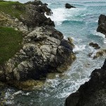
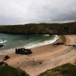
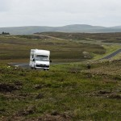
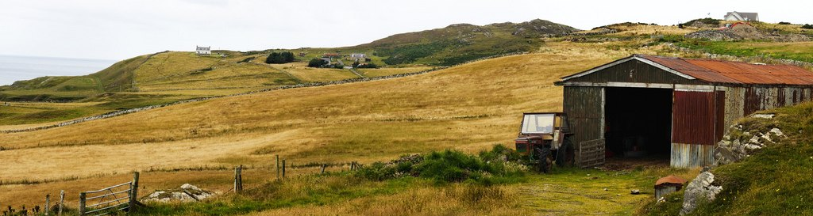
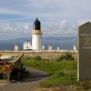
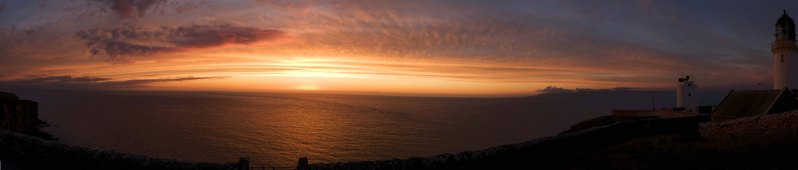

[Mostra un mapa més gran](http://maps.google.es/maps?f=d&hl=ca&geocode=17941306913036334199,58.560920,-4.764210&saddr=Ullapool&daddr=A838+%4058.560920,+-4.764210+to:58.67069,-3.376236+to:Mey&mra=dpe&mrcr=0&mrsp=2&sz=12&via=1,2&doflg=ptm&sll=58.635506,-3.361473&sspn=0.087738,0.200844&ie=UTF8&ll=57.112385,-4.020996&spn=5.860718,12.854004&source=embed)

Sexto día, estoy a la mitad del viaje y me tomo un desayuno completo. Sabía que iba a realizar muchas millas por carretera y no estaba muy seguro si podría hacer alguna parada larga en el trayecto. Mi objetivo, que bien era también el objetivo del viaje, llegar al punto más al norte de la isla británica: [Dunnet Head](http://en.wikipedia.org/wiki/Dunnet_Head). Para llegar, el recorrido escogido fue continuar hasta la costa del norte y posteriormente [agarrar la carretera A836 cruzando de oeste a este Escocia](http://en.wikipedia.org/wiki/A836_road_%28Great_Britain%29).

<figure id="attachment_2167" aria-describedby="caption-attachment-2167" style="width: 140px"><figcaption id="caption-attachment-2167">Ancantilados Durness – Lluís Ribes i Portillo (<a href="http://creativecommons.org/licenses/by-nc-nd/3.0/" target="_blank" rel="noopener noreferrer">cc</a>)</figcaption></figure>

  
Manos a la obra. La carretera hasta Rhiconich es de dos carriles, rápida si no hay tráfico y pasa por el interior. Comienzas a ver unas Highland diferentes, quizá más ásperas y agrestes. No hay nada de especial aparte de la belleza y tranquilidad típica de Escocia y un punto turístico interesante, el [Ardvreck Castle](http://en.wikipedia.org/wiki/Ardvreck_Castle). Son las ruinas de un castillo que está a las orillas de un lago. A pesar que queda un poco escondido y quedan apenas algunas paredes, es fácil de encontrarlo, a unas 30 millas de Ullapol en un parquing con caravanas y coches y con turistas en fila india como si fueran hormigas caminando cerca del lago. Eso es Ardvreck Castle.

Pasado Rhiconich, la carretera se estrecha a un carril, la soledad crece y tan solo los espacios reservados para ceder el paso a algún vehículo en sentido contrario te permite socializarte un poco con un característico saludo: levantar la mano sobre el volante, sonreír y realizar una ligera reverencia con tu cabeza en señal de amistad. Esto es conducir por Escocia.

<figure id="attachment_2165" aria-describedby="caption-attachment-2165" style="width: 140px"><figcaption id="caption-attachment-2165">Playa de Durness – Lluís Ribes i Portillo (<a href="http://creativecommons.org/licenses/by-nc-nd/3.0/" target="_blank" rel="noopener noreferrer">cc</a>)</figcaption></figure>

  
Al final, ya en la costa norte, el primer pueblo que encuentras es [Durness](http://en.wikipedia.org/wiki/Durness). Aproveché para llenar el depósito y comprar en el supermercado [Spar](http://www.spar.co.uk/)[.](http://en.wikipedia.org/wiki/Normandy) No tengo recuerdos de [Normandía](http://en.wikipedia.org/wiki/Normandy), más allá del [Mount Sant Michel](http://es.wikipedia.org/wiki/Monte_Saint-Michel), pero Durness me recordó a ella (o a los estudios de Hollywood…).con sus playas que están resguardadas por acantilados grandes y verdes y un bravo mar en frente.

<figure id="attachment_2166" aria-describedby="caption-attachment-2166" style="width: 140px"><figcaption id="caption-attachment-2166">Carretera – Lluís Ribes i Portillo (<a href="http://creativecommons.org/licenses/by-nc-nd/3.0/" target="_blank" rel="noopener noreferrer">cc</a>)</figcaption></figure>

  
Después de unas fotos en el pueblo, cambié el rumbo del viaje encarándome al este. Era pasado el mediodía y aún me quedaba unas 100 millas de carretera de costa. Esta carretera es bonita, sobretodo en las dos lenguas de agua, el [Loch Eriboll](http://en.wikipedia.org/wiki/Loch_Eriboll) que tienes que rodearla y el [Kyle Of Tongue](http://en.wikipedia.org/wiki/Tongue,_Highland) que lo atraviesas con un puente. Cuando llegas a cada una de las dos lenguas lo haces desde una altura sobre el mar considerable y a tus pies te queda un gran paisaje.

<figure id="attachment_2164" aria-describedby="caption-attachment-2164" style="width: 1014px"><figcaption id="caption-attachment-2164">Granja – Lluís Ribes i Portillo (<a href="http://creativecommons.org/licenses/by-nc-nd/3.0/" target="_blank" rel="noopener noreferrer">cc</a>)</figcaption></figure>

Tras las dos lenguas de mar, algunos pequeños pueblos y la única [central nuclear escocesa](http://es.wikipedia.org/wiki/Dounreay) se llega a [Thurso](http://en.wikipedia.org/wiki/Thurso). Llegué sobre las 17:00 horas y es la ciudad más grande de la costa norte. No estuve mucho rato, porque entrando por la carretera se ve una ciudad un poco triste y una vez que estás dentro se confirma. A pesar de ello, hay una biblioteca municipal donde aproveché otra vez para conectarme a Internet.

En Escocia te puedes conectar a Internet en cualquier biblioteca. Lo único que debes hacer, es dirigirte a su recepción, y dejar tus datos enseñando un carnet para poder reservar un ordenador con Internet. Depende de la biblioteca, tienes un límite de tiempo en el uso del ordenador mayor o menor, pero normalmente 15 minutos te los dan sin problemas.

<figure id="attachment_2162" aria-describedby="caption-attachment-2162" style="width: 140px"><figcaption id="caption-attachment-2162">Dunnet Head – Lluís Ribes i Portillo (<a href="http://creativecommons.org/licenses/by-nc-nd/3.0/" target="_blank" rel="noopener noreferrer">cc</a>)</figcaption></figure>

  
Bueno bueno, tras enviar unos mails, me encontraba a escasamente 9 millas del objetivo: Dunnet Head. ¿A qué esperaba? ¿Andiamo? ¡Sí! Para llegar a ese punto geográfico tan deseado, se continúa la carretera al este y en Dunnet se agarra un desvío hacia el faro. Se llega a un gran parking gratuito donde dejas el coche y una indicación te recuerda que estás en “Dunnet Head: Most Northerly Point of Mainland Britain“. Allá, un faro blanco convertido en un estudio de música, hierba alta y unos antiguos restos de un pueblo te acompañarán a la puesta de sol sobre el Océano Atlántico si llegas de tarde. La verdad es que llegaba temprano, era como muy tarde las 19:00 horas con lo que aproveché para arreglar el tema del alojamiento. Tenía varias posibilidades:

1.  Primero la ciudad de Thurso pero me daba mucho palo dejar el coche y recorrer las calles en busca de algo. Además no tenía mucho tiempo si quería volver al faro ese día.
2.  Otra posibilidad era plantar la tienda de campaña en el campo. En realidad no conozco muy bien la legislación en Escocia respecto a ello, pero cerca del faro, al lado del camino vi como una familia lo hacía. Pero pasar una noche sin enchufe eléctrico para recargar todos mis chismes electrónicos no me entusiasmó.
3.  Finalmente, preguntando me comentaron que en Mey, un pueblo de tres casas, que no tiene entrada en la [Wikipedia,](http://es.wikipedia.org/) había un hotel. Y bien, pese a que salía de la idea original de estancias baratas era ideal para aquel día: muy tranquilo y a quince minutos del faro. El hotel se llamaba [Castle Arms Hotel](http://www.castlearms.co.uk/) y os lo recomiendo si buscáis un alojamiento de hotel sin complicaciones.

Cené y me volví alrededor de las 20:30 al faro. El cielo ya tenía una tonalidad naranja la hierba del lugar estaba dorada y el sol se acercaba a las aguas del océano. Desgraciadamente perdí todas las fotos de este momento aunque por fortuna, he conservado un par que edité con el portátil la misma noche y las subí a flickr. ¡Fue una puesta de sol increíble, llevaba 6 días de viaje para llegar allí!

<figure id="attachment_2163" aria-describedby="caption-attachment-2163" style="width: 1014px"><figcaption id="caption-attachment-2163">Puesta de sol en Dunnet Head – Lluís Ribes i Portillo (<a href="http://creativecommons.org/licenses/by-nc-nd/3.0/" target="_blank" rel="noopener noreferrer">cc</a>)</figcaption></figure>

Una vez la noche comenzaba a gobernar el cielo lentamente (en esa latitud se comienza a notar que el cambio del día a la noche es mucho más lento que aquí), me dirigí al hotel a descansar. Objetivo cumplido, ahora vuelta al sur y seis días más de intenso viaje…

Hotel  
Castle Arms Hotel  
Mey, Thurso, Caithness, Scotland, KW14 8XH  
**Telephone** 01847 851244 | **E-Mail** [info@castlearms.co.uk](mailto:info@castlearms.co.uk)  
**Web** [www.castlearms.co.uk](http://www.castlearms.co.uk/)

Precio individual: 45 £