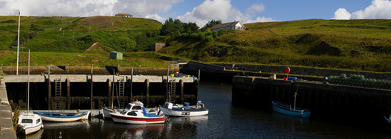
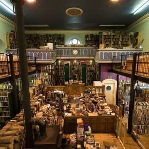
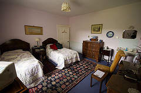

  
[Mostra un mapa més gran](http://maps.google.es/maps?f=d&hl=ca&geocode=14226644244118234472,57.482490,-4.230730&saddr=Mey&daddr=Shore+Street+Roundabout+%4057.482490,+-4.230730+to:57.47745,-4.454956+to:Cannich&mra=dpe&mrcr=0&mrsp=2&sz=8&via=1,2&doflg=ptm&sll=57.967331,-3.762817&sspn=1.430572,3.213501&ie=UTF8&ll=56.752723,-4.262695&spn=5.9174,12.854004&source=embed)

Una vez llegado al punto más al norte de Escocia, vuelvo hacia el sur pero por la otra costa, la costa este. El séptimo día lo planifico para realizar unas 150 millas, las que separa el norte de la ciudad de [Inverness.](http://en.wikipedia.org/wiki/Inverness) Saliendo del hotel de Mey, me dirijo un poco al este, hasta [Jong o’Groats](http://en.wikipedia.org/wiki/John_o%27_Groats) conocida erróneamente por ser el punto geográfico más septentrional en tierra firme de la isla británica. Este lugar lo pasé de largo, básicamente debido a unas anotaciones que habían en la guía de [Lonely Planet](http://www.lonelyplanet.com/) que me hizo reflexionar en como un artículo podrían condicionar notablemente las visitas a una localidad, sobretodo si el artículo es de una publicación de tirada internacional. Os hago una transcripción de la guía de este lugar:

> “John o’Groats: ¿Por qué hay que pagar 20 peniques por utilizar un aseo público? Esto es lo que el visitante se pregunta cuando llega a John o’Groats, la peor y más vergonzosa atracción turística de Escocia (…) “

¿Continuo?, no hace falta creo. La verdad es que no se que le pasó a Neil Wilson o Alan Murphy (los autores de la guía) en este lugar. Yo tengo una teoría un tanto escatológica de lo que les ocurrió pero lo dejo para otra ocasión.

Bajando por la a99 en un otro día espléndido me paro en [Lybster](http://en.wikipedia.org/wiki/Lybster). Esta localidad de costa es un pequeño pueblo a 30 millas de John o’Groats que tiene un puerto muy pintoresco. Este está a las afueras, entrando en el pueblo en una desviación hacia la derecha. Llegué a las 11 y podía ver como salían y entraban algunas embarcaciones en ese coqueto puerto protegido por unos acantilados verdes.

<figure id="attachment_2173" aria-describedby="caption-attachment-2173" style="width: 630px"><figcaption id="caption-attachment-2173">Puerto de Lybster – Lluís Ribes i Portillo (<a href="http://creativecommons.org/licenses/by-nc-nd/3.0/" target="_blank" rel="noopener noreferrer">cc</a>)</figcaption></figure>

Tras pasearme un poco por el puerto vuelvo a la carretera y a medida que voy haciendo ruta al sur, esta va aumentando el tráfico considerablemente. Vuelvo a encontrarme con trailers (quizá los últimos que vi fueron en Ullapol, dos días atrás en un aparcamiento del Ferry para las isla Lewis), también me vuelvo a encontrar con los adelantamientos de coches, centros comerciales … así hasta 80 millas cuando llego a las 14:00 horas a Inverness.

Inverness es una de las ciudades más importantes de Escocia. Está situado a las orillas del [Lago Ness](http://en.wikipedia.org/wiki/Loch_Ness) y tiene salida al mar lo que le convierte en un centro turístico y comercial de primer orden en la región. Pero mi impresión fue un tanto traumática. Venía del norte y el oeste, de lugares muy tranquilos y no excesivamente poblados y en Inverness, tras dejar el coche en un aparcamiento de las afueras (aparcar dentro de la ciudad es un poco difícil) y al comenzar a caminar por ella, veía una muchedumbre de personas de todo tipo: [mochileros,](http://images.google.es/images?q=trekking&ie=UTF-8&oe=utf-8&rls=org.mozilla:es-ES:official&client=firefox-a&um=1&sa=N&tab=wi) [gente trajeada](http://images.google.es/images?um=1&hl=es&client=firefox-a&rls=org.mozilla%3Aes-ES%3Aofficial&q=yuppies&btnG=Buscar+im%C3%A1genes), [niñas inglesas con algunas pintas de Victoria Adams](http://images.google.es/images?um=1&hl=es&client=firefox-a&rls=org.mozilla%3Aes-ES%3Aofficial&q=victoria+adams&btnG=Buscar+im%C3%A1genes), [gente oriental](http://images.google.es/images?um=1&hl=es&client=firefox-a&rls=org.mozilla%3Aes-ES%3Aofficial&q=japan+tourist&btnG=Buscar+im%C3%A1genes), [restaurantes de comida rápida](http://images.google.es/images?&um=1&hl=es&client=firefox-a&rls=org.mozilla:es-ES:official&q=mac+donalds&&sa=N&start=0&ndsp=20), [de comida paquistaní](http://images.google.es/images?um=1&hl=es&client=firefox-a&rls=org.mozilla%3Aes-ES%3Aofficial&q=pakistan+dishes&btnG=Buscar+im%C3%A1genes), [de comida china](http://images.google.es/images?um=1&hl=es&client=firefox-a&rls=org.mozilla:es-ES:official&sa=X&oi=spell&resnum=0&ct=result&cd=1&q=chinese+dishes&spell=1), [de comida india](http://images.google.es/images?um=1&hl=es&client=firefox-a&rls=org.mozilla%3Aes-ES%3Aofficial&q=india+dishes&btnG=Buscar+im%C3%A1genes), de [comida italiana](http://images.google.es/images?um=1&hl=es&client=firefox-a&rls=org.mozilla%3Aes-ES%3Aofficial&q=italian+dishes&btnG=Buscar+im%C3%A1genes),… [pubs y pubs](http://www.worldsbestbars.com/). [Oh, no! he vuelto a la civilización](http://www.futurehi.net/). Rápidamente me dirigí a la biblioteca para conectarme con mi gente por internet (está al lado de la estación de autobuses) y al centro de información para preguntar por alojamiento. Pero el centro de información, no tenía nada que ver con aquellos pequeños y familiares que podías encontrar en pueblos remotos…, era un centro de información grande, [con colas para cada tipo de gestión](http://images.google.es/images?hl=es&client=firefox-a&rls=org.mozilla:es-ES:official&hs=Mwi&q=queue&um=1&ie=UTF-8&sa=N&tab=wi), tanda de número y tanta gente en su interior como en la calle. Tengo que salir de aquí!!

<figure id="attachment_2172" aria-describedby="caption-attachment-2172" style="width: 290px"><figcaption id="caption-attachment-2172">Leakey’s Second Hand book – Lluís Ribes i Portillo (<a href="http://creativecommons.org/licenses/by-nc-nd/3.0/" target="_blank" rel="noopener noreferrer">cc</a>)</figcaption></figure>

Por suerte, en una de las calles ya dirigiéndome hacia el aparcamiento me topé [con una tienda de libros de segunda mano: Leakey’s Second-hand Book](http://www.tripadvisor.com/Attraction_Review-g186543-d191390-Reviews-Leakey_s_Second_hand_Bookshop-Inverness_Scottish_Highlands_Scotland.html). Era un edificio que al entrar lo único que ves es una sala como el de una biblioteca antigua toda ella de madera, con un segundo nivel que se sube a través de una escalera de caracol. Y por todas partes llena de libros. Era sencional porque además en el segundo nivel había una cafetería donde podías tomarte una comida fría acompañado de un ambiente bohemio y sereno, nada que ver con el follón cosmopolita de la calle. Fantástico.

Lo que tenía claro era que no me iba a quedar a dormir en la ciudad. Hubiera sido de locos encontrar un lugar para la misma noche para mi y mi coche. Entonces, mientras tomaba un café con leche con un sandwich vegetal bien completo , desplegué el mapa, comencé a mirar y vi a 30 millas un pueblecito en el interior de unas montañas que me pareció un lugar super tranquilo. Además, había marcado un triángulo rojo, que significaba la existencia de un hostal para jóvenes de tal forma que el alojamiento lo tenía casi asegurado… El pueblo se llamaba [Cannich](http://en.wikipedia.org/wiki/Cannich) y tras la comida me dirigí a el. Está claro, más allá de 10 millas de Inverness la tranquilidad volvió al viaje, la carretera estrecha y sinuosa volvía ser mía y especialmente disfruté porque era una carretera que se adentraba en un bosque denso que la convertía en un túnel natural por donde pasaban de tanto en tanto los rayos de sol de la tarde.

Al llegar a Cannich se confirma, volvemos a la Escocia remota, rural. No es una población que se dedique a la agricultura, no vi mucho suelo cultivado, pero si que volví a sentirme como si estuviera en el campo. Aunque en realidad descubrí que es una pueblo relativamente concurrido, sobretodo por mochileros, ya que de allá parte muchas excursiones de trekking hacia algunas de las cordilleras más bellas de las [Highlands](http://en.wikipedia.org/wiki/Scottish_Highlands).

El alojamiento no fue tan fácil encontrarlo. El B&B principal, estaba a tope, el hostal para jóvenes lo habían cerrado hacía escasamente unos días y todo el mundo me decía que sería imposible encontrar algún sitio para dormir en el mismo pueblo. Eran quizá las 18:00 horas, y todos los lugares estaban full, bueno menos el camping, pero no se si habréis notado en algunos de los post que tengo, una cierta fobia a pasar la noche en uno de ellos… Pero como lo último que se pierde es la esperanza (o eso dicen) continué buscando y a 500 metros saliendo del pueblo en dirección a [Drumnadrochit](http://en.wikipedia.org/wiki/Drumnadrochit) vi una granja con un cartel apunto de caer que ponía “B&B”. La granja estaba escondida dentro de una isla de grandes y tupidos árboles y la entrada era un camino de carro que te llevaba a un porche. Tenía un aire de [casa](http://images.google.es/images?hl=es&client=firefox-a&rls=org.mozilla:es-ES:official&hs=kn3&q=Gone%20with%20the%20wind%20home&um=1&ie=UTF-8&sa=N&tab=wi) de [“Lo que el viento se llevó”](http://www.imdb.com/title/tt0031381/), con un pequeño cobertizo todo acristalado, sus vallas blancas de madera que limitan el jardín, grandes ventanas. Llamé a la puerta con la campana que hay en la entrada y apareció el casero que si no me acuerdo mal se llamaba Ian. Me comentó que le quedaba sólo una habitación doble, y tuve que negociar con él para que me la dejara a un precio razonable. Al final le convencí (o me convenció él a mi)… y choqué mi mano con la suya: trato hecho.

<figure style="width: 230px"><figcaption>B&amp;B Comar Lodge – Lluís Ribes i Portillo (<a href="http://creativecommons.org/licenses/by-nc-nd/3.0/" target="_blank" rel="noopener noreferrer">cc</a>)</figcaption></figure>

Por fin con un techo para dormir me dispuse a dejar las cosas en la habitación, espectacular por los muebles antiguos que tenía y lo grande que era. El B&B tenía el baño compartido, pero tan solo había tres habitaciones y el propietario ya me comentó el horario que hacían los otros huéspedes para poder usarlo cómodamente sin ningún problema. Ya era la tarde noche y me dirigí a Cannich y al [Loch Mullardoch](http://www.undiscoveredscotland.co.uk/cannich/lochmullardoch/index.html) a dar una vuelta para acabar en el pub del pueblo donde cené rodeado de cervezas y más cervezas…

B&B  
[Comar Lodge](http://www.dalesandvaleswalks.co.uk/comarlodge.html)  
Canninch, by Beauly  
Inverness UV4 7NB  
Tel/fax: 01456 415251  
Móvil: 07769 705998  
Mail: e-mailIanmure@aol.com  
Precio: 35 £