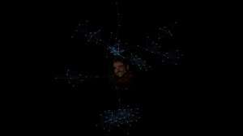
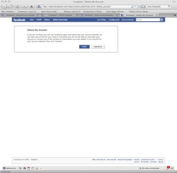
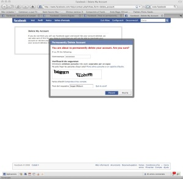
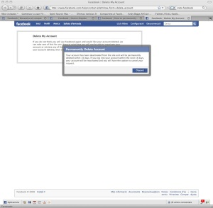

Estoy deconstruyendo mi [Facebook](http://www.facebook.com/) que inicié el 14/03/07 y ayer lo eliminé. Es más fácil de lo que pensaba, ¡[en tan solo tres clicks](http://www.facebook.com/group.php?gid=16929680703)!

Bueno, estoy preparando un pequeño post, sobre cuatro cosas de mi Facebook que me parecen divertidas contar, pero no os esperéis una tesis ni nada similar, eso para los que saben. De momento os dejo una imagen de “mi universo” con las relaciones de mis amigos en Facebook.

Espero, con el consentimiento de la gente que no quiere leer el último post de [mi viaje a Escocia](http://lluisr.blogspot.com/2008/08/viaje-escocia.html) en [Navidad](http://www.happychristmas.com/), tener algo listo para este fin de semana respecto lo que fue mi Facebook.

ACTUALIZACIÓN (16/11/2008)  
Cuatro días después que me diera de baja con el link siguiente:

[http://www.facebook.com/group.php?gid=16929680703](http://www.facebook.com/group.php?gid=16929680703)

se borró toda la información de mi perfil de FB definitivamente. Es curioso, porque no desapareces del todo hasta que pasa unos días, pero parece que va. A modo de curiosidad os dejo los tres pantallazos que aparecen cuando te borras (no están traducidoas al idioma configurado que tenía en FaceBook, el catalán… 🙁 ) :  
  
