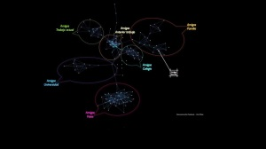

Hola,os voy a explicar en el siguiente post mi deconstrucción de mi cuenta de Facebook (a.k.a. FB).  
Y todo comenzó…  
Hace dos años me di de alta mi cuenta de FB. En aquel entonces, FB disfrutaba [de una interficie mala](http://blog.integricity.com/2008/08/01/facebook-facelifted/) pero eso no impidía que ya estuviera teniendo mucho éxito desde hacía años, [en parte gracias a que se consolidó primero en las universidades americanas](http://www.guardian.co.uk/technology/2007/jul/25/media.newmedia) para luego saltar al público general. Quien me animó a darme de alta me enseñó todo el partido que le puedes sacar: mantener el contacto con la gente que está lejos de ti, convocar reuniones y fiestas, colgar las fotos de estos eventos, tener la agenda de cumpleaños actualizados, enviar [pokes (¡aunque nunca los he entendido!)](http://ar.answers.yahoo.com/question/index?qid=20070910163703AAl8FpH), anunciar noticias o poner a disposición de tus contactos tus datos personales para que puedan contactar contingo y muchas cosas más. Bueno, reconozco que tenía buena pinta y allí entré.  
amigo…  
Lo primero que me pasó al estar usándolo durante unos días es que me di cuenta que FB me simplificaba mi ya pobre lenguaje: contacto, compañero, amante, socio, adepto, devoto, colega, compinche, camarada, querido, todos estos términos se fusionaban en uno de solo: [AMIGO](http://wiki.answers.com/Q/What_is_the_word_for_cowboy_in_different_languages_all_languages)  
Que buen uso de los sinónimos, una palabra fantástica y a partir de ahora, en este comentario del blog la continuaré usando también para todo.  
Poco a poco el grupo de amigos fue creciendo, y en parte por mi culpa que animaba a que así lo hicieran la gente que conocía.  
A modo de curiosidad me apunté a una [Aplicación del FB](http://www.facebook.com/apps/) llamada [Nexus](http://apps.facebook.com/_nexus_/), que posteriormente ha sido para mi la más útil y divertida. [Nexus](http://apps.facebook.com/_nexus_/) es una aplicación que permite crear un gráfico de tus amigos. Hay muchas aplicaciones en FB semejantes, pero esta genera un dibujo limpio, sencillo y rápido de entender. Sobretodo el gráfico que genera llamado [Spring Graph](http://www.chaosreigns.com/code/springgraph/). Como veréis en el aprtado de las nubes, el diagrama que dibuja Nexus está muy bien (los bocadillos y el texto los añadí más tarde).

las nubes…  
Es muy curioso como ha ido creciendo. Al principio de todos mis tiempos en FB eran unos puntos, luego se fueron formando unas nubes de amigos que lo eran entre ellos, pero estas nubes eran inconexas ellas y al final de todo y de forma inevitable estas nubes se acabaron de unir entre ellas. Y es que en FB siempre hay un amigo [Loctite](http://www.henkel.es/cps/rde/xchg/henkel_ess/hs.xsl/2887_ESS_HTML.htm), con mucho poder para uno, que hace de unión entre estas nubes.  
En el siguiente gráfico podéis ver las nubes de mi FB y como se agrupan y luego os hago una explicación de cada nube:  

> Nube Familia

Mi amigo semilla, es quien me inició en FB, y está en la nube Familia, es decir a quien considero familia o amigos de ellos. La nube Familia es la que más ha tardado en crecer, pero siempre crece, poco a poco pero a ritmo fijo.  
Nube Anterior Trabajo  
Aquí tengo amigos de mi anterior trabajo, el [Citilab](http://www.citilab.eu/) y fue la primera en formarse. Obvio, son amigos muy relacionados con las nuevas tecnologías, la [web 2.0](http://www.oreillynet.com/pub/a/oreilly/tim/news/2005/09/30/what-is-web-20.html) y por supuesto sus [redes sociales](http://jcmc.indiana.edu/vol13/issue1/boyd.ellison.html). Cuando me cambié de trabajo, esta nube dejo de crecer pero siempre ha sido la más densa y con las conexiones más fuertes entre los amigos.  
Nube Amigos de Colegio  
Poco después se fue formando fue la de los Amigos de Colegio. ¡¡¡Quién no la tiene!!! Los antiguos compañeros de colegio, con quin compartiste tanto tiempo dentro como fuera de las aulas. Me imagino que es un clásico y en parte una razón de ser de FB, porque quizá es la red de amigos que hace más promoción de FB: tus amigos del cole que pierdes de vista (con el buen sentido de la expresión) y FB te los vuelve a unir.  
Nube Amigos Universidad  
Menos grande de lo que podría ser dado que soy de la [FIB](http://www.fib.upc.es/) (Facultad de Informática de Barcelona) pero mis amigos de esta nube son poco consumidores de las redes sociales y hace tiempo que la “[red celular](http://en.wikipedia.org/wiki/Cellular_network)” y las cenas suple de largo el FB. Pero gracias a dos de ellos pude unir la nube de Amigos Fotos con el resto…  
Nube Amigos Fotos  
Esta nube son toda aquella gente con la que comparto la [fotografía en flickr](http://flickr.com/lluisr) y se han apuntado a FB. Se puede ver como la nube también es muy densa, todos son amigos de todos, y de ello deduzco que hay mucha fraternidad entre la gente artista, o lo aparenta. Por mi experiencia, me decanto por la primera. Esta nube creció muy rápidamente, de forma explosiva. Y aun suerte que algún freno puse a la hora de añadir más amigos porque sino entran decenas de contactos más ! :). Realmente es una comunidad muy y muy activa.  
Nube Trabajo Actual  
De los amigos de [Lavinia](http://www.laviniainteractiva.com/), mi nube más joven de estos dos últimos meses y que estaba creciendo a buen ritmo hasta hoy. Curioso, pero muy real la conexión que hay entre la nube de Trabajo Actual y la nube de Anterior Trabajo.  
Y estos son mis amigos del FB y sus relaciones. ¿Es una representación real de mis amigos en la realidad? Pues no y sí :). No porque falta mucha gente que no están aquí y deberían estarlo, así como que tengo mucha gente de amigos FB que no les tengo un afecto más allá de un buen recuerdo y en cambio están aquí. Pero por otra parte, la representación de estas nubes de amigos es muy real y da una idea muy próxima de mi.  
el valor …  
  
En definitiva que el valor no está en los amigos que añadamos o dejemos de añadir, sino en sus conexiones (que por otra parte no podemos controlar, bueno, como mínimo de forma directa…)  
proyectos de amigos…  
A raíz de estas conexiones entre amigos, comienzan a aparecer contactos raros que te quieren hacer amigo o que FB, a través de su ingeniería social te lo ofrece para que le pidas amistad. Pongo dos casos curiosos para mi:  
Primero es el de [Ernest Benach](http://es-es.facebook.com/people/Ernest_Benach/1241053155), mi presidente del [Parlament de Catalunya](http://es-es.facebook.com/people/Ernest_Benach/1241053155). Un día me apareció en la aplicación “quizá sean amigos tuyos…” !Oh, que cerca que estoy de la clase política de mi país! pensé. Mi dedo estuvo a punto de hacer click en el botón [para pedirle amistad,](http://es.answers.yahoo.com/question/index?qid=20080914110120AAlis4E)… pero si a este tío no lo conozco de nada… que absurdo. Mirando un poco, vi que era amigo de 4 amigos mios. Vaya, nada más que un político moderno.  
El otro caso es el de [Javier Moreno Bandera](http://es-es.facebook.com/people/Javier_Moreno_Bandera/1386336535), un médico fisicoterapeuta con más de ¡1420 amigos en FB! Este señor me pidió amistad y teniamos 10 amigos en común. ¿Pero quién era este señor que todavía no lo había conocido?. Bueno, antes de aceptarlo hice una pequeña encuesta entre esas amistades comunes, y básicamente Javier llegó a ser amigo de mis amigos porque estos le añadieron sin más. Pues vaya amigos de FB, que tengo … 🙂 Y vaya con el Javier, un [ganadero de amistades](http://www.urbandictionary.com/define.php?term=friend%20farmer&defid=925659), seguro que buen tipo, pero un [ganadero de amistades](http://www.urbandictionary.com/define.php?term=friend%20farmer&defid=925659). Bueno, si queréis agregarlo como amigo, hacerlo, porque seguro que él estará encantado.  
los grupos …  
Hasta ahora tan solo he hablado de los amigos de FB, pero también tanteé con los [grupos](http://www.facebook.com/apps/application.php?id=2361831622&b). Esto de los grupos es la evolución natural de los amigos. Los grupos son el punto de encuentro de las conexiones de las nubes aquellas que hablo más arriba y me parece una información mucho más interesante de la persona. Me imagino que es más difícil pertenecer a un grupo con el que no te identificas, que tener un amigo FB que no es tu amigo. Quién se apuntaría por ejemplo al grupo “Soy un asesino”. Nadie con un poco de cordura. Pero quizá pasaría más desapercibido tener un amigo llamado Dan White.  
En mi caso no he participado excesivamente en esto de los grupos, porque tengo la experiencia de [Flickr](http://www.flickr.com/) de estar apuntado a 200 grupos, que en un momento puntual acepté entrar por algún motivo, y después no sabes como eliminarte de 199 de ellos (básicamente porque ya no pintas nada).Por tanto he acabado participando en muy pocos.

> El primero fue el grupo de FB en català ([ahora me he dado cuenta que era causa y no un grupo, pero a estas horas no lo voy a cambiar 🙂](http://apps.facebook.com/causes/view_cause/57676?recruiter_id=12049729&h=mfccb)). Y pronto salió la versión en catalán del Facebook, ¡chapó!.  
> El segundo es el grupo [Party Mate Barcelona](http://www.facebook.com/group.php?gid=19803059181) y su hermano [Do you like party](http://www.facebook.com/group.php?gid=21822562252) con el que puedes encontrar buenas fiestas nocturnas en [Barcelona](http://www.bcn.cat/), no solo por el lugar sino por la gente y en todas entrar con una invitación. !Sí de gratis!  
> Más grupos, el grupo de [Volem veure TV3 i altres cadenes en català](http://www.facebook.com/group.php?gid=7860211820). Por muchos motivos siempre me he solidarizado con ellos.  
> También estaba apuntado a [StartUp 2.0](http://www.facebook.com/group.php?gid=11783142979). En este grupo están apuntados un montón de gente que aprecio mucho, por su trabajo y sus ganas de innovar.  
> Otro grupo, el creado por Al, un [grupo de Firefox](http://www.facebook.com/group.php?gid=45515669632) que está esperando a que se llene de gente e ideas. Desde aquí, y a todos los que tenéis FB y os interesa el tema del [navegador FireFox](http://www.mozilla-europe.org/es/firefox/) apuntaros. Si se anima el grupo, se pueden realizar cosas interesantes.

Me hizo gracia esta semana, buscando información de FB encontrarme con un link a grupos estúpidos (o no…) que os paso a enumerar.

-   [La física no existe, todo son gnomos](http://www.facebook.com/group.php?gid=2217915679)
-   [Niños quienes se escondieron entre los percheros del departamento de ropa mientras su mamá estaba comprand](http://www.facebook.com/group.php?gid=2219159998)o
-   [Yo grito a los objetos inanimados](http://www.facebook.com/group.php?gid=2223114754)
-   [Si tu no comienzas a caminar rápido, yo te voy a dar con my bolsa](http://www.facebook.com/group.php?gid=2219873935)
-   [Sociedad del afecto a los teléfonos-zapato](http://www.facebook.com/group.php?gid=2405293540)
-   [Yo creo que los patrones de los test son sospechosos](http://www.facebook.com/group.php?gid=2230181363)
-   [Nosotros estamos bien sexys con nuestras batas de laboratorio, nosotros necesitamos gafas de protección… por protección](http://www.facebook.com/group.php?gid=2230541251)

y poca cosa más…  
Y no os puedo hablar de muchas cosas más del FB mio. Quizá las aplicaciones que más usaba eran el Nexus y una que me encantó fue el [Birthday Explorer](http://www.facebook.com/apps/application.php?id=2444662219&b&ref=pd) un importador de aniversarios a la agenda de mi Mac, y de allí sincronizando mi mòbil he conseguido tener una buena cantidad de aniversarios a mano para no olvidarme de ninguno…  
Pero poca cosa más, las [páginas de FB](http://www.facebook.com/business/?pages), nunca las usé, el mail interno, solo para no dejar de contestar a aquellos que lo usaban asiduamente, las fotos, [teniendo flickr ya](http://flickr.com/lluisr) soy feliz, … y lo mismo con el inmenso abanico de cosas que FB tiene.  
y me voy…  
Llegados a este punto de mi desconstrucción, ¿por qué me desapunto de FB?  
En primer lugar me he desapuntado para evitar situaciones como la que te envíen una petición de amistad el jefe que te despidió no hace más de un año, o tu ex-mujer, o de tu peor enemigo no declarado o alguien que ya habías conseguido olvidar y FB te devuelve el favor recordándotela. Todos estos casos de amigos FB (o ex usuarios de FB…) mios me hacen que pensar que lo mismo te puede pasar por la calle. Pero en la calle no los vas a ignorar, sinceramente, hasta quizá te hagan pasar un rato coordial e interesante. En FB, no es natural la amistad, si no aceptas, ya no existe, y si lo aceptas, entonces se mete dentro de tu cocina hasta al fondo.  
Bueno, hasta el fondo no, puedes ajustar tu [configuración de privacidad](http://weblogs.elearning.ubc.ca/brian/archives/043929.php) y especificar con bastante detalle quién tiene acceso a tu información, tu perfil, tu muro… pero sinceramente, ¿quién lo ajusta esto? Seguro que más de uno lo utiliza, pero a mi me pareció poco flexible y útil para ajustar mi privacidad a decenas de amigos que tengo. Al final optas por poner menos información en FB. Cuantos más amigos tienes, menos cosas dices o haces y solo te dedicas a mirar. ¿Útil?  
Por tanto, para tus amistades no lo veo muy claro. Si que es cierto, que conozco personas que FB les parece muy útil, pero lo usan con un círculo de amistades muy reducido, controlado y de mucha confianza. Pero creo que va en dirección contraria a la filosofia del FB de tener muchos amigos y tantas conexiones directas como sea posibles entre ellos.  
No he usado FB para conseguir citas, [hacer negocios con FB](http://www.insidefacebook.com/2008/07/28/facebook-for-business-what-it-needs-what-it-has/), para promocionarme o para [encontrar trabajo](http://www.facebook.com/jobs/index.php) aunque creo que sí debe ser muy útil, porque la red de FB a día de hoy es increíblemente grande y la confianza entre las conexiones de amigos es alta aun. Pero si uno de estos dos factores fallará, la estrategia de FB debería cambiar, y dudo que vaya a aumentar la confianza cuanto más conexiones de amigos tengas.  
Si fuera FB intentaría no facilitar tanto la visualización de información de forma automática para encontrar amigos. Con ello disminuiría la creación de conexiones directas entre dos usuarios de FB porque a gran escala creo que no funciona, como mínimo en nuestra generación. Pero claro, si así se hiciera, la belleza de FB no las cargamos y dependeriamos de intermediarios o amigos Loctite como digo yo que podrían administrar sus conexiones en forma de poder. ¡Vaya dilema!  
privadamente público…  
Por último hay otra cosa que no me gusta de FB, y que por otra parte lo veo poco útil y es que es una red privada. Debes de estar dado de alta para poder acceder a prácticamente toda la información que se genera desde él. Sí, ok, tienes las [páginas FB](http://www.facebook.com/business/?pages) visibles desde internet, pero no son más que una web con enlaces internos a FB. No puedes compartir información con el resto de internautas.  
… pero satisfacción  
Estoy orgulloso de FB a pesar de todo, ya que sea una revolución, o una moda, o un pasatiempos, o una religión, o un fraude o simplemente una red social, lo comenzaron a engendrar mayoritariamente estudiantes informáticos y emprendedores como [Dustin Moskovitz](http://en.wikipedia.org/wiki/Dustin_Moskovitz), [Chris Hughes](http://en.wikipedia.org/wiki/Chris_Hughes) y [Mark Elliot Zuckerberg](http://es.wikipedia.org/wiki/Mark_Zuckerberg). Este último ha acabado siendo el jefe ejecutivo de FB con tan solo 23 años. Y esto nos debe de llenar de orgullo [a todas aquellas personas que hemos dedicado con la formación, carrera, doctorado o simplemente el tiempo a esta profesión que es la informática](http://trompeti.blogspot.com/2008/11/soy-un-informtico-soy-una-puta-desde.html) y [a la vez una lección para los que no somos aun emprendedores.](http://lluisr.blogspot.com/)  
Cuatro links interesante  
[Libro marketing de FB](http://www.insidefacebook.com/facebook-marketing-bible/)  
[Estar al día de FB](http://www.insidefacebook.com/)  
[Blog de FB](http://blog.facebook.com/)  
[Estadísticas de FB](http://www.appdata.com/)  
Adiós, fue un placer veros por FB :))