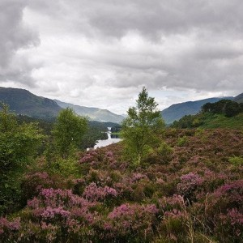
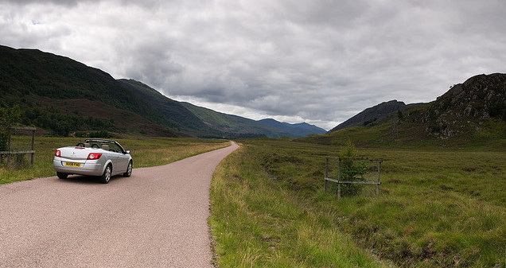
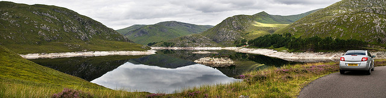

  
[Mostra un mapa més gran](http://maps.google.es/maps?f=d&hl=ca&geocode=15507057790607815504,57.265540,-4.984860%3B4213816538305872782,57.403390,-4.999590&saddr=Cannich&daddr=Carrer+desconegut+%4057.265540,+-4.984860+to:Carrer+desconegut+%4057.403390,+-4.999590+to:57.407982,-4.96788+to:Drumnadrochit&mra=dpe&mrcr=0&mrsp=3&sz=11&via=1,2,3&doflg=ptm&sll=57.378381,-4.88205&sspn=0.181749,0.401688&ie=UTF8&ll=56.956957,-5.273437&spn=5.885242,12.854004&source=embed)

 Me levanto tarde, creo haber visto murciélagos por la noche, la habitación es acogedora pero no deja de ser una habitación de una caserón campestre. ¿Pero será el caserón, será la resaca? Me aseo y bajo a la cocina. Allí me encuentro a todos los inquilinos del B&B de esa noche: una familia francesa y una pareja holandesa. Todos, junto al casero Ian que estaba cocinando el desayuno. Me senté con todos en una gran mesa de madera mientras escogía el desayuno de aquella mañana. Fue un rato genial, pudimos compartir nuestras visitas por esas tierras y la familia francesa me recomendó una whiskeria que estaba genial para visitar. A pesar que no acabé visitándola, sí que las indicaciones me sirvieron para llegar a otra, pero esto os lo cuento en el siguiente día.

El desayuno, a parte de la agradable conversación, estuvo muy bien, el casero viéndome con unos cuantas huevos fritos, pancetas, butifarras y otros sucedanios que tenía acumulados en mi cuerpo, me preparó una macedonia llena de frutas. Un poco [al estilo de Jo.](http://lluisr.blogspot.com/2008/08/da-5-escocia.html) Y posteriormente, una vez acabado desplegué el mapa de ruta y le comenté que quería hacer alguna ruta espectacular por la zona.

<figure id="attachment_2178" aria-describedby="caption-attachment-2178" style="width: 290px"><figcaption id="caption-attachment-2178">Glen Affric – Lluís Ribes i Portillo (<a href="http://creativecommons.org/licenses/by-nc-nd/3.0/" target="_blank" rel="noopener noreferrer">cc</a>)</figcaption></figure>

  
Ese día me iba a quedar por [Inverness](http://es.wikipedia.org/wiki/Inverness). A la tarde quedaba con un amigo que subía [con toda una pandilla de Barcelona](http://www.elpais.com/fotografia/Fiestas/Gracia/Barcelona/elpdiaesp/20080819elpcat_3/Ies/) 🙂 Por tanto podía gastar la mañana por las inmediaciones del precioso [Glen Affric](http://en.wikipedia.org/wiki/Glen_Affric). Pero Ian me recomendó otro valle, menos conocido y más remoto, el [Glen Strathfarrar](http://www.glenaffric.info/glens2.html) que acaba en el Loch Monar.  
  
Antes de realizar el camino de Ian, me dirigí al famoso Glen Affrich.  
Se llega a través de una carretera que comienza justo en la pequeña central eléctrica que queda a mano izquierda a 400 metros del centro de Cannich en dirección Drumnadrochit. Esta carretera, estrecha y entre una vegetación muy frondosa, sigue el curso del río, hasta finalizar en un gran parquing de donde salen todos los caminos de de ruta de montaña. Yo no realicé más que un pequeño sendero para enfilarme y hacer una foto del lago, y me harté de los [mosquitos escocesés](http://en.wikipedia.org/wiki/Midge_%28insect%29). Por tanto, si vais a hacer alguna excursión en verano por esta zona, o os ponéis un [repelente bien potente](http://www.mosquitorepellent.com/), o [un traje de astronauta](http://www.midgie.net/) o vais a acabar hasta las narices de Escocia en tan solo una hora gracias a estos bichitos voladores.

Tras lograr los mosquitos que me resignara en hacer una segunda foto del Glen Affrich, agarré el coche y me dirigí al “camino de Ian”.

<figure id="attachment_2177" aria-describedby="caption-attachment-2177" style="width: 626px"><figcaption id="caption-attachment-2177">Camino de Ian – Lluís Ribes i Portillo (<a href="http://creativecommons.org/licenses/by-nc-nd/3.0/" target="_blank" rel="noopener noreferrer">cc</a>)</figcaption></figure>

> Estaba al norte de [Cannich](http://en.wikipedia.org/wiki/Cannich). Para ello, se debía salir de Canninch en dirección a Inverness, y a 8 millas a la altura de Struy, hay que torcer a la izquierda en un camino asfaltado que pronto lo encuentras cerrado por una reja. Pero tan solo tienes que hacer sonar la bocina, para que una amable señora salga de la casita contigua a la verja y tras apuntar la matrícula te abre paso a quizá unos de los lugares más inóspitos que puedas conocer (aún más si vas a primera hora).
> 
> Estas en el [centro de Escocia](http://lluisr.blogspot.com/2005/11/la-cerverza-5-la-cerveza-en-los-5.html), en [una región con ciudades grandes](http://www.cyberpunkreview.com/movie/decade/pre-1980/metropolis/), vas por [un camino asfaltado](http://images.businessweek.com/ss/06/01/wonders_bigdigs/source/6.htm), sabes que [no estás en Siberia,](https://www.allposters.com/-sp/Tiny-Tropical-Sand-Island-with-Palm-Tree-Surrounded-by-Sea-Posters_i2634798_.htm) de tanto en tanto [dejas a tu lado una cabaña](http://www.thetoyzone.com/little-tikes-cambridge-cottage-house-review/) o [algún pescador madrugador](http://video.google.es/videosearch?um=1&hl=es&client=firefox-a&rls=org.mozilla:es-ES:official&q=fisher&ndsp=18&ie=UTF-8&sa=N&tab=iv#q=fisher%20bear&hl=es&emb=0), pero a pesar de todo esto te sientes perdido en otro mundo, tu y la naturaleza.
> 
> La ruta hacia el Lago Monar son aproximádamente unas 10 millas entre un valle con unos lagos con bonitos reflejos hasta llegar a una subida que llega a la central hidroléctrica del lago. Puedes cruzar la presa y continuar subiendo hasta tener una gran perspectiva completa del paisaje:
> 
> <figure id="attachment_2176" aria-describedby="caption-attachment-2176" style="width: 630px"><figcaption id="caption-attachment-2176">Loch Monhar – Lluís Ribes i Portillo (<a href="http://creativecommons.org/licenses/by-nc-nd/3.0/" target="_blank" rel="noopener noreferrer">cc</a>)</figcaption></figure>
> 
> Y la verdad, es que aun puedes adentrarte más, pero por un lado, la cobertura de móvil la tienes perdida desde hace rato y por otro debes pasar por una segunda presa donde apenas tienes el ancho de un utilitario (no llega a tres metros) y creo que mi coche se hubiera quedado apresado nunca mejor dicho entre las paredes de la curva que realizaba la edificación. Ufff… ¿Hubiera podido abrir la puerta?
> 
> Todo era muy bonito y tranquilo, y si no fuera por la temporada de mosquitos [se hubiera podido convertir en un trekking genial](http://www.flickr.com/photos/innerleithen/2927072056/).
> 
> Pero llegado a la segunda presa “estrangula coches” decidí volver a la civilización.

El trayecto sobre mapa parece corto pero dos horas de coche de paseo no te las quita nadie en total. Cuando regresé a la carretera principal, era ya mediodía y me dirigí a [Drumnadrochit](http://en.wikipedia.org/wiki/Drumnadrochit), punto de encuentro con los colegas y con [Nessie](http://en.wikipedia.org/wiki/Loch_Ness_Monster).

Si Nessie, el monstruo del lago Ness. Qué os voy contar de ello: como sacarle provecho a un lago no especialemente hermosos de Escocia con hoteles temáticos, restaurantes y negocios como son [barcos con sónar para dar un paseo en busca del monstruo](http://www.lochness-cruises.com/). Y Drumnadrochit es el pueblo central de todas estas diversiones. Muy tranquilo, si no fuera por la [horda de turistas](http://farm1.static.flickr.com/105/365678519_602878e5f7_o.jpg) que hay.

Aproveché para buscar alojamiento encontrando un B&B en el mismo pueblo. Estaba en frente de la información turística y se llamaba [Greenlea House](http://www.scottishaccommodationindex.com/greenlea.php). Me costó un poco encontrar algo donde dormir, es un lugar muy turístico y al final este B&B me permitió descansar aunque de todos los que he estado, no paso ni con pena ni gloria. Tampoco el lugar era muy atractivo, y una vez que vinieron los colegas y tras jugar a tenis en el parque con un banco como red, las manos como raqueta y una bola de tenis, eso sí, marchamos a Inverness.

Inverness a 15 millas de Drumnadrochit, seguía siendo la ciudad del día anterior, lleno de gente, turística sin parar pero cuando se hizo de noche, sobre las 21:00 solo una pandilla de barceloneses iban por las calles vacías para acabar cenando en un [restaurante indio llamado Garden](http://maps.google.es/maps?ie=utf-8&oe=utf-8&rls=org.mozilla:es-ES:official&client=firefox-a&um=1&q=indian+garden+inverness&fb=1&view=text&latlng=11752766158457489103). :-p, comida india :-p, [comida picante :))))))))](http://www.mengambrea.com.mx/2006/04/el-chile-ms-picante-del-mundo.html) . Con el paladar marchitado, fuimos al primer pub que encontramos abierto, y si bien en la calle no había nadie, allí en cambio se concentraba un momntón de gente de todo tipo alrededor de la cerveza y una pequeña pista de baile amenizada con música en directo…

B&B  
  
Greenlea Loch Ness  
Drumnadrochit,  
Loch Ness,  
IV63 6TX  
web: [Greenlea Loch Ness](http://www.scottishaccommodationindex.com/greenlea.php)  
Precio individual: 30 £